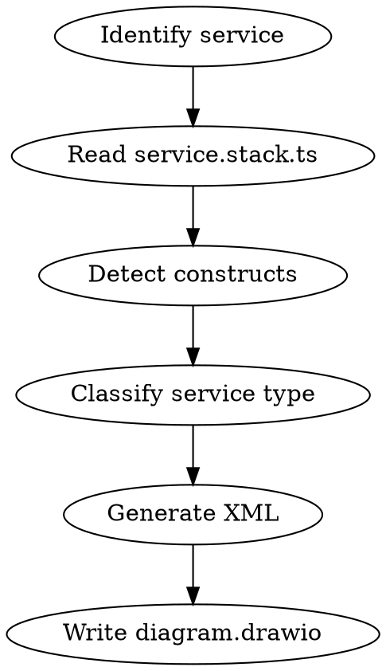

# Generate Infrastructure Diagram

Generate a `.drawio` infrastructure diagram for any service by reading its `service.stack.ts` and producing a draw.io XML file with AWS4 icons.

## Process



### Step 1: Identify the service

Find the service directory under `services/<domain>/<service-name>/`. If user gives just a name (e.g. "investor-bff"), glob for `services/**/<name>/src/service.stack.ts`.

### Step 2: Read service.stack.ts

Read the file and detect which constructs are instantiated:

| Import | Detection | Notes |
|--------|-----------|-------|
| `Ingress` | `new Ingress(` | Extract `eventTypes` array |
| `Egress` | `new Egress(` | Extract `publishableTypes` array |
| `Facade` | `new Facade(` | Extract resolver info |
| `State` | `stateProps` or implicit | Present unless `stateProps: false` |
| `AgentRuntime` | `new AgentRuntime(` | Extract tool targets |

### Step 3: Classify service type

| Type | Constructs | Examples |
|------|-----------|----------|
| **BFF** | Facade + Ingress + Egress + State | investor-bff, dashboard-bff |
| **Controller** | Ingress + Egress + State (no Facade) | advisory-ctrl, execution-ctrl |
| **Hub** | EventBus only (`stateProps: false`, no Ingress/Egress) | investor-hub, advisory-hub |
| **Adapter** | Cross-domain forwarding rules (no Ingress/Egress) | execution-adpt, investor-adpt |

### Step 4: Generate XML

Use the styles, layouts, and templates below. All icons are 80x80. Use a unique ID prefix per diagram (e.g. `d1-1`, `d1-2`, etc.).

### Step 5: Write output

Write to `services/<domain>/<service-name>/diagram.drawio`.

---

## AWS Icon Styles

Common points prefix (used by all AWS icons):

```
POINTS = sketch=0;points=[[0,0,0],[0.25,0,0],[0.5,0,0],[0.75,0,0],[1,0,0],[0,1,0],[0.25,1,0],[0.5,1,0],[0.75,1,0],[1,1,0],[0,0.25,0],[0,0.5,0],[0,0.75,0],[1,0.25,0],[1,0.5,0],[1,0.75,0]];outlineConnect=0;fontColor=#232F3E;
```

Common suffix:

```
SUFFIX = strokeColor=#ffffff;dashed=0;verticalLabelPosition=bottom;verticalAlign=top;align=center;html=1;fontSize=12;fontStyle=0;aspect=fixed;shape=mxgraph.aws4.resourceIcon;
```

| Resource | fillColor | resIcon |
|----------|-----------|---------|
| Lambda | `#ED7100` | `mxgraph.aws4.lambda` |
| DynamoDB | `#C925D1` | `mxgraph.aws4.dynamodb` |
| SQS | `#E7157B` | `mxgraph.aws4.sqs` |
| EventBridge | `#E7157B` | `mxgraph.aws4.eventbridge` |
| AppSync | `#E7157B` | `mxgraph.aws4.appsync` |
| S3 | `#3F8624` | `mxgraph.aws4.s3` |
| Bedrock | `#01A88D` | `mxgraph.aws4.bedrock` |
| CloudWatch | `#E7157B` | `mxgraph.aws4.cloudwatch_2` |
| EventBridge Archive | `#E7157B` | `mxgraph.aws4.eventbridge_archive` |

Full style for an icon = `{POINTS}fillColor={color};{SUFFIX}resIcon={resIcon};`

### Service boundary box style

```
rounded=0;whiteSpace=wrap;html=1;shadow=1;align=left;verticalAlign=top;spacingLeft=6;
```

### Edge style

```
edgeStyle=orthogonalEdgeStyle;rounded=1;orthogonalLoop=1;jettySize=auto;html=1;curved=0;
```

Add entry/exit points on edges when connecting to specific sides:
- Top: `entryX=0.5;entryY=0;entryDx=0;entryDy=0;entryPerimeter=0;`
- Bottom: `exitX=0.5;exitY=1;exitDx=0;exitDy=0;exitPerimeter=0;`
- Left: `entryX=0;entryY=0.5;entryDx=0;entryDy=0;entryPerimeter=0;`
- Right: `exitX=1;exitY=0.5;exitDx=0;exitDy=0;exitPerimeter=0;`

---

## Layouts

All coordinates use a base origin. The service box starts at `(100, 40)`. External resources (EventBridge bus) sit to the left of the box.

### BFF Layout

```
Service Box: (100, 40) w=280 h=520
  AppSync "graphql-api":       (140, 80)
  DynamoDB "state":            (260, 80)
  Lambda "events-listener":    (140, 200)
  SQS "events-buffer":         (140, 320)
  Lambda "events-publisher":   (140, 440)

External:
  EventBridge "":              (-20, 320)
```

**Edges:**
1. EventBridge exit(0.5, 0) -> AppSync entry(0, 0.5)
2. EventBridge exit(1, 0.5) -> SQS entry(0, 0.5)
3. SQS -> Lambda-listener (default)
4. Lambda-listener exit(0.5, 0) -> AppSync entry(0.5, 1)
5. AppSync -> DynamoDB (default)
6. DynamoDB exit(0.5, 1) -> Lambda-publisher entry(1, 0.5)
7. Lambda-publisher exit(0.5, 1) -> EventBridge entry(0.5, 1)

### Controller Layout

```
Service Box: (100, 40) w=280 h=400
  DynamoDB "state":            (260, 80)
  Lambda "events-listener":    (140, 80)
  SQS "events-buffer":         (140, 200)
  Lambda "events-publisher":   (140, 320)

External:
  EventBridge "":              (-20, 200)
```

**Edges:**
1. EventBridge exit(1, 0.5) -> SQS entry(0, 0.5)
2. SQS -> Lambda-listener (default, upward)
3. Lambda-listener -> DynamoDB (default)
4. DynamoDB exit(0.5, 1) -> Lambda-publisher entry(1, 0.5)
5. Lambda-publisher exit(0.5, 1) -> EventBridge entry(0.5, 1)

If **AgentRuntime** present, add:
```
  Bedrock "agent-runtime":     (260, 200)
```
Edge: Lambda-listener -> Bedrock-agent

### Hub Layout

```
Service Box: (100, 40) w=200 h=200
  EventBridge "event-bus":     (160, 80)
  Archive "archive":           (160, 180)
```

**Edges:**
1. EventBridge exit(0.5, 1) -> Archive entry(0.5, 0)

### Adapter Layout

```
Service Box: (100, 40) w=280 h=200

External:
  EventBridge "source-bus":    (-20, 100)
  EventBridge "target-bus":    (420, 100)
```

**Edges:**
1. Source-EventBridge exit(1, 0.5) -> box entry(0, 0.5)
2. Box exit(1, 0.5) -> Target-EventBridge entry(0, 0.5)

---

## XML Template

Wrap everything in this structure:

```xml
<mxfile host="app.diagrams.net" version="29.6.4">
  <diagram id="diagramid" name="{service-name}">
    <mxGraphModel dx="1916" dy="675" grid="1" gridSize="10" guides="1" tooltips="1" connect="1" arrows="1" fold="1" page="1" pageScale="1" pageWidth="850" pageHeight="1100" math="0" shadow="0">
      <root>
        <mxCell id="0" />
        <mxCell id="1" parent="0" />
        <!-- nodes and edges here -->
      </root>
    </mxGraphModel>
  </diagram>
</mxfile>
```

**Node cell:**
```xml
<mxCell id="{id}" parent="1" style="{style}" value="{label}" vertex="1">
  <mxGeometry height="80" width="80" x="{x}" y="{y}" as="geometry" />
</mxCell>
```

**Service box cell** (use width/height from layout):
```xml
<mxCell id="{id}" parent="1" style="rounded=0;whiteSpace=wrap;html=1;shadow=1;align=left;verticalAlign=top;spacingLeft=6;" value="{service-name}" vertex="1">
  <mxGeometry height="{h}" width="{w}" x="100" y="40" as="geometry" />
</mxCell>
```

**Edge cell:**
```xml
<mxCell id="{id}" edge="1" parent="1" source="{source-id}" target="{target-id}" style="edgeStyle=orthogonalEdgeStyle;rounded=1;orthogonalLoop=1;jettySize=auto;html=1;curved=0;{extra-entry-exit-points}">
  <mxGeometry relative="1" as="geometry" />
</mxCell>
```

---

## Enrichment

After generating the base diagram from constructs, enrich labels:

- **Ingress Lambda**: label = `"events-listener"` — add tooltip or subtitle with event types (e.g. `USER_REGISTERED, NOTIFICATION_CREATED`)
- **Egress Lambda**: label = `"events-publisher"` — add subtitle with publishable types count
- **Facade AppSync**: label = `"graphql-api"`
- **State DynamoDB**: label = `"state"`
- **SQS**: label = `"events-buffer"`
- **EventBridge**: label = `""` (empty — it's the domain bus, external to service)
- **Hub EventBridge**: label = `"event-bus"`

## Common Mistakes

- Forgetting `entryPerimeter=0` / `exitPerimeter=0` on edges connecting to AWS icons (they have custom connection points)
- Using wrong parent — all cells must have `parent="1"`
- Missing root cells `id="0"` and `id="1"`
- Using duplicate IDs — each cell needs a unique ID
- Placing EventBridge bus inside the service box — it's external (shared domain bus)
