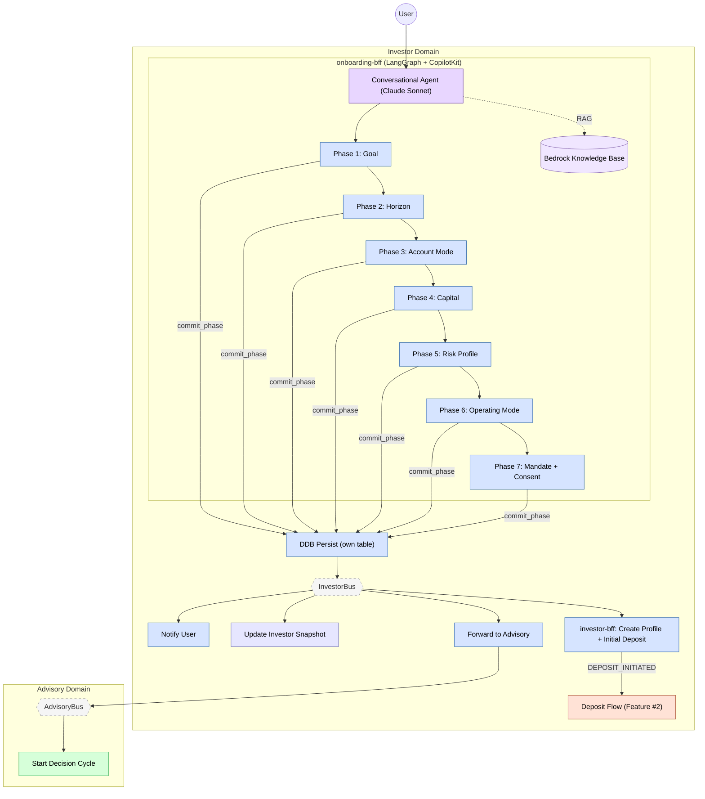

# Feature #1 — Investor Onboarding (Happy Path)

The onboarding flow is a conversational AI-guided experience. The onboarding-mfe connects to onboarding-bff — a LangGraph state machine powered by Claude Sonnet via CopilotKit — that walks the user through 7 phases: goal, horizon, account mode, capital, risk profile, operating mode, and mandate. The agent renders rich UI components (sliders, option cards, amount pickers) via tool calls, persists each phase to DynamoDB (own table, CDC via DynamoDB Streams), and uses a Bedrock Knowledge Base for product questions (RAG). Once committed, CDC events on InvestorBus trigger downstream processing: investor-ctrl generates welcome notifications, dashboard-bff materializes the investor snapshot, and investor-adpt forwards the mandate to AdvisoryBus — kicking off the first advisory decision cycle. When investor-bff processes the ONBOARDING_COMPLETED event, it atomically creates 7 entities including an initial Deposit record (if capitalAmount > 0), which triggers the standard deposit flow (see Feature #2).

**Trigger**: User starts the onboarding wizard in onboarding-mfe (guarded by `onboardingPendingGuard` in shell).

---

## Flowchart

---

## Summary Table

| Step | Component | Domain | Input Event | Action | Output Event | Target Bus |
|------|-----------|--------|-------------|--------|-------------|------------|
| 1 | onboarding-bff | Investor | User conversation (CopilotKit) | LangGraph 7-phase state machine (Claude Sonnet), render UI tools, RAG via Bedrock KB | _(commit_phase per step)_ | — |
| 2 | onboarding-bff | Investor | commit_phase tool call | DDB persist per phase (own table) | GOAL_SET, RISK_PROFILE_SET, MANDATE_GRANTED (CDC) | InvestorBus |
| 3 | onboarding-bff | Investor | Final mandate consent | DDB insert OnboardingCompleted | ONBOARDING_COMPLETED (CDC) | InvestorBus |
| 3a | investor-bff | Investor | ONBOARDING_COMPLETED | transactWrite: InvestorProfile + Goal + RiskProfile + OperatingMode + AccountMode + Mandate + initial Deposit (if capitalAmount > 0) | DEPOSIT_INITIATED (CDC) | InvestorBus → deposit flow (Feature #2) |
| 4 | investor-ctrl | Investor | ONBOARDING_COMPLETED | Create notification "Welcome to Nestfolio" | NOTIFICATION_CREATED | InvestorBus |
| 5 | investor-ctrl | Investor | MANDATE_GRANTED | Create notification "Investment Mandate Activated" | NOTIFICATION_CREATED | InvestorBus |
| 6 | dashboard-bff | Investor | ONBOARDING_COMPLETED, GOAL_SET, GOAL_UPDATED, RISK_PROFILE_SET, RISK_PROFILE_UPDATED | Materialize investor snapshot | _(terminal)_ | — |
| 7 | investor-adpt | Investor | MANDATE_GRANTED, GOAL_UPDATED, RISK_PROFILE_UPDATED | Cross-domain forward | Same events | AdvisoryBus |
| 8 | advisory-ctrl | Advisory | MANDATE_GRANTED | Start advisory decision cycle (see Feature #6) | DECISION_PACKET_CREATED | AdvisoryBus |
