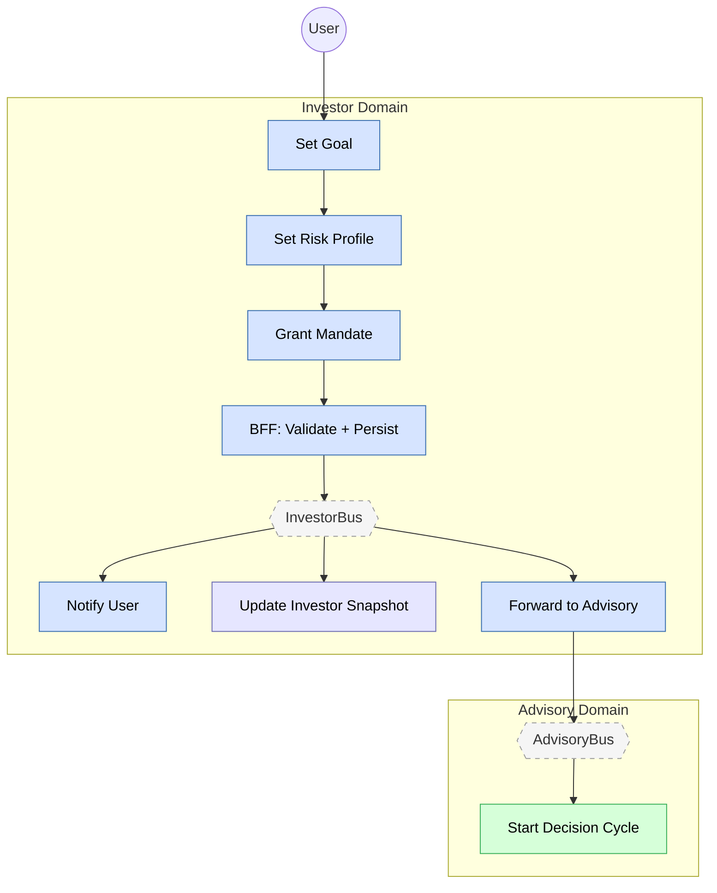

# Feature #1 — Investor Onboarding (Happy Path)

**Trigger**: User completes the onboarding wizard in investor-mfe.

---

## Flowchart

---

## Summary Table

| Step | Component | Domain | Input Event | Action | Output Event | Target Bus |
|------|-----------|--------|-------------|--------|-------------|------------|
| 1 | investor-bff | Investor | GraphQL mutations (updateGoal, updateMandate) | Zod validate + DDB insert per step | GOAL_SET, RISK_PROFILE_SET, MANDATE_GRANTED (CDC) | InvestorBus |
| 2 | investor-bff | Investor | Final wizard step | DDB insert InvestorProfile | ONBOARDING_COMPLETED (CDC) | InvestorBus |
| 3 | investor-ctrl | Investor | ONBOARDING_COMPLETED | Create notification "Welcome to Nestfolio" | NOTIFICATION_CREATED | InvestorBus |
| 4 | investor-ctrl | Investor | MANDATE_GRANTED | Create notification "Investment Mandate Activated" | NOTIFICATION_CREATED | InvestorBus |
| 5 | dashboard-bff | Investor | ONBOARDING_COMPLETED, GOAL_SET, GOAL_UPDATED, RISK_PROFILE_SET, RISK_PROFILE_UPDATED | Materialize investor snapshot | _(terminal)_ | — |
| 6 | investor-adpt | Investor | MANDATE_GRANTED, GOAL_UPDATED, RISK_PROFILE_UPDATED | Cross-domain forward | Same events | AdvisoryBus |
| 7 | advisory-ctrl | Advisory | MANDATE_GRANTED | Start advisory decision cycle (see Feature #6) | DECISION_PACKET_CREATED | AdvisoryBus |
