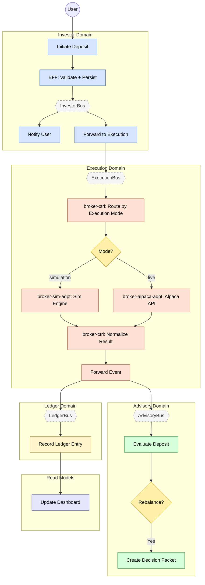

> **Deprecated:** This document has been superseded by `flows/deposit.flow.yaml` and the agent documentation system. See `docs/agent-system.md` for details.

# Feature #2 — Deposit (Happy Path)

A deposit starts in the Investor domain and ripples across all four domains. The investor-bff validates and persists the request, investor-adpt forwards it to ExecutionBus. In the Execution domain, `broker-ctrl` routes the deposit based on the tenant's **execution mode** — either to the simulation engine (`broker-sim-adpt`) or to the live broker (`broker-alpaca-adpt`). Both paths normalize back to a common `NormalizedEvent` via `deposit-withdrawal-normalizer`. execution-adpt then fans the event out to AdvisoryBus (which may trigger a rebalance decision) and LedgerBus (which appends an event-sourced entry and updates the portfolio snapshot).

**Trigger**: User initiates a deposit via investor-mfe (either during onboarding or as a subsequent top-up).

---

## Flowchart

---

## Execution Mode Routing (broker-ctrl)

`broker-ctrl/deposit-withdrawal-router` reads the tenant's execution mode from DDB (`ExecutionMode#${tenantId}`) and emits a mode-specific event:

| Execution Mode | Routed Event | Adapter | Direction Field |
|---------------|-------------|---------|-----------------|
| `simulation` | `SIM_DEPOSIT_INITIATED` | broker-sim-adpt | `INCOMING` |
| `live` | `ALPACA_TRANSFER_REQUESTED` | broker-alpaca-adpt | `INCOMING` |

Each adapter processes the deposit and emits a completion event:

| Adapter Path | Completion Event |
|-------------|-----------------|
| Simulation | `SIM_DEPOSIT_COMPLETED` |
| Live (Alpaca) | `ALPACA_TRANSFER_COMPLETED` (or `ALPACA_TRANSFER_FAILED`) |

`broker-ctrl/deposit-withdrawal-normalizer` materializes both completion paths into a common `NormalizedEvent` record (DDB key: `NormalizedEvent#${tenantId}#${depositId}`, sk: `DEPOSIT_DETECTED`), tagged with the `executionMode` that was used. This normalized record triggers CDC emission of `DEPOSIT_DETECTED`, which downstream services consume identically regardless of execution mode.

---

## Summary Table

| Step | Component | Domain | Input Event | Action | Output Event | Target Bus |
|------|-----------|--------|-------------|--------|-------------|------------|
| 1 | investor-bff | Investor | GraphQL mutation | JS resolver validate + DDB insert | DEPOSIT_INITIATED (CDC) | InvestorBus |
| 2 | investor-ctrl | Investor | DEPOSIT_INITIATED | Create push notification | NOTIFICATION_CREATED | InvestorBus |
| 3 | investor-adpt | Investor | DEPOSIT_INITIATED | Cross-domain forward | DEPOSIT_INITIATED | ExecutionBus |
| 4 | broker-ctrl | Execution | DEPOSIT_INITIATED | Read execution mode, route deposit | SIM_DEPOSIT_INITIATED or ALPACA_TRANSFER_REQUESTED | ExecutionBus |
| 5a | broker-sim-adpt | Execution | SIM_DEPOSIT_INITIATED | Simulation engine credits balance | SIM_DEPOSIT_COMPLETED | ExecutionBus |
| 5b | broker-alpaca-adpt | Execution | ALPACA_TRANSFER_REQUESTED | Alpaca API transfer (direction=INCOMING) | ALPACA_TRANSFER_COMPLETED or ALPACA_TRANSFER_FAILED | ExecutionBus |
| 6 | broker-ctrl | Execution | SIM_DEPOSIT_COMPLETED / ALPACA_TRANSFER_COMPLETED | Normalize to NormalizedEvent (DEPOSIT_DETECTED) | DEPOSIT_DETECTED (CDC) | ExecutionBus |
| 7 | execution-adpt | Execution | DEPOSIT_DETECTED | Cross-domain forward | DEPOSIT_DETECTED | AdvisoryBus + LedgerBus |
| 8 | advisory-ctrl | Advisory | DEPOSIT_DETECTED | Evaluate rebalance trigger | DECISION_PACKET_CREATED _(conditional)_ | AdvisoryBus |
| 9 | ledger-ctrl | Ledger | DEPOSIT_DETECTED | Append event-sourced entry | LEDGER_ENTRY_RECORDED | LedgerBus |
| 10 | dashboard-bff | Read Model | BALANCE_UPDATED | Update materialized view | _(terminal)_ | — |
