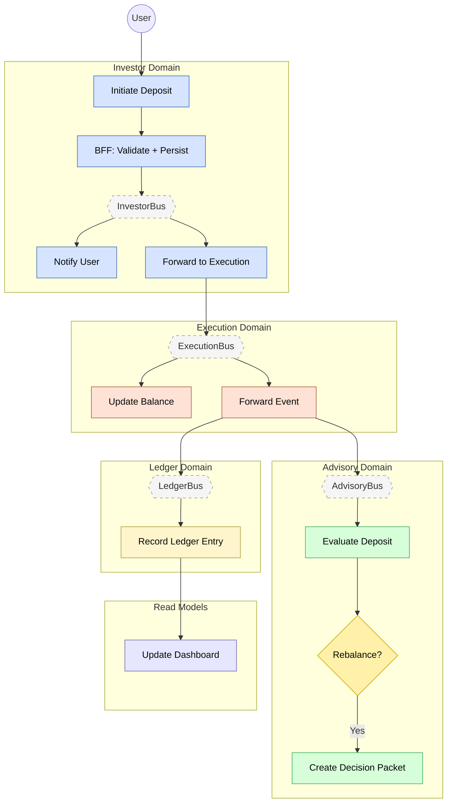

# Feature #2 — Deposit (Happy Path)

**Trigger**: User initiates a deposit via the Investor MFE onboarding wizard.

---

## Flowchart

---

## Summary Table

| Step | Component | Domain | Input Event | Action | Output Event | Target Bus |
|------|-----------|--------|-------------|--------|-------------|------------|
| 1 | investor-bff | Investor | GraphQL mutation | Zod validate + DDB insert | DEPOSIT_INITIATED (CDC) | InvestorBus |
| 2 | investor-ctrl | Investor | DEPOSIT_INITIATED | Create push notification | NOTIFICATION_CREATED | InvestorBus |
| 3 | investor-adpt | Investor | DEPOSIT_INITIATED | Cross-domain forward | DEPOSIT_INITIATED | ExecutionBus |
| 4 | broker-adpt | Execution | DEPOSIT_INITIATED | Idempotent cash balance update | _(terminal)_ | — |
| 5 | execution-adpt | Execution | DEPOSIT_INITIATED | Cross-domain forward | DEPOSIT_DETECTED | AdvisoryBus + LedgerBus |
| 6 | advisory-ctrl | Advisory | DEPOSIT_DETECTED | Evaluate rebalance trigger | DECISION_PACKET_CREATED _(conditional)_ | AdvisoryBus |
| 7 | ledger-ctrl | Ledger | DEPOSIT_DETECTED | Append event-sourced entry | LEDGER_ENTRY_RECORDED | LedgerBus |
| 8 | dashboard-bff | Read Model | BALANCE_UPDATED | Update materialized view | _(terminal)_ | — |
