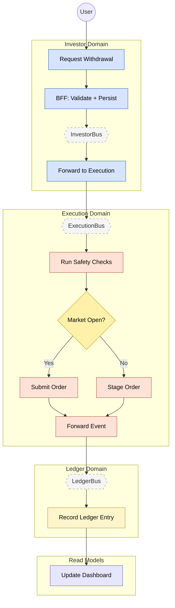

# Feature #3 — Withdrawal (Happy Path)

A withdrawal request flows from the Investor domain into Execution, where safety checks and market-hours logic determine whether the order is submitted immediately or staged for the next market open. Once filled, the event is forwarded to the Ledger domain for event-sourced recording and dashboard materialization.

**Trigger**: User requests a withdrawal via the investor-mfe.

---

## Flowchart

---

## Summary Table

| Step | Component | Domain | Input Event | Action | Output Event | Target Bus |
|------|-----------|--------|-------------|--------|-------------|------------|
| 1 | investor-bff | Investor | GraphQL `requestWithdrawal` | Zod validate + DDB insert | WITHDRAWAL_REQUESTED (CDC) | InvestorBus |
| 2 | investor-adpt | Investor | WITHDRAWAL_REQUESTED | Cross-domain forward | WITHDRAWAL_REQUESTED | ExecutionBus |
| 3 | execution-ctrl | Execution | WITHDRAWAL_REQUESTED | Safety checks + market hours check | ORDER_SUBMITTED or ORDER_STAGED | ExecutionBus |
| 4 | broker-adpt | Execution | ORDER_SUBMITTED | Execute withdrawal at broker | ORDER_FILLED | ExecutionBus |
| 5 | execution-adpt | Execution | ORDER_FILLED | Cross-domain forward | WITHDRAWAL_COMPLETED | LedgerBus |
| 6 | ledger-ctrl | Ledger | WITHDRAWAL_COMPLETED | Append event-sourced entry, debit cash | LEDGER_ENTRY_RECORDED | LedgerBus |
| 7 | dashboard-bff | Read Model | BALANCE_UPDATED | Update materialized view (cash, activity) | _(terminal)_ | — |
