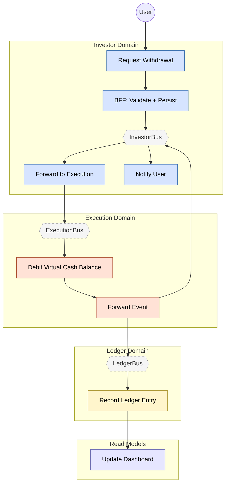

# Feature #3 — Withdrawal (Happy Path)

A withdrawal request flows from the Investor domain into Execution, where broker-adpt debits the virtual cash balance and emits WITHDRAWAL_COMPLETED via CDC. execution-adpt then fans the event to InvestorBus (notification) and LedgerBus (event-sourced recording and dashboard materialization).

**Trigger**: User requests a withdrawal via the investor-mfe.

---

## Flowchart

---

## Summary Table

| Step | Component | Domain | Input Event | Action | Output Event | Target Bus |
|------|-----------|--------|-------------|--------|-------------|------------|
| 1 | investor-bff | Investor | GraphQL `requestWithdrawal` | JS resolver validate + atomic DDB TransactWriteItems (debit CashBalance + insert Withdrawal) | WITHDRAWAL_REQUESTED (CDC) | InvestorBus |
| 2 | investor-adpt | Investor | WITHDRAWAL_REQUESTED | Cross-domain forward | WITHDRAWAL_REQUESTED | ExecutionBus |
| 3 | broker-adpt | Execution | WITHDRAWAL_REQUESTED | Idempotent virtual cash balance debit + write WithdrawalCompleted record | WITHDRAWAL_COMPLETED (CDC) | ExecutionBus |
| 4 | execution-adpt | Execution | WITHDRAWAL_COMPLETED | Cross-domain forward | WITHDRAWAL_COMPLETED | InvestorBus + LedgerBus |
| 5 | investor-ctrl | Investor | WITHDRAWAL_COMPLETED | Create email notification "Withdrawal Completed" | NOTIFICATION_CREATED | InvestorBus |
| 6 | ledger-ctrl | Ledger | WITHDRAWAL_COMPLETED | Append event-sourced entry, debit cash | LEDGER_ENTRY_RECORDED | LedgerBus |
| 7 | dashboard-bff | Read Model | BALANCE_UPDATED | Update materialized view (cash, activity) | _(terminal)_ | — |
