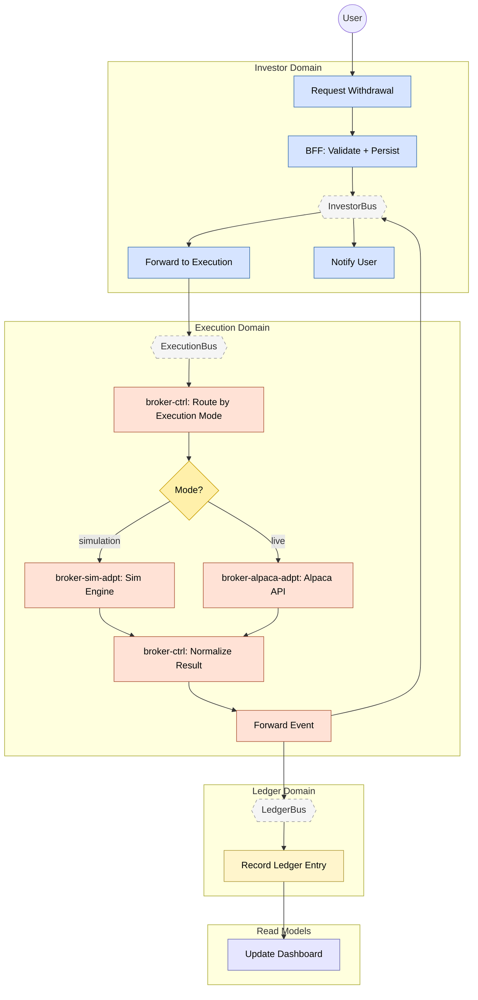

> **Deprecated:** This document has been superseded by `flows/withdrawal.flow.yaml` and the agent documentation system. See `docs/agent-system.md` for details.

# Feature #3 — Withdrawal (Happy Path)

A withdrawal request flows from the Investor domain into Execution, where `broker-ctrl` routes it based on the tenant's **execution mode** — either to the simulation engine (`broker-sim-adpt`) or to the live broker (`broker-alpaca-adpt`). Both paths normalize back to a common `NormalizedEvent` via `deposit-withdrawal-normalizer`. execution-adpt then fans the event to InvestorBus (notification) and LedgerBus (event-sourced recording and dashboard materialization).

**Trigger**: User requests a withdrawal via the investor-mfe.

---

## Flowchart

---

## Execution Mode Routing (broker-ctrl)

`broker-ctrl/deposit-withdrawal-router` reads the tenant's execution mode from DDB (`ExecutionMode#${tenantId}`) and emits a mode-specific event:

| Execution Mode | Routed Event | Adapter | Direction Field |
|---------------|-------------|---------|-----------------|
| `simulation` | `SIM_WITHDRAWAL_REQUESTED` | broker-sim-adpt | `OUTGOING` |
| `live` | `ALPACA_TRANSFER_REQUESTED` | broker-alpaca-adpt | `OUTGOING` |

Each adapter processes the withdrawal and emits a completion event:

| Adapter Path | Completion Event |
|-------------|-----------------|
| Simulation | `SIM_WITHDRAWAL_COMPLETED` |
| Live (Alpaca) | `ALPACA_TRANSFER_COMPLETED` (or `ALPACA_TRANSFER_FAILED`) |

`broker-ctrl/deposit-withdrawal-normalizer` materializes both completion paths into a common `NormalizedEvent` record (DDB key: `NormalizedEvent#${tenantId}#${withdrawalId}`, sk: `WITHDRAWAL_COMPLETED`), tagged with the `executionMode` that was used. This normalized record triggers CDC emission of `WITHDRAWAL_COMPLETED`, which downstream services consume identically regardless of execution mode.

---

## Summary Table

| Step | Component | Domain | Input Event | Action | Output Event | Target Bus |
|------|-----------|--------|-------------|--------|-------------|------------|
| 1 | investor-bff | Investor | GraphQL `requestWithdrawal` | JS resolver validate + atomic DDB TransactWriteItems (debit CashBalance + insert Withdrawal) | WITHDRAWAL_REQUESTED (CDC) | InvestorBus |
| 2 | investor-adpt | Investor | WITHDRAWAL_REQUESTED | Cross-domain forward | WITHDRAWAL_REQUESTED | ExecutionBus |
| 3 | broker-ctrl | Execution | WITHDRAWAL_REQUESTED | Read execution mode, route withdrawal | SIM_WITHDRAWAL_REQUESTED or ALPACA_TRANSFER_REQUESTED | ExecutionBus |
| 4a | broker-sim-adpt | Execution | SIM_WITHDRAWAL_REQUESTED | Simulation engine debits balance | SIM_WITHDRAWAL_COMPLETED | ExecutionBus |
| 4b | broker-alpaca-adpt | Execution | ALPACA_TRANSFER_REQUESTED | Alpaca API transfer (direction=OUTGOING) | ALPACA_TRANSFER_COMPLETED or ALPACA_TRANSFER_FAILED | ExecutionBus |
| 5 | broker-ctrl | Execution | SIM_WITHDRAWAL_COMPLETED / ALPACA_TRANSFER_COMPLETED | Normalize to NormalizedEvent (WITHDRAWAL_COMPLETED) | WITHDRAWAL_COMPLETED (CDC) | ExecutionBus |
| 6 | execution-adpt | Execution | WITHDRAWAL_COMPLETED | Cross-domain forward | WITHDRAWAL_COMPLETED | InvestorBus + LedgerBus |
| 7 | investor-ctrl | Investor | WITHDRAWAL_COMPLETED | Create email notification "Withdrawal Completed" | NOTIFICATION_CREATED | InvestorBus |
| 8 | ledger-ctrl | Ledger | WITHDRAWAL_COMPLETED | Append event-sourced entry, debit cash | LEDGER_ENTRY_RECORDED | LedgerBus |
| 9 | dashboard-bff | Read Model | BALANCE_UPDATED | Update materialized view (cash, activity) | _(terminal)_ | — |
