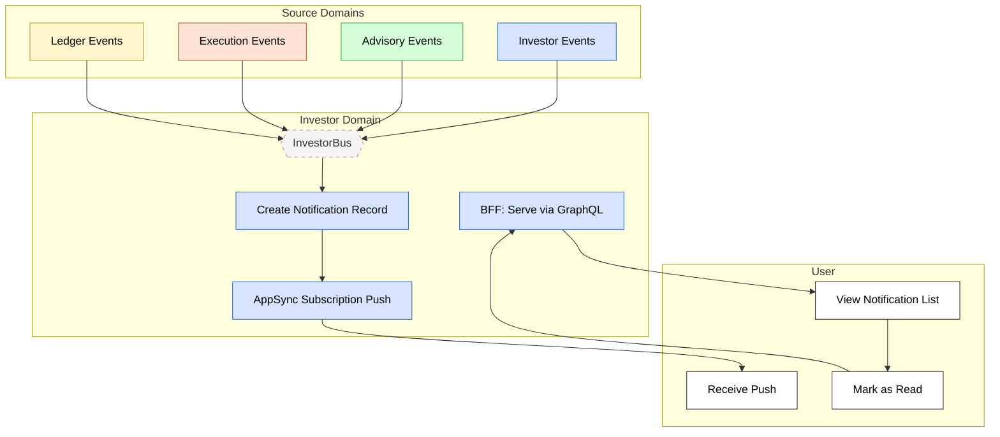

# Feature #4 — Notification Delivery (Happy Path)

Notifications are a cross-cutting concern handled entirely within the Investor domain. investor-ctrl listens for 11 events from all domains (onboarding, goals, deposits, withdrawals, operating mode, decisions, order fills/rejections, balance updates) and creates notification records in DynamoDB. investor-bff serves them via GraphQL queries and pushes real-time updates through AppSync subscriptions.

**Trigger**: A domain event occurs that requires user notification.

---

## Flowchart

---

## Summary Table

| Step | Component | Domain | Input Event | Action | Output Event | Target Bus |
|------|-----------|--------|-------------|--------|-------------|------------|
| 1 | investor-ctrl | Investor | ONBOARDING_COMPLETED | Create notification "Welcome to Nestfolio" (email) | NOTIFICATION_CREATED | InvestorBus |
| 1 | investor-ctrl | Investor | MANDATE_GRANTED | Create notification "Investment Mandate Activated" (push) | NOTIFICATION_CREATED | InvestorBus |
| 1 | investor-ctrl | Investor | GOAL_UPDATED | Create notification "Goal Updated" (push) | NOTIFICATION_CREATED | InvestorBus |
| 1 | investor-ctrl | Investor | DEPOSIT_INITIATED | Create notification "Deposit Received" (push) | NOTIFICATION_CREATED | InvestorBus |
| 1 | investor-ctrl | Investor | OPERATING_MODE_CHANGED | Create notification "Operating Mode Changed" (push) | NOTIFICATION_CREATED | InvestorBus |
| 1 | investor-ctrl | Investor | DECISION_APPROVED | Create notification "Investment Decision Approved" (push) | NOTIFICATION_CREATED | InvestorBus |
| 1 | investor-ctrl | Investor | DECISION_BLOCKED | Create notification "Decision Blocked" (push) | NOTIFICATION_CREATED | InvestorBus |
| 1 | investor-ctrl | Investor | ORDER_FILLED | Create notification "Order Executed" (email) | NOTIFICATION_CREATED | InvestorBus |
| 1 | investor-ctrl | Investor | ORDER_REJECTED | Create notification "Order Rejected" (push) | NOTIFICATION_CREATED | InvestorBus |
| 1 | investor-ctrl | Investor | WITHDRAWAL_COMPLETED | Create notification "Withdrawal Completed" (email) | NOTIFICATION_CREATED | InvestorBus |
| 1 | investor-ctrl | Investor | BALANCE_UPDATED | Create notification (default template, push) | NOTIFICATION_CREATED | InvestorBus |
| 2 | investor-bff | Investor | GraphQL `getNotifications` | Query paginated notifications from DDB | _(response)_ | — |
| 3 | investor-bff | Investor | AppSync subscription `onNotification` | Real-time push to connected clients | _(websocket)_ | — |
| 4 | investor-bff | Investor | GraphQL `markNotificationRead` | Update status to READ | NOTIFICATION_READ (CDC) | InvestorBus |
