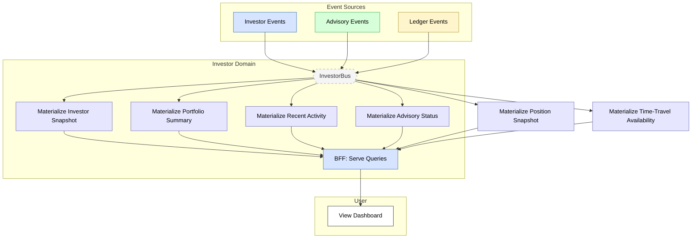

# Feature #5 — Portfolio Dashboard (Happy Path)

**Trigger**: User opens the dashboard-mfe to view portfolio status.

---

## Flowchart

---

## Summary Table

| Step | Component | Domain | Input Event | Action | Output Event | Target Bus |
|------|-----------|--------|-------------|--------|-------------|------------|
| 1 | dashboard-bff | Investor | ONBOARDING_COMPLETED, GOAL_SET, RISK_PROFILE_SET | Materialize investor snapshot | _(terminal)_ | — |
| 2 | dashboard-bff | Investor | BALANCE_UPDATED, PORTFOLIO_UPDATED, RECONCILIATION_COMPLETED | Materialize portfolio summary | _(terminal)_ | — |
| 3 | dashboard-bff | Investor | BALANCE_UPDATED, PORTFOLIO_UPDATED, DECISION_APPROVED | Materialize recent activity | _(terminal)_ | — |
| 4 | dashboard-bff | Investor | DECISION_PACKET_CREATED, DECISION_APPROVED, DECISION_BLOCKED | Materialize advisory status | _(terminal)_ | — |
| 5 | dashboard-bff | Investor | PORTFOLIO_UPDATED | Materialize position snapshot | _(terminal)_ | — |
| 6 | dashboard-bff | Investor | LEDGER_ENTRY_RECORDED | Materialize time-travel availability | _(terminal)_ | — |
| 7 | dashboard-bff | Investor | GraphQL queries | Serve materialized views to dashboard-mfe | _(response)_ | — |

**Feed events cross-domain sources:**

| Materialized View | Source Events | Original Domain |
|-------------------|--------------|-----------------|
| investorSnapshot | ONBOARDING_COMPLETED, GOAL_SET, GOAL_UPDATED, RISK_PROFILE_SET, RISK_PROFILE_UPDATED | Investor (local) |
| portfolioSummary | BALANCE_UPDATED, PORTFOLIO_UPDATED, RECONCILIATION_COMPLETED | Ledger (via ledger-adpt) |
| recentActivity | BALANCE_UPDATED, PORTFOLIO_UPDATED, DECISION_APPROVED, DECISION_BLOCKED | Ledger + Advisory (via adapters) |
| advisoryStatus | DECISION_PACKET_CREATED, USER_CONFIRMATION_REQUESTED, DECISION_APPROVED, DECISION_BLOCKED | Advisory (via advisory-adpt) |
| positionSnapshot | PORTFOLIO_UPDATED | Ledger (via ledger-adpt) |
| timeTravelAvailability | LEDGER_ENTRY_RECORDED | Ledger (via ledger-adpt) |
