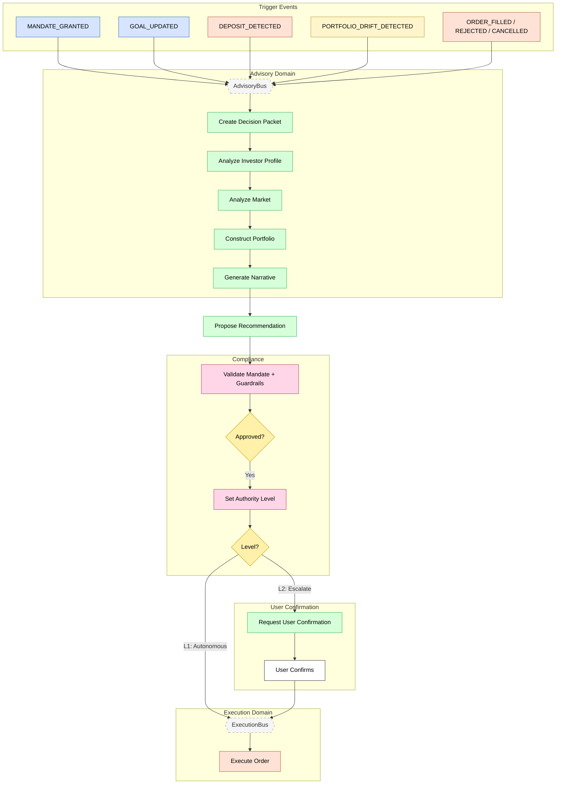

# Feature #6 — Advisory Decision Cycle (Happy Path)

**Trigger**: One of 9 domain events triggers the advisory decision lifecycle.

---

## Flowchart

---

## Summary Table

| Step | Component | Domain | Input Event | Action | Output Event | Target Bus |
|------|-----------|--------|-------------|--------|-------------|------------|
| 1 | advisory-ctrl | Advisory | Trigger event (1 of 9) | Create decision packet (idempotent) | DECISION_PACKET_CREATED | AdvisoryBus |
| 2 | advisory-ctrl | Advisory | DECISION_PACKET_CREATED | Analyze investor profile agent (Haiku) | INVESTOR_PROFILE_ANALYZED | AdvisoryBus |
| 3 | advisory-ctrl | Advisory | INVESTOR_PROFILE_ANALYZED | Analyze market agent (Haiku) | MARKET_ANALYZED | AdvisoryBus |
| 4 | advisory-ctrl | Advisory | MARKET_ANALYZED | Construct portfolio agent (Sonnet) | PORTFOLIO_CONSTRUCTED | AdvisoryBus |
| 5 | advisory-ctrl | Advisory | PORTFOLIO_CONSTRUCTED | Generate narrative agent (Haiku) | NARRATIVE_GENERATED | AdvisoryBus |
| 6 | advisory-ctrl | Advisory | NARRATIVE_GENERATED | Propose recommendation | RECOMMENDATION_PROPOSED | AdvisoryBus |
| 7 | compliance-ctrl | Advisory | DECISION_PACKET_CREATED / DECISION_PACKET_ENRICHED | Validate mandate, guardrails, suitability | DECISION_APPROVED or DECISION_BLOCKED | AdvisoryBus |
| 8a | advisory-ctrl | Advisory | DECISION_APPROVED (L1) | Auto-approve, forward to execution | DECISION_APPROVED | ExecutionBus |
| 8b | advisory-ctrl | Advisory | DECISION_APPROVED (L2) | Request user confirmation | USER_CONFIRMATION_REQUESTED | AdvisoryBus |
| 9 | advisory-bff | Advisory | GraphQL `confirmDecision` | User confirms recommendation | USER_CONFIRMED | AdvisoryBus |
| 10 | advisory-adpt | Advisory | DECISION_APPROVED / USER_CONFIRMED | Cross-domain forward | Same events | ExecutionBus |

**Trigger events (9 total):**

| Event | Source Domain |
|-------|-------------|
| MANDATE_GRANTED | Investor |
| GOAL_UPDATED | Investor |
| RISK_PROFILE_UPDATED | Investor |
| OPERATING_MODE_CHANGED | Investor |
| DEPOSIT_DETECTED | Execution |
| ORDER_FILLED | Execution |
| ORDER_REJECTED | Execution |
| ORDER_CANCELLED | Execution |
| PORTFOLIO_DRIFT_DETECTED | Ledger |

**Agent tier escalation**: Haiku → Sonnet → Opus (on failure/insufficient quality).
