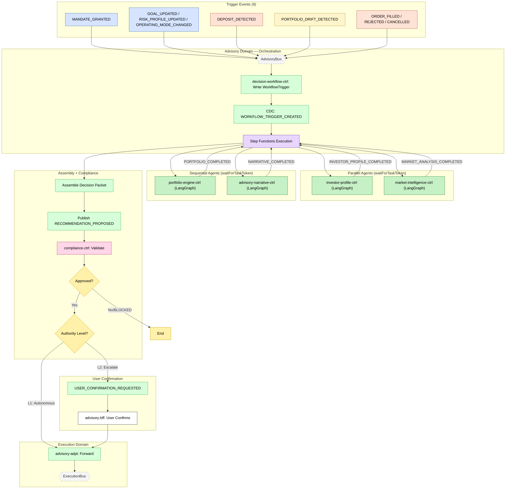

> **Deprecated:** This document has been superseded by `flows/advisory-cycle.flow.yaml` and the agent documentation system. See `docs/agent-system.md` for details.

# Feature #6 — Advisory Decision Cycle (Happy Path)

The advisory decision cycle is the core AI-driven workflow, orchestrated by decision-workflow-ctrl via AWS Step Functions. Any of 9 trigger events writes a WorkflowTrigger record whose CDC starts a state machine execution. The state machine invokes 4 LangGraph agents — investor-profile-ctrl and market-intelligence-ctrl in parallel, then portfolio-engine-ctrl, then advisory-narrative-ctrl sequentially — using EventBridge `waitForTaskToken` callbacks. Each agent reads/writes to a shared AgentCore Memory session. After narrative generation, the assembled recommendation is published and compliance-ctrl validates it (mandate, guardrails, suitability), resolving authority level L1 (autonomous) or L2 (user confirmation). advisory-adpt forwards approved decisions to ExecutionBus.

**Trigger**: One of 9 domain events triggers the advisory decision lifecycle.

---

## Flowchart

---

## Summary Table

| Step | Component | Domain | Input Event | Action | Output Event | Target Bus |
|------|-----------|--------|-------------|--------|-------------|------------|
| 1 | decision-workflow-ctrl | Advisory | Trigger event (1 of 9) | Write WorkflowTrigger record to DDB | WORKFLOW_TRIGGER_CREATED (CDC) | AdvisoryBus |
| 2 | Step Functions | Advisory | WORKFLOW_TRIGGER_CREATED | Start state machine execution | ANALYZE_INVESTOR_PROFILE + ANALYZE_MARKET (parallel, waitForTaskToken) | AdvisoryBus |
| 3a | investor-profile-ctrl | Advisory | ANALYZE_INVESTOR_PROFILE | LangGraph agent: analyze profile, read/write AgentCore Memory | INVESTOR_PROFILE_COMPLETED (SendTaskSuccess) | AdvisoryBus |
| 3b | market-intelligence-ctrl | Advisory | ANALYZE_MARKET | LangGraph agent: analyze market signals + data feeds, read/write Memory | MARKET_ANALYSIS_COMPLETED (SendTaskSuccess) | AdvisoryBus |
| 4 | portfolio-engine-ctrl | Advisory | CONSTRUCT_PORTFOLIO (after 3a+3b) | LangGraph agent: construct portfolio using upstream agent outputs from Memory | PORTFOLIO_COMPLETED (SendTaskSuccess) | AdvisoryBus |
| 5 | advisory-narrative-ctrl | Advisory | GENERATE_NARRATIVE (after 4) | LangGraph agent: generate investor narrative using all upstream outputs | NARRATIVE_COMPLETED (SendTaskSuccess) | AdvisoryBus |
| 6 | decision-workflow-ctrl | Advisory | All agents completed | Assemble decision packet from AgentCore Memory, publish recommendation | RECOMMENDATION_PROPOSED | AdvisoryBus |
| 7 | compliance-ctrl | Advisory | DECISION_PACKET_CREATED / DECISION_PACKET_ENRICHED | MandateValidator → GuardrailEvaluator → SuitabilityChecker → AuthorityResolver | DECISION_APPROVED or DECISION_BLOCKED | AdvisoryBus |
| 8a | decision-workflow-ctrl | Advisory | DECISION_APPROVED (L1) | State machine ends — autonomous execution | _(terminal)_ | — |
| 8b | decision-workflow-ctrl | Advisory | DECISION_APPROVED (L2) | Request user confirmation (72h timeout) | USER_CONFIRMATION_REQUESTED | AdvisoryBus |
| 9 | advisory-bff | Advisory | GraphQL `confirmDecision` | User confirms recommendation | USER_CONFIRMED (CDC) | AdvisoryBus |
| 10 | advisory-adpt | Advisory | DECISION_APPROVED / USER_CONFIRMED | Cross-domain forward | Same events | ExecutionBus |

**Trigger events (9 total):**

| Event | Source Domain |
|-------|-------------|
| MANDATE_GRANTED | Investor |
| GOAL_UPDATED | Investor |
| RISK_PROFILE_UPDATED | Investor |
| OPERATING_MODE_CHANGED | Investor |
| DEPOSIT_DETECTED | Execution |
| ORDER_FILLED | Execution |
| ORDER_REJECTED | Execution |
| ORDER_CANCELLED | Execution |
| PORTFOLIO_DRIFT_DETECTED | Ledger |

**Agent invocation pattern**: Step Functions publishes event with embedded `$.Task.Token` → agent service processes → callback Lambda calls `SendTaskSuccess` to resume state machine.

**Memory sharing**: All 4 agents read/write to a shared AgentCore Memory session keyed by `tenantId + decisionId`. Sequential agents read upstream outputs from Memory.

**Agent tier escalation**: Haiku → Sonnet → Opus (on failure/insufficient quality).

**Compliance events**: compliance-ctrl also emits `GUARDRAIL_VIOLATION_DETECTED`, `ESCALATION_TRIGGERED`, `AUDIT_ARTIFACT_CREATED` for traceability.
