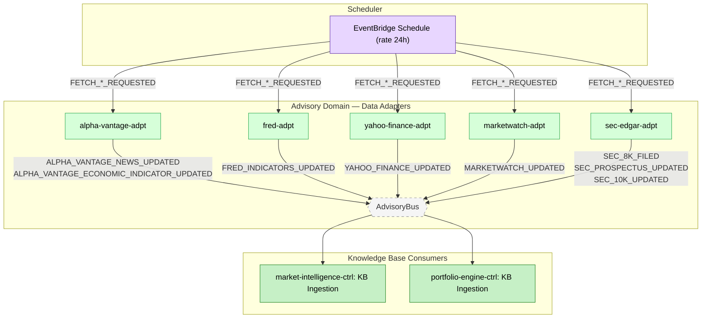

# Feature #7 — Market Data Ingestion (Happy Path)

Market data ingestion is a scheduled, multi-source pipeline within the Advisory domain. Five specialized adapters fetch external data daily, persist to DynamoDB, and publish CDC events on AdvisoryBus. These events are consumed by two agent services: market-intelligence-ctrl ingests news and economic feeds into its knowledge base, while portfolio-engine-ctrl ingests SEC filings (prospectuses, 10-K/10-Q). Both agents use this data as context during decision cycle invocations (Feature #6).

**Trigger**: EventBridge Scheduler invokes each adapter on a 24-hour cycle.

---

## Flowchart

---

## Summary Table

| Step | Component | Domain | Input Event | Action | Output Event | Target Bus |
|------|-----------|--------|-------------|--------|-------------|------------|
| 1 | EventBridge Scheduler | — | Cron (rate 24h) | Invoke fetch-trigger Lambda per adapter | FETCH_*_REQUESTED | AdvisoryBus |
| 2a | alpha-vantage-adpt | Advisory | FETCH_ALPHA_VANTAGE_REQUESTED | Fetch news sentiment (VTI, BND, QQQ, SPY) + 5 economic indicators (GDP, CPI, treasury, fed funds, unemployment) | ALPHA_VANTAGE_NEWS_UPDATED, ALPHA_VANTAGE_ECONOMIC_INDICATOR_UPDATED (CDC) | AdvisoryBus |
| 2b | fred-adpt | Advisory | FETCH_FRED_REQUESTED | Fetch 11 economic series (FEDFUNDS, CPIAUCSL, DGS10, VIXCLS, SP500, UNRATE, etc.) | FRED_INDICATORS_UPDATED (CDC) | AdvisoryBus |
| 2c | yahoo-finance-adpt | Advisory | FETCH_YAHOO_FINANCE_REQUESTED | Fetch RSS feeds for tracked tickers (VTI, BND, QQQ, VTIP, SPY) | YAHOO_FINANCE_UPDATED (CDC) | AdvisoryBus |
| 2d | marketwatch-adpt | Advisory | FETCH_MARKETWATCH_REQUESTED | Fetch 2 RSS feeds (topstories, marketpulse) | MARKETWATCH_UPDATED (CDC) | AdvisoryBus |
| 2e | sec-edgar-adpt | Advisory | FETCH_SEC_EDGAR_REQUESTED | Fetch SEC filings (8-K, 485BPOS, N-1A, 10-K, 10-Q) for tracked CIKs | SEC_8K_FILED, SEC_PROSPECTUS_UPDATED, SEC_10K_UPDATED (CDC, form-type routing) | AdvisoryBus |
| 3a | market-intelligence-ctrl | Advisory | YAHOO_FINANCE_UPDATED, MARKETWATCH_UPDATED, SEC_8K_FILED, FRED_INDICATORS_UPDATED, ALPHA_VANTAGE_NEWS_UPDATED | KB ingestion handler — index into agent knowledge base | _(consumed internally)_ | — |
| 3b | portfolio-engine-ctrl | Advisory | SEC_PROSPECTUS_UPDATED, SEC_10K_UPDATED | KB ingestion handler — index SEC filings for portfolio context | _(consumed internally)_ | — |

**Note**: Each adapter follows the 5-construct CDC pattern (Ingress → Lambda → DDB persist → DDB Stream → Egress CDC). All adapters use `AdapterSchedule` with configurable `enabled`/`rate` props.
