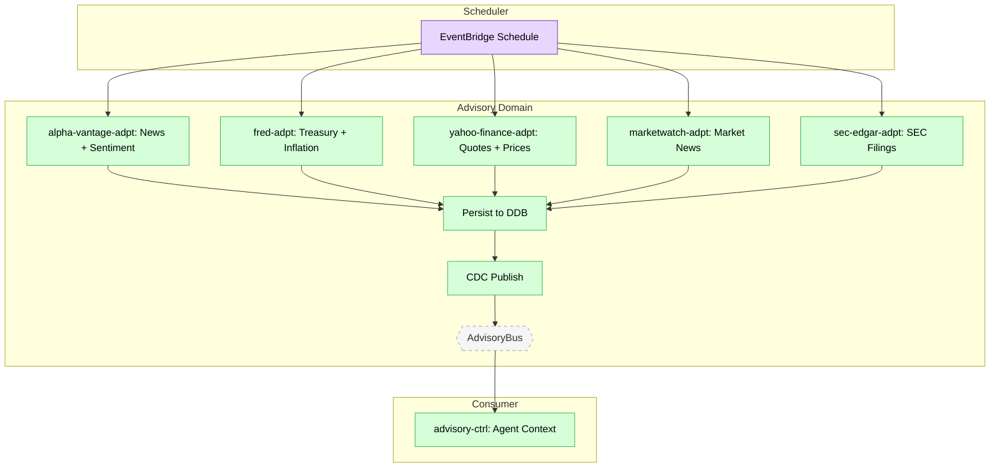

# Feature #7 — Market Data Ingestion (Happy Path)

**Trigger**: EventBridge Scheduler invokes each adapter on a 24-hour cycle.

---

## Flowchart

---

## Summary Table

| Step | Component | Domain | Input Event | Action | Output Event | Target Bus |
|------|-----------|--------|-------------|--------|-------------|------------|
| 1 | EventBridge Scheduler | — | Cron (rate 24h) | Invoke fetch-trigger Lambda per adapter | Service-specific FETCH_*_REQUESTED | AdvisoryBus |
| 2 | alpha-vantage-adpt | Advisory | FETCH_ALPHA_VANTAGE_REQUESTED | Fetch news + economic indicators from Alpha Vantage API | _(DDB persist)_ | — |
| 2 | fred-adpt | Advisory | FETCH_FRED_REQUESTED | Fetch treasury yields + inflation from FRED API | _(DDB persist)_ | — |
| 2 | yahoo-finance-adpt | Advisory | FETCH_YAHOO_FINANCE_REQUESTED | Fetch quotes + price history from Yahoo Finance | _(DDB persist)_ | — |
| 2 | marketwatch-adpt | Advisory | FETCH_MARKETWATCH_REQUESTED | Fetch market news from MarketWatch | _(DDB persist)_ | — |
| 2 | sec-edgar-adpt | Advisory | FETCH_SEC_EDGAR_REQUESTED | Fetch SEC filings from EDGAR | _(DDB persist)_ | — |
| 3 | Each adapter | Advisory | DDB Stream CDC | Publish materialized data events | MARKET_DATA_* events | AdvisoryBus |
| 4 | advisory-ctrl | Advisory | Market data events | Use as context for agent invocations (knowledge base) | _(consumed internally)_ | — |
