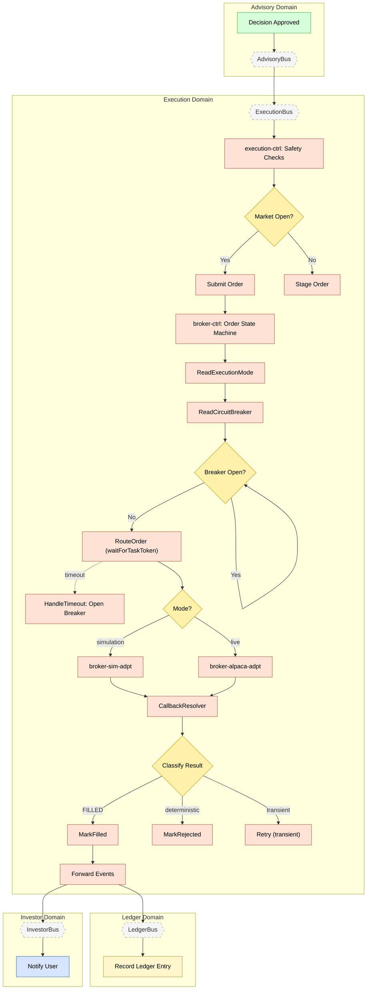

> **Deprecated:** This document has been superseded by `flows/order-execution.flow.yaml` and the agent documentation system. See `docs/agent-system.md` for details.

# Feature #8 — Order Execution (Happy Path)

Order execution bridges the Advisory and Execution domains. Once a decision is approved, execution-ctrl runs safety checks and evaluates market hours — submitting the order immediately or staging it for the next open. The order then enters the `broker-ctrl` **Order State Machine** (Step Functions), which reads the tenant's **execution mode**, checks the **circuit breaker**, and routes to either the simulation engine or Alpaca. A callback-based pattern (`waitForTaskToken`) pauses the state machine until the adapter reports a fill, rejection, or timeout.

**Trigger**: Advisory decision approved (L1 autonomous or L2 user-confirmed).

---

## Flowchart

---

## Order State Machine (broker-ctrl)

The order lifecycle is managed by a Step Functions state machine defined in `broker-ctrl/state-machine/order-state-machine.ts`.

### State Machine Flow

1. **ReadExecutionMode** — DDB GetItem (`ExecutionMode#${tenantId}`) to determine `simulation` or `live`.
2. **ReadCircuitBreaker** — DDB GetItem (`CircuitBreaker#${tenantId}#${symbol}`) to check breaker state.
3. **IsCircuitBreakerOpen** — If `OPEN`, enters a 30-second **BreakerWait** loop, re-reading breaker until it closes.
4. **RouteOrder** — Lambda `invoke.waitForTaskToken` calls `route-order` handler. The handler:
   - Writes a `BrokerOrder` record with the task token, execution mode, and `routedTo` (`sim` or `alpaca`).
   - Emits `SIM_ORDER_REQUESTED` (simulation) or `ALPACA_ORDER_REQUESTED` (live) to ExecutionBus.
   - The state machine pauses (up to 300s timeout) waiting for the adapter callback.
5. **ClassifyResult** — When `callback-resolver` sends `SendTaskSuccess`, the state machine classifies the result:

| Result | Next State | Description |
|--------|-----------|-------------|
| `FILLED` | MarkFilled | Parallel: update BrokerOrder to FILLED + write NormalizedEvent (ORDER_FILLED) |
| `PARTIALLY_FILLED` | MarkPartialFill | Update BrokerOrder, then re-enter waitForTaskToken for more fills (15-min timeout) |
| `transient` failure | CheckRetryCount | Up to 3 retries with exponential backoff (5s, 15s, 45s) |
| `deterministic` failure | MarkRejected | Parallel: update BrokerOrder to REJECTED + write NormalizedEvent (ORDER_REJECTED) |
| Timeout | HandleTimeout | Parallel: open circuit breaker + escalate order + write NormalizedEvent (ORDER_ESCALATED) + emit BROKER_CIRCUIT_OPEN |

### Callback Resolution (callback-resolver)

`broker-ctrl/callback-resolver` receives adapter result events via SQS and resolves the Step Functions task token:

**Failure classification** (`classifyFailure`):
- **none**: `SIM_ORDER_FILLED`, `ALPACA_ORDER_FILLED`, `ALPACA_ORDER_PARTIALLY_FILLED`, `ALPACA_ORDER_CANCELLED`
- **deterministic**: `SIM_ORDER_REJECTED`, `ALPACA_ORDER_REJECTED` (insufficient funds, halted, delisted, invalid), `ALPACA_TRANSFER_FAILED`
- **transient**: `ALPACA_ORDER_REJECTED` with timeout/5xx/rate-limit/unavailable patterns
- **ambiguous**: unrecognized event types

**Status mapping** (`mapEventToStatus`): `SIM_ORDER_FILLED`/`ALPACA_ORDER_FILLED` → `FILLED`, `*_REJECTED` → `REJECTED`, `ALPACA_ORDER_PARTIALLY_FILLED` → `PARTIALLY_FILLED`, `ALPACA_ORDER_CANCELLED` → `CANCELLED`.

---

## Summary Table

| Step | Component | Domain | Input Event | Action | Output Event | Target Bus |
|------|-----------|--------|-------------|--------|-------------|------------|
| 1 | advisory-adpt | Advisory | DECISION_APPROVED / USER_CONFIRMED | Cross-domain forward | Same events | ExecutionBus |
| 2 | execution-ctrl | Execution | DECISION_APPROVED | Run SafetyChecksService.runAllChecks() | _(internal)_ | — |
| 3a | execution-ctrl | Execution | Safety passed + market open | Create Order, submit immediately; function-based CDC mapping: INSERT status=SUBMITTED → ORDER_SUBMITTED | ORDER_SUBMITTED (CDC via customEventTypeMap) | ExecutionBus |
| 3b | execution-ctrl | Execution | Safety passed + market closed | Create Order + StagedOrder; function-based CDC mapping: INSERT status=STAGED → ORDER_STAGED | ORDER_STAGED (CDC via customEventTypeMap) | ExecutionBus |
| 4 | broker-ctrl SF | Execution | ORDER_SUBMITTED | Order State Machine: ReadExecutionMode → ReadCircuitBreaker → RouteOrder (waitForTaskToken) | SIM_ORDER_REQUESTED or ALPACA_ORDER_REQUESTED | ExecutionBus |
| 5a | broker-sim-adpt | Execution | SIM_ORDER_REQUESTED | Simulation engine processes trade | SIM_ORDER_FILLED or SIM_ORDER_REJECTED | ExecutionBus |
| 5b | broker-alpaca-adpt | Execution | ALPACA_ORDER_REQUESTED | Alpaca API submits order | ALPACA_ORDER_FILLED / ALPACA_ORDER_REJECTED / ALPACA_ORDER_PARTIALLY_FILLED | ExecutionBus |
| 6 | broker-ctrl | Execution | Adapter result event | callback-resolver: classify failure + SendTaskSuccess to SF | _(SF resumes)_ | — |
| 7 | broker-ctrl SF | Execution | SF ClassifyResult | MarkFilled: update BrokerOrder + write NormalizedEvent (ORDER_FILLED) | ORDER_FILLED (CDC) | ExecutionBus |
| 8 | execution-adpt | Execution | ORDER_FILLED | Cross-domain forward | ORDER_FILLED | LedgerBus + InvestorBus |
| 9 | ledger-ctrl | Ledger | ORDER_FILLED | Append event-sourced entry, update positions | LEDGER_ENTRY_RECORDED | LedgerBus |
| 10 | investor-ctrl | Investor | ORDER_FILLED | Create notification "Order Executed" (email) | NOTIFICATION_CREATED | InvestorBus |
