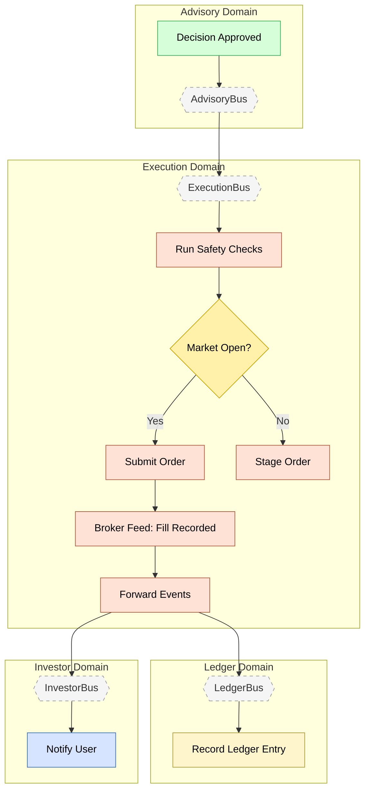

# Feature #8 — Order Execution (Happy Path)

**Trigger**: Advisory decision approved (L1 autonomous or L2 user-confirmed).

---

## Flowchart

---

## Summary Table

| Step | Component | Domain | Input Event | Action | Output Event | Target Bus |
|------|-----------|--------|-------------|--------|-------------|------------|
| 1 | advisory-adpt | Advisory | DECISION_APPROVED / USER_CONFIRMED | Cross-domain forward | Same events | ExecutionBus |
| 2 | execution-ctrl | Execution | DECISION_APPROVED | Run SafetyChecksService.runAllChecks() | _(internal)_ | — |
| 3a | execution-ctrl | Execution | Safety passed + market open | Create Order, submit immediately; function-based CDC mapping: INSERT status=SUBMITTED → ORDER_SUBMITTED | ORDER_SUBMITTED (CDC via customEventTypeMap) | ExecutionBus |
| 3b | execution-ctrl | Execution | Safety passed + market closed | Create Order + StagedOrder; function-based CDC mapping: INSERT status=STAGED → ORDER_STAGED | ORDER_STAGED (CDC via customEventTypeMap) | ExecutionBus |
| 4 | broker-adpt | Execution | ORDER_SUBMITTED | Simulation engine processes trades; emits DEPOSIT_DETECTED / WITHDRAWAL_COMPLETED via CDC (customEventTypeMap); broker feed records fill via CDC | ORDER_FILLED (CDC), DEPOSIT_DETECTED (CDC), WITHDRAWAL_COMPLETED (CDC) | ExecutionBus |
| 5 | execution-adpt | Execution | ORDER_FILLED | Cross-domain forward | ORDER_FILLED | LedgerBus + InvestorBus |
| 6 | ledger-ctrl | Ledger | ORDER_FILLED | Append event-sourced entry, update positions | LEDGER_ENTRY_RECORDED | LedgerBus |
| 7 | investor-ctrl | Investor | ORDER_FILLED | Create notification "Order Executed" (email) | NOTIFICATION_CREATED | InvestorBus |
