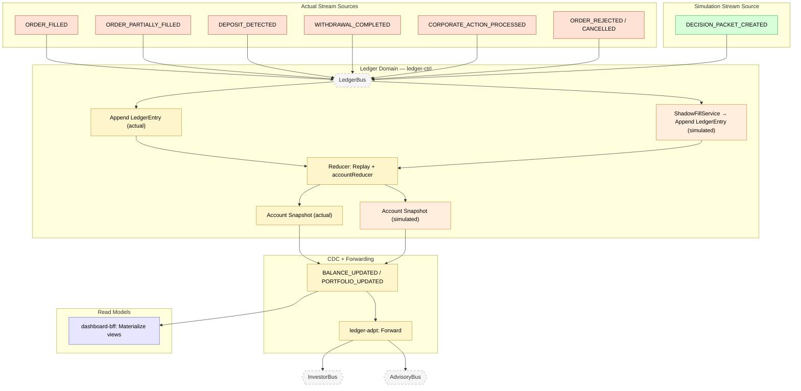

# Feature #9 — Order Ledger / Event Sourcing (Happy Path)

The order ledger is a dual-stream event-sourced engine in the Ledger domain. It maintains two parallel streams in a single DynamoDB table: the **actual stream** (real execution events — fills, deposits, withdrawals) and the **simulated stream** (synthetic fills generated by ShadowFillService from advisory decision packets). A DDB Stream-powered Reducer replays each stream independently through an `accountReducer`, rebuilding Account snapshots partitioned by `tenantId#streamType`. CDC publishes BALANCE_UPDATED and PORTFOLIO_UPDATED events that feed downstream read models and cross-domain forwarding via ledger-adpt.

**Trigger**: Execution domain events forwarded to ledger for append-only recording; advisory DECISION_PACKET_CREATED triggers simulation stream.

---

## Flowchart

---

## Summary Table

**Actual stream (execution events)**

| Step | Component | Domain | Input Event | Action | Output Event | Target Bus |
|------|-----------|--------|-------------|--------|-------------|------------|
| 1 | execution-adpt | Execution | ORDER_FILLED, DEPOSIT_DETECTED, etc. | Cross-domain forward | Same events | LedgerBus |
| 2 | ledger-ctrl | Ledger | Any execution event | Append LedgerEntry (streamType: `actual`, dedup by eventId) | LEDGER_ENTRY_RECORDED (CDC) | LedgerBus |
| 3 | ledger-ctrl (Reducer) | Ledger | DDB Stream INSERT (LedgerEntry) | Replay entries grouped by `tenantId#actual`, apply accountReducer | _(snapshot update)_ | — |
| 4 | ledger-ctrl | Ledger | Reducer output | Store Account snapshot (`Account#tenantId#actual#Snapshot#latest`) | BALANCE_UPDATED / PORTFOLIO_UPDATED (CDC) | LedgerBus |
| 5 | ledger-adpt | Ledger | BALANCE_UPDATED, PORTFOLIO_UPDATED, LEDGER_ENTRY_RECORDED | Cross-domain forward | Same events | InvestorBus + AdvisoryBus |
| 6 | dashboard-bff | Read Model | BALANCE_UPDATED, PORTFOLIO_UPDATED | Materialize portfolio views | _(terminal)_ | — |

**Simulated stream (shadow fills)**

| Step | Component | Domain | Input Event | Action | Output Event | Target Bus |
|------|-----------|--------|-------------|--------|-------------|------------|
| 1 | advisory-adpt | Advisory | DECISION_PACKET_CREATED | Cross-domain forward | DECISION_PACKET_CREATED | LedgerBus |
| 2 | ledger-ctrl | Ledger | DECISION_PACKET_CREATED | ShadowFillService: extract proposedTrades, simulate fills via CachedMarketDataProvider | Synthetic ORDER_FILLED entries | — |
| 3 | ledger-ctrl | Ledger | Synthetic events | Append LedgerEntry (streamType: `simulated`, eventId: `${id}-sim-${symbol}`) | LEDGER_ENTRY_RECORDED (CDC) | LedgerBus |
| 4 | ledger-ctrl (Reducer) | Ledger | DDB Stream INSERT | Replay entries grouped by `tenantId#simulated`, apply accountReducer | Account snapshot (`Account#tenantId#simulated#Snapshot#latest`) | — |

**Reducer operations by event type:**

| Event Type | Reducer Action |
|-----------|---------------|
| DEPOSIT_DETECTED | RecordDeposit — add to cashBalanceCents |
| WITHDRAWAL_COMPLETED | RecordWithdrawal — debit cashBalanceCents |
| ORDER_FILLED / ORDER_PARTIALLY_FILLED | RecordFill — update positions + cost basis |
| CORPORATE_ACTION_PROCESSED | RecordCorporateAction — stock split / dividend |
| ORDER_REJECTED / ORDER_CANCELLED | No-op (state unchanged) |

**Cross-domain forwarding (ledger-adpt):**

| Destination | Events |
|-------------|--------|
| InvestorBus | BALANCE_UPDATED, PORTFOLIO_UPDATED, LEDGER_ENTRY_RECORDED, RECONCILIATION_COMPLETED, RECONCILIATION_FAILED, LEDGER_PROCESSING_FAILED |
| AdvisoryBus | PORTFOLIO_UPDATED, PORTFOLIO_DRIFT_DETECTED, RECONCILIATION_FAILED |
