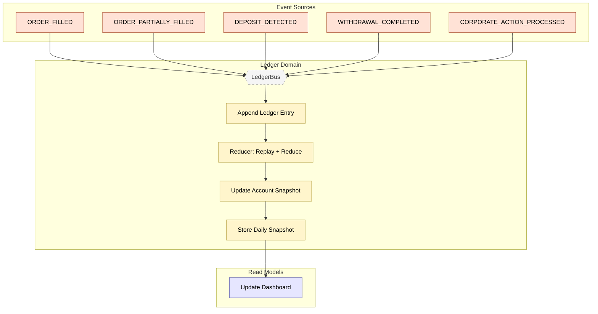

# Feature #9 — Order Ledger / Event Sourcing (Happy Path)

**Trigger**: Execution domain events are forwarded to the ledger for append-only recording.

---

## Flowchart

---

## Summary Table

| Step | Component | Domain | Input Event | Action | Output Event | Target Bus |
|------|-----------|--------|-------------|--------|-------------|------------|
| 1 | execution-adpt | Execution | ORDER_FILLED, DEPOSIT_DETECTED, etc. | Cross-domain forward | Same events | LedgerBus |
| 2 | ledger-ctrl | Ledger | Any execution event | Append LedgerEntry (streamType: actual, dedup by eventId) | LEDGER_ENTRY_RECORDED | LedgerBus |
| 3 | ledger-ctrl | Ledger | DDB Stream (Reducer) | Replay all entries, apply accountReducer | _(snapshot update)_ | — |
| 4 | ledger-ctrl | Ledger | Reducer output | Store daily Account snapshot | BALANCE_UPDATED / PORTFOLIO_UPDATED (CDC via customEventTypeMap) | LedgerBus |
| 5 | dashboard-bff | Read Model | BALANCE_UPDATED, PORTFOLIO_UPDATED | Update materialized portfolio views | _(terminal)_ | — |

**Reducer operations by event type:**

| Event Type | Reducer Action |
|-----------|---------------|
| DEPOSIT_DETECTED | RecordDeposit — add to cashBalanceCents |
| WITHDRAWAL_COMPLETED | RecordWithdrawal — debit cashBalanceCents |
| ORDER_FILLED / ORDER_PARTIALLY_FILLED | RecordFill — update positions + cost basis |
| CORPORATE_ACTION_PROCESSED | RecordCorporateAction — stock split / dividend |
| ORDER_REJECTED / ORDER_CANCELLED | No-op (state unchanged) |
