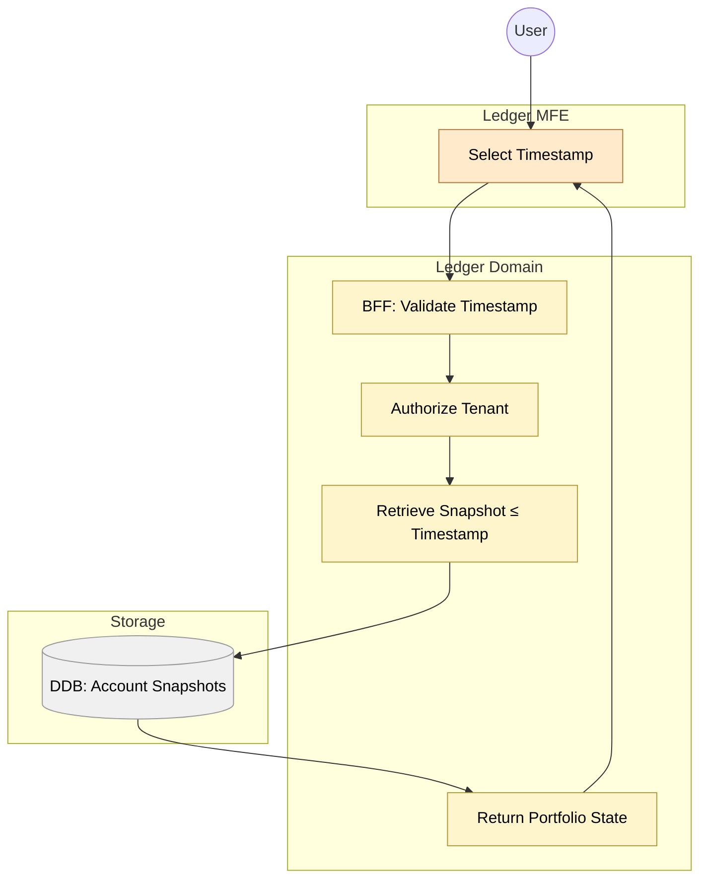

# Feature #10 — Time-Travel Query (Happy Path)

**Trigger**: User selects a past timestamp in the ledger-mfe time-travel UI.

---

## Flowchart

---

## Summary Table

| Step | Component | Domain | Input | Action | Output |
|------|-----------|--------|-------|--------|--------|
| 1 | ledger-mfe | Frontend | User picks timestamp on timeline slider | GraphQL query `getPortfolioAt(timestamp)` | _(request)_ |
| 2 | order-ledger-bff | Ledger | GraphQL query | Validate timestamp (TimestampSchema) | _(internal)_ |
| 3 | order-ledger-bff | Ledger | Validated timestamp | Authorize tenant from Cognito claims | _(internal)_ |
| 4 | order-ledger-bff | Ledger | tenantId + timestamp | Retrieve latest Account snapshot ≤ target timestamp | Portfolio state |
| 5 | ledger-mfe | Frontend | Portfolio state response | Render positions, cash balance, holdings at that point in time | _(UI render)_ |

**Note**: This is a synchronous query flow (no events). Portfolio snapshots are pre-computed daily by the ledger-ctrl reducer (see Feature #9).
