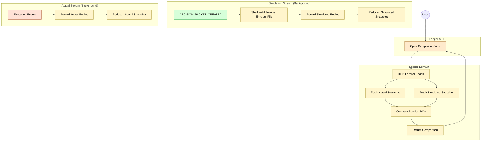

# Feature #11 — Simulation Comparison (Happy Path)

**Trigger**: User opens the comparison view in the ledger-mfe.

---

## Flowchart

---

## Summary Table

**Background: Simulation stream creation**

| Step | Component | Domain | Input Event | Action | Output |
|------|-----------|--------|-------------|--------|--------|
| 1 | ledger-ctrl | Ledger | DECISION_PACKET_CREATED | Extract proposed trades from decision packet | _(internal)_ |
| 2 | ShadowFillService | Ledger | Proposed trades | Simulate fill for each trade (synthetic price) | Synthetic ORDER_FILLED events |
| 3 | ledger-ctrl | Ledger | Synthetic events | Record entries with streamType: simulated | LEDGER_ENTRY_RECORDED |
| 4 | Reducer | Ledger | DDB Stream | Replay simulated stream, build Account snapshot | _(snapshot stored)_ |

**Foreground: Comparison query**

| Step | Component | Domain | Input | Action | Output |
|------|-----------|--------|-------|--------|--------|
| 1 | ledger-mfe | Frontend | User opens comparison view | GraphQL `getSimulationComparison` | _(request)_ |
| 2 | order-ledger-bff | Ledger | Query | Parallel reads (Promise.all): actual + simulated snapshots + positions | _(internal)_ |
| 3 | order-ledger-bff | Ledger | Both snapshots | Compute cashDeltaCents + positionDiffs by symbol | Comparison result |
| 4 | ledger-mfe | Frontend | Comparison response | Render divergence table (actual vs simulated) | _(UI render)_ |
