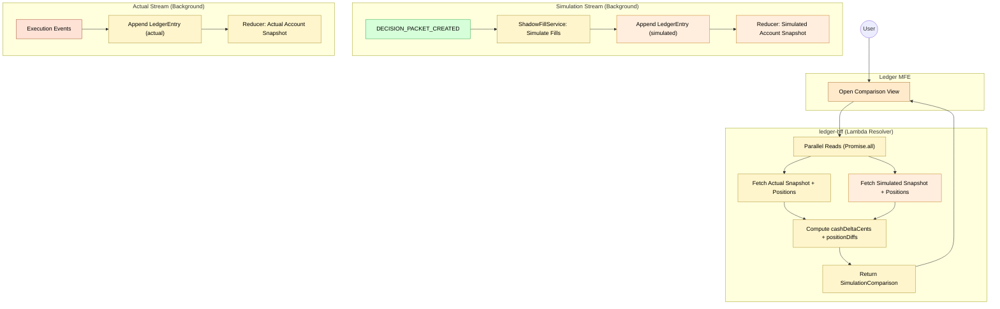

# Feature #11 — Simulation Comparison (Happy Path)

Simulation comparison answers "what if we had followed every advisory recommendation?". In the background, whenever a DECISION_PACKET_CREATED event arrives, ledger-ctrl's ShadowFillService extracts proposed trades and simulates fills at current market prices via CachedMarketDataProvider, recording them as `streamType: simulated` ledger entries with synthetic eventIds (`${id}-sim-${symbol}`). The Reducer builds a parallel Account snapshot from the simulated stream. On query, ledger-bff reads both actual and simulated snapshots + positions in parallel (Promise.all), computes cash delta and per-symbol position diffs, and returns the comparison to ledger-mfe.

**Trigger**: User opens the comparison view in the ledger-mfe.

---

## Flowchart

---

## Summary Table

**Background: Simulation stream creation**

| Step | Component | Domain | Input Event | Action | Output |
|------|-----------|--------|-------------|--------|--------|
| 1 | ledger-ctrl | Ledger | DECISION_PACKET_CREATED | ShadowFillService: extract proposedTrades from decision packet | _(internal)_ |
| 2 | ShadowFillService | Ledger | Proposed trades | Simulate fill per trade via CachedMarketDataProvider (synthetic price) | Synthetic ORDER_FILLED events (eventId: `${id}-sim-${symbol}`) |
| 3 | ledger-ctrl | Ledger | Synthetic events | Append LedgerEntry with streamType: `simulated` | LEDGER_ENTRY_RECORDED (CDC) |
| 4 | Reducer | Ledger | DDB Stream INSERT | Replay simulated stream (`tenantId#simulated`), build Account snapshot | Account snapshot stored |

**Foreground: Comparison query**

| Step | Component | Domain | Input | Action | Output |
|------|-----------|--------|-------|--------|--------|
| 1 | ledger-mfe | Frontend | User opens comparison view | GraphQL `getSimulationComparison` | _(request)_ |
| 2 | ledger-bff | Ledger | Query (Lambda resolver) | Promise.all: actual snapshot + simulated snapshot + actual positions + simulated positions | _(internal)_ |
| 3 | ledger-bff | Ledger | Both snapshots + positions | Compute `cashDeltaCents = simulated - actual`, `positionDiffs[]` per symbol (`quantityDiff = simulated - actual`) | SimulationComparison result |
| 4 | ledger-mfe | Frontend | Comparison response | Render divergence table (actual vs simulated) | _(UI render)_ |

**Note**: `getSimulationComparison` is a Lambda resolver (not JS pipeline) because it requires parallel DDB reads. See Feature #9 for dual-stream architecture.
