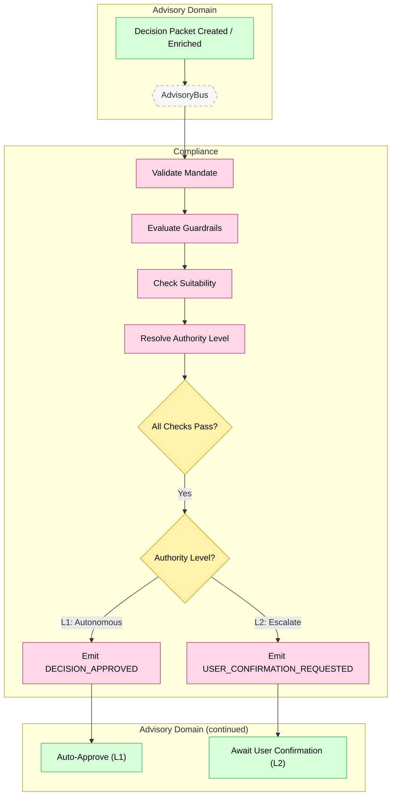

# Feature #12 — Compliance Check (Happy Path)

**Trigger**: Advisory decision packet is created or enriched, triggering compliance validation.

---

## Flowchart

---

## Summary Table

| Step | Component | Domain | Input Event | Action | Output Event | Target Bus |
|------|-----------|--------|-------------|--------|-------------|------------|
| 1 | compliance-ctrl | Advisory | DECISION_PACKET_CREATED / DECISION_PACKET_ENRICHED | Validate mandate (effective dates, type, revocation) | _(internal)_ | — |
| 2 | compliance-ctrl | Advisory | _(internal)_ | Evaluate guardrails (turnover cap, concentration limits) | _(internal)_ | — |
| 3 | compliance-ctrl | Advisory | _(internal)_ | Check suitability (risk profile alignment, asset restrictions) | _(internal)_ | — |
| 4 | compliance-ctrl | Advisory | _(internal)_ | Resolve authority level (L1=autonomous, L2=escalate) | _(internal)_ | — |
| 5a | compliance-ctrl | Advisory | All checks pass, L1 | Approve decision for autonomous execution | DECISION_APPROVED (L1) | AdvisoryBus |
| 5b | compliance-ctrl | Advisory | All checks pass, L2 | Approve but escalate to user | DECISION_APPROVED (L2) + USER_CONFIRMATION_REQUESTED | AdvisoryBus |
| 6 | compliance-ctrl | Advisory | Any check | Create audit artifact for traceability | AUDIT_ARTIFACT_CREATED | AdvisoryBus |

**Guardrail rules:**

| Rule | Description |
|------|------------|
| MandateValidator | Mandate type (ADVISORY/DISCRETIONARY), effective dates, revocation status |
| GuardrailEvaluator | Monthly turnover cap, max single trade %, concentration limits |
| SuitabilityChecker | Risk profile alignment, restricted asset classes |
| AuthorityResolver | L1 (autonomous, within mandate) vs L2 (needs user confirmation) |
