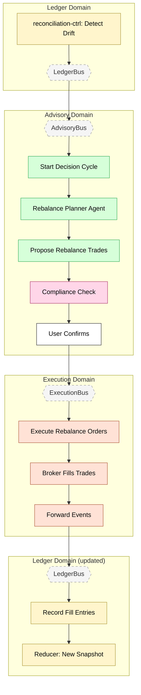

# Feature #13 — Portfolio Rebalancing (Happy Path)

Portfolio rebalancing is a composite flow that chains three existing features. It begins in the Ledger domain when reconciliation-ctrl detects drift between actual and target allocations. The drift event is forwarded to AdvisoryBus, triggering a full advisory decision cycle (Feature #6) with the rebalance planner agent. After compliance approval and optional user confirmation, the resulting trade orders flow through order execution (Feature #8) and back into the ledger (Feature #9) to rebuild the portfolio snapshot.

**Trigger**: Drift detected between actual and target portfolio allocations.

---

## Flowchart

---

## Summary Table

| Step | Component | Domain | Input Event | Action | Output Event | Target Bus |
|------|-----------|--------|-------------|--------|-------------|------------|
| 1 | reconciliation-ctrl | Ledger | Portfolio snapshot update | Compare intent vs settlement positions, detect drift | PORTFOLIO_DRIFT_DETECTED | LedgerBus |
| 2 | ledger-adpt | Ledger | PORTFOLIO_DRIFT_DETECTED | Cross-domain forward | PORTFOLIO_DRIFT_DETECTED | AdvisoryBus + ExecutionBus |
| 3 | advisory-ctrl | Advisory | PORTFOLIO_DRIFT_DETECTED | Trigger advisory decision cycle (1 of 9 triggers) | DECISION_PACKET_CREATED | AdvisoryBus |
| 4 | advisory-ctrl | Advisory | Decision packet | Invoke rebalance planner agent (Sonnet) | REBALANCE_PLAN_PRODUCED | AdvisoryBus |
| 5 | compliance-ctrl | Advisory | DECISION_PACKET_ENRICHED | Validate rebalance plan against guardrails | DECISION_APPROVED | AdvisoryBus |
| 6 | advisory-bff | Advisory | USER_CONFIRMATION_REQUESTED | User reviews and confirms rebalance trades | USER_CONFIRMED | AdvisoryBus |
| 7 | execution-ctrl | Execution | DECISION_APPROVED / USER_CONFIRMED | Create orders for each rebalance trade | ORDER_SUBMITTED | ExecutionBus |
| 8 | broker-adpt | Execution | ORDER_SUBMITTED | Simulation engine processes trades via CDC | ORDER_FILLED (per trade) | ExecutionBus |
| 9 | ledger-ctrl | Ledger | ORDER_FILLED (multiple) | Record each fill, rebuild portfolio snapshot | BALANCE_UPDATED, PORTFOLIO_UPDATED | LedgerBus |

**Note**: This flow composes Features #6 (advisory decision cycle), #8 (order execution), and #9 (order ledger). The drift detection is the unique entry point; the rest follows established patterns.
