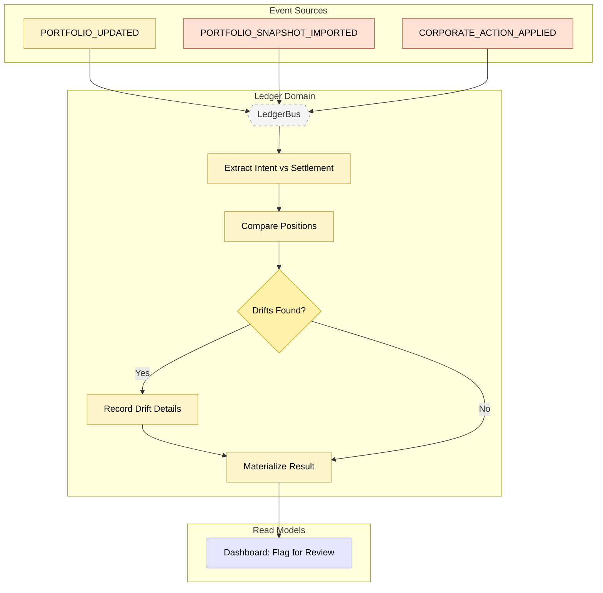

# Feature #14 — Reconciliation (Happy Path)

Reconciliation ensures consistency between intent (what the system thinks the portfolio looks like) and settlement (what the broker reports). When a portfolio update or broker snapshot arrives, reconciliation-ctrl extracts both position sets, compares them symbol by symbol, and records any drifts. The result is materialized as a RECONCILIATION_COMPLETED event — feeding the dashboard and potentially triggering portfolio rebalancing (Feature #13) if drift exceeds thresholds.

**Trigger**: Portfolio update or broker snapshot triggers reconciliation check.

---

## Flowchart

---

## Summary Table

| Step | Component | Domain | Input Event | Action | Output Event | Target Bus |
|------|-----------|--------|-------------|--------|-------------|------------|
| 1 | reconciliation-ctrl | Ledger | PORTFOLIO_UPDATED / PORTFOLIO_SNAPSHOT_IMPORTED | Extract intent positions + settlement positions | _(internal)_ | — |
| 2 | reconciliation-ctrl | Ledger | _(internal)_ | Compare intent vs settlement quantities per symbol | _(internal)_ | — |
| 3 | reconciliation-ctrl | Ledger | _(internal)_ | Record DriftRecords for each mismatch | _(DDB materialize)_ | — |
| 4 | reconciliation-ctrl | Ledger | _(internal)_ | Materialize ReconciliationResult (status, driftCount) | RECONCILIATION_COMPLETED | LedgerBus |
| 5 | dashboard-bff | Read Model | RECONCILIATION_COMPLETED | Update portfolio summary (flag if drifts found) | _(terminal)_ | — |

**Reconciliation storage:**

| Record Type | DDB Key | Content |
|------------|---------|---------|
| ReconciliationResult | `Reconciliation#${tenantId}#${id}` / `Reconciliation` | status, driftCount, timestamp |
| DriftRecord | `Reconciliation#${tenantId}#${id}` / `DriftRecord#${symbol}` | instrument, intentQty, settlementQty, drift |

---

## Execution Mode Impact

Reconciliation behavior depends on the tenant's **execution mode**:

- **Simulation mode**: Settlement positions come from the simulation engine's internal state (`broker-sim-adpt`). Since the sim engine is deterministic and instant, drifts in simulation mode typically indicate bugs rather than real market discrepancies.
- **Live mode**: Settlement positions come from real Alpaca account snapshots (`ALPACA_ACCOUNT_SNAPSHOT` events processed by `broker-ctrl/callback-resolver`). Live mode reconciliation may detect genuine drifts caused by partial fills, corporate actions, or timing differences between intent and settlement.

In both modes, the reconciliation logic and downstream flow (drift detection, dashboard flagging, potential rebalancing trigger) remain the same. The difference is solely in the source of settlement position data.
