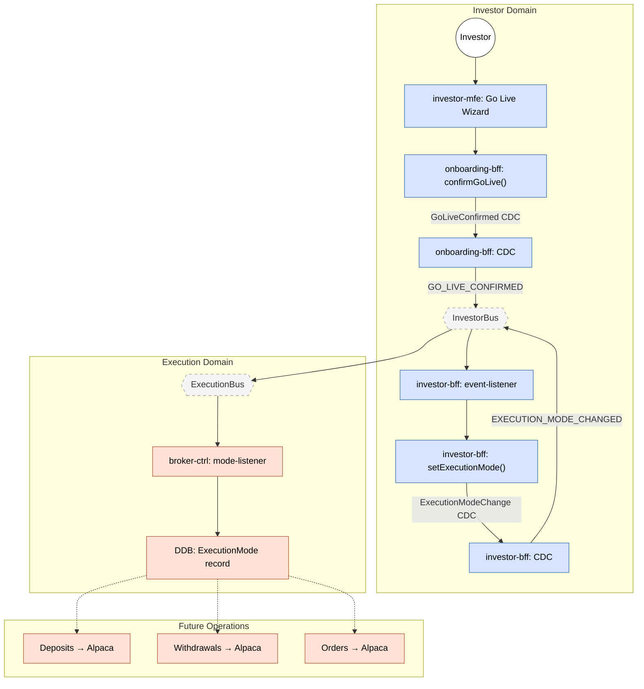

> **Deprecated:** This document has been superseded by `flows/go-live.flow.yaml` and the agent documentation system. See `docs/agent-system.md` for details.

# Feature #15 — Go Live Flow

The Go Live flow transitions a tenant from **simulation** to **live** execution mode. The investor completes a re-onboarding wizard in the investor-mfe, which triggers a cross-domain event chain: onboarding-bff writes a CDC record, investor-bff updates the profile's execution mode (producing its own CDC record), and broker-ctrl materializes the new mode for use in deposit/withdrawal/order routing.

**Trigger**: Investor completes the Go Live re-onboarding wizard in investor-mfe.

---

## Flowchart

---

## Step-by-Step Flow

### 1. Investor completes Go Live wizard (investor-mfe)

The investor-mfe presents a re-onboarding wizard for the "go-live" phase. On completion, the frontend calls the onboarding-bff to confirm the transition.

### 2. onboarding-bff writes GoLiveConfirmed CDC record

`onboarding-bff/repositories/onboarding.repository.ts` — `confirmGoLive()` executes a DDB TransactWrite:
- Updates the OnboardingSession status to `completed`, currentPhase to `go_live_confirmation`.
- Writes a `GoLiveConfirmed` CDC record (`pk: GoLiveConfirmed#${tenantId}`, `sk: GoLiveConfirmed#${timestamp}`).

### 3. onboarding-bff event-publisher emits GO_LIVE_CONFIRMED

`onboarding-bff/handlers/event-publisher.ts` uses `changeDataCapture` with the mapping `GoLiveConfirmed:INSERT → GO_LIVE_CONFIRMED`. The DDB Stream picks up the new `GoLiveConfirmed` record and emits `GO_LIVE_CONFIRMED` to InvestorBus.

### 4. investor-bff event-listener catches GO_LIVE_CONFIRMED

`investor-bff/handlers/event-listener.ts` handles the `GO_LIVE_CONFIRMED` event. The handler calls `profileRepo.setExecutionMode(tenantId, userId, 'simulation', 'live')`.

### 5. investor-bff setExecutionMode writes ExecutionModeChange CDC record

`investor-bff/repositories/investor-profile.repository.ts` — `setExecutionMode()` executes a DDB TransactWrite:
- Writes an `ExecutionModeChange` record (`pk: InvestorProfile#${tenantId}#${userId}`, `sk: ExecutionModeChange#${changeId}`) with `fromMode: 'simulation'`, `toMode: 'live'`.
- Updates the `InvestorProfile` record's `executionMode` field to `live`.

### 6. investor-bff event-publisher emits EXECUTION_MODE_CHANGED

`investor-bff/handlers/event-publisher.ts` uses `changeDataCapture` with the mapping `ExecutionModeChange:INSERT → EXECUTION_MODE_CHANGED`. The DDB Stream picks up the new `ExecutionModeChange` record and emits `EXECUTION_MODE_CHANGED` to InvestorBus.

### 7. broker-ctrl mode-listener materializes ExecutionMode

`broker-ctrl/handlers/mode-listener.ts` uses `materializeToTable` to handle the `EXECUTION_MODE_CHANGED` event. It writes an `ExecutionMode` record to DDB:
- Key: `pk: ExecutionMode#${tenantId}`, `sk: ExecutionMode`
- Content: `mode: 'live'`, `updatedAt: timestamp`

### 8. Future operations route to Alpaca

Once the `ExecutionMode` record is materialized, all subsequent deposit/withdrawal/order routing in `broker-ctrl` reads this record and routes to the live Alpaca adapter instead of the simulation engine:
- Deposits: `ALPACA_TRANSFER_REQUESTED` (direction=INCOMING) instead of `SIM_DEPOSIT_INITIATED`
- Withdrawals: `ALPACA_TRANSFER_REQUESTED` (direction=OUTGOING) instead of `SIM_WITHDRAWAL_REQUESTED`
- Orders: `ALPACA_ORDER_REQUESTED` instead of `SIM_ORDER_REQUESTED`

---

## EventBridge Events

| Event | Source | Bus | Description |
|-------|--------|-----|-------------|
| `GO_LIVE_CONFIRMED` | onboarding-bff (CDC) | InvestorBus | Investor completed the Go Live wizard |
| `EXECUTION_MODE_CHANGED` | investor-bff (CDC) | InvestorBus | Tenant execution mode changed (simulation → live) |

---

## DDB Entities

| Entity | Service | Key Pattern | Purpose |
|--------|---------|-------------|---------|
| GoLiveConfirmed | onboarding-bff | `GoLiveConfirmed#${tenantId}` / `GoLiveConfirmed#${timestamp}` | CDC trigger for GO_LIVE_CONFIRMED event |
| ExecutionModeChange | investor-bff | `InvestorProfile#${tenantId}#${userId}` / `ExecutionModeChange#${changeId}` | CDC trigger for EXECUTION_MODE_CHANGED event; audit trail |
| InvestorProfile | investor-bff | `InvestorProfile#${tenantId}#${userId}` / `InvestorProfile` | `executionMode` field updated to `live` |
| ExecutionMode | broker-ctrl | `ExecutionMode#${tenantId}` / `ExecutionMode` | Materialized read model used by deposit/withdrawal/order routers |

---

## Summary Table

| Step | Component | Domain | Input Event | Action | Output Event | Target Bus |
|------|-----------|--------|-------------|--------|-------------|------------|
| 1 | investor-mfe | Investor | User action | Complete Go Live wizard, call onboarding-bff | _(API call)_ | — |
| 2 | onboarding-bff | Investor | API call | confirmGoLive(): TransactWrite (update session + write GoLiveConfirmed) | GO_LIVE_CONFIRMED (CDC) | InvestorBus |
| 3 | investor-bff | Investor | GO_LIVE_CONFIRMED | event-listener: setExecutionMode('simulation' → 'live') | EXECUTION_MODE_CHANGED (CDC) | InvestorBus |
| 4 | investor-adpt | Investor | EXECUTION_MODE_CHANGED | Cross-domain forward | EXECUTION_MODE_CHANGED | ExecutionBus |
| 5 | broker-ctrl | Execution | EXECUTION_MODE_CHANGED | mode-listener: materialize ExecutionMode record (mode='live') | _(terminal)_ | — |
