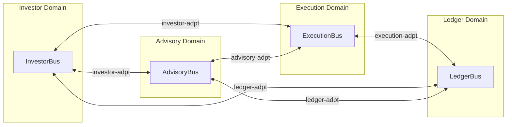

# Data Flow Documentation

End-to-end business flow specifications for Nestfolio, generated from `flows/*.flow.yaml`.

> **Auto-generated** — do not edit manually. Run `node tools/generate-flow-docs.mjs` to regenerate.

## Flows

| # | Flow | Domains | Description |
|---|------|---------|-------------|
| 01 | [Advisory Cycle](./advisory-cycle.md) | `advisory`, `investor`, `execution` | Advisory decision cycle orchestrated by decision-workflow-ctrl Step Functions, invoking 4 LangGraph agents in parallel, compliance check, and user confirmation |
| 02 | [Deposit](./deposit.md) | `investor`, `execution`, `ledger` | Investor initiates a deposit, routed through broker-ctrl to sim or Alpaca adapter, normalized back to canonical events |
| 03 | [Go Live](./go-live.md) | `investor`, `execution` | Investor transitions from simulation to live trading by completing Go Live wizard, switching execution mode from simulation to live |
| 04 | [Investor Onboarding](./investor-onboarding.md) | `investor`, `advisory` | New investor completes onboarding wizard, goals/risk/mandate are persisted and forwarded to advisory domain |
| 05 | [Market Data Ingestion](./market-data-ingestion.md) | `advisory` | Scheduled market data adapters fetch external data, materialize records, and emit feed-updated events consumed by market-intelligence-ctrl |
| 06 | [Order Execution](./order-execution.md) | `advisory`, `execution` | Approved decision triggers order creation in execution-ctrl, routed through broker-ctrl state machine to sim or Alpaca adapter, normalized back to canonical fill/reject events |
| 07 | [Order Ledger](./order-ledger.md) | `execution`, `ledger`, `investor`, `advisory` | Order fill events from execution domain are recorded as ledger entries, balance and portfolio snapshots are materialized and forwarded cross-domain |
| 08 | [Portfolio Rebalance](./portfolio-rebalance.md) | `ledger`, `advisory`, `execution` | Portfolio drift detected by reconciliation-ctrl triggers advisory decision cycle which produces rebalance orders |
| 09 | [Reconciliation](./reconciliation.md) | `ledger`, `execution`, `investor` | Reconciliation-ctrl compares intent positions (from portfolio events) against settlement positions (from broker snapshots), producing drift records and completion events |
| 10 | [Withdrawal](./withdrawal.md) | `investor`, `execution`, `ledger` | Investor requests a withdrawal, routed through broker-ctrl to sim or Alpaca adapter, normalized back to canonical events |

## Architecture Overview



## Regenerating

```bash
# All flows
node tools/generate-flow-docs.mjs

# Single flow
node tools/generate-flow-docs.mjs deposit
```
