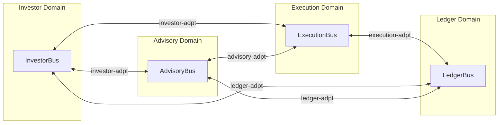

# Data Flow Documentation

End-to-end business flow specifications for Nestfolio, generated from `flows/*.flow.yaml`.

> **Auto-generated** — do not edit manually. Run `node tools/generate-flow-docs.mjs` to regenerate.

## Flows

| # | Flow | Domains | Description |
|---|------|---------|-------------|
| 01 | [Account Closure](./account-closure.md) | `investor`, `execution` | Investor requests account closure via GraphQL mutation; intent is acknowledged synchronously and forwarded to execution-ctrl for order-book awareness via cross-domain event |
| 02 | [Advisory Cycle](./advisory-cycle.md) | `advisory`, `investor`, `execution`, `ledger` | Advisory decision cycle — Step Functions orchestrates 2 sequential agents (Portfolio Engine → Narrative). Investor-profile and market-intelligence outputs are precomputed snapshots — the SF reads them from DWC-local DDB projections via Direct DDB GetItem (no per-cycle agent invocation). PE + AN are the only waitForTaskToken hops; their CDC-emitted PORTFOLIO_COMPLETED/NARRATIVE_COMPLETED (and *_FAILED) events resume the SF via DWC's CallbackIngress. AssembleDecisionPacket reads agent outputs from SF state, runs compliance check, then optionally requests user confirmation before forwarding to execution and ledger. |
| 03 | [Broker Circuit Breaker](./broker-circuit-breaker.md) | `execution`, `investor` | broker-alpaca-adpt detects Alpaca API failure, opens a global circuit breaker, triggers a HealStateMachine that polls health until recovery or escalation, surfaces visibility to investors via feature flags and push notifications |
| 04 | [Deposit](./deposit.md) | `investor`, `execution`, `ledger` | Investor initiates a deposit, routed through broker-ctrl to sim or Alpaca adapter, normalized back to canonical events, recorded in ledger, balance update propagated to investor domain |
| 05 | [Go Live](./go-live.md) | `investor`, `execution` | Investor transitions from simulation to live trading by completing Go Live wizard, switching execution mode from simulation to live |
| 06 | [Incident Escalation](./incident-escalation.md) | `advisory`, `execution`, `investor` | Compliance escalations and broker order escalations surface as investor notifications via cross-domain forwarding |
| 07 | [Investor Onboarding](./investor-onboarding.md) | `investor`, `execution`, `advisory` | New investor completes onboarding wizard; investor-bff materializes the composite InvestorProfile row + Mandate sibling row (sk='Mandate'); emits INVESTOR_PROFILE_CREATED (carrier) + MANDATE_ISSUED (lifecycle) + DEPOSIT_INITIATED (conditional); investor-ctrl sends welcome notification via MANDATE_ISSUED subscription; compliance-ctrl bootstraps GuardrailPolicy from MANDATE_ISSUED; initial advisory decision cycle triggered via MANDATE_ISSUED -> mandate-projector -> MandateSnapshot:INSERT -> CDC -> MANDATE_SNAPSHOT_CREATED -> SF (decision-workflow-ctrl) |
| 08 | [Market Data Ingestion](./market-data-ingestion.md) | `advisory` | Scheduled market data adapters fetch external data, materialize records, and emit feed-updated events consumed by market-intelligence-ctrl and portfolio-engine-ctrl |
| 09 | [Order Execution](./order-execution.md) | `advisory`, `execution`, `ledger`, `investor` | Approved decision triggers order creation in execution-ctrl, routed through broker-ctrl state machine to sim or Alpaca adapter, normalized back to canonical fill/reject events |
| 10 | [Order Ledger](./order-ledger.md) | `execution`, `ledger`, `investor`, `advisory` | Order fill events from execution domain recorded as ledger entries, balance and portfolio snapshots materialized via event-sourced reducer, forwarded cross-domain to investor and advisory |
| 11 | [Portfolio Rebalance](./portfolio-rebalance.md) | `ledger`, `advisory`, `execution` | Portfolio drift detected by reconciliation-ctrl triggers advisory decision cycle which produces rebalance orders |
| 12 | [Reconciliation](./reconciliation.md) | `ledger`, `investor`, `advisory`, `execution` | reconciliation-ctrl compares intent positions against settlement positions per instrument, producing DriftRecord items for mismatches and a ReconciliationResult summary. CDC emits RECONCILIATION_COMPLETED and PORTFOLIO_DRIFT_DETECTED, which cross domains to update the investor dashboard and trigger the advisory rebalance cycle. |
| 13 | [Withdrawal](./withdrawal.md) | `investor`, `execution`, `ledger` | Investor requests a withdrawal, routed through broker-ctrl to sim or Alpaca adapter, normalized back to canonical funding events, ledger debited, read models projected, investor notified |

## Architecture Overview



## Regenerating

```bash
# All flows
node tools/generate-flow-docs.mjs

# Single flow
node tools/generate-flow-docs.mjs deposit
```
