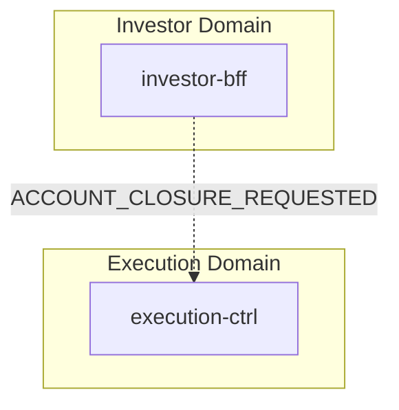
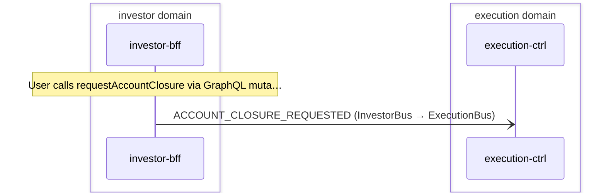

# Account Closure

> Investor requests account closure via GraphQL mutation; intent is acknowledged synchronously and forwarded to execution-ctrl for order-book awareness via cross-domain event

**Domains:** investor, execution

**Trigger:** investor calls requestAccountClosure GraphQL mutation on investor-bff

## Flowchart

## Sequence Diagram

## Steps

### Step 1: investor-bff

- **Action:** User calls requestAccountClosure via GraphQL mutation (request-account-closure.fn.js)
- **Via:** AppSync NONE data source — JS pipeline resolver, no Lambda invocation
- **State change:** none — no DDB write; resolver returns synthetic { closureId, status REQUESTED, requestedAt } directly
- **Emits:** `none — ACCOUNT_CLOSURE_REQUESTED is defined in InvestorBffEventTypes but no CDC record type is mapped in Egress; event is NOT emitted in current implementation`
- **Idempotent:** yes

### Step 2: Cross-domain hop

- **Event:** `ACCOUNT_CLOSURE_REQUESTED`
- **From:** InvestorBus
- **To:** ExecutionBus
- **Via:** execution-adpt EB rule (ExecutionIngress-FromInvestor)

### Step 3: execution-ctrl

- **Receives:** `ACCOUNT_CLOSURE_REQUESTED`
- **Via:** ExecutionBus -> SQS -> execution-ctrl-Ingress
- **State change:** none — handler calls skip(); no DDB write
- **Emits:** `none`
- **Idempotent:** yes

## Success Criteria

- [object Object]
- Response is well-formed (valid UUID closureId, parseable ISO timestamp)

## Failure Modes

- **AppSync resolver error:** mutation returns GraphQL error; no retry path (client must retry)
- **execution-adpt FromInvestorDLQ:** if ACCOUNT_CLOSURE_REQUESTED were ever emitted, a forwarding failure would land here
- **execution-ctrl ingress DLQ:** if event were emitted and forwarded, a handler failure would land here
