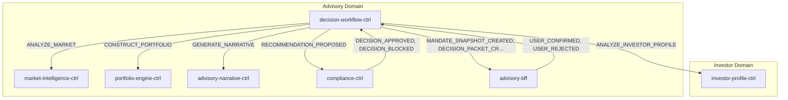
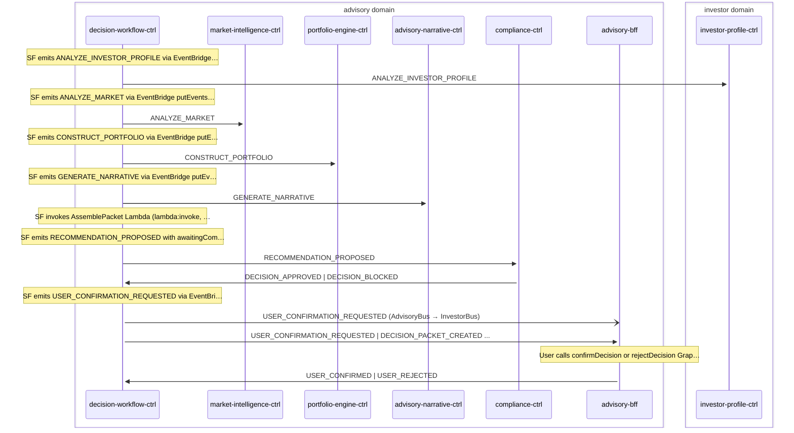

# Advisory Cycle

> Advisory decision cycle — Step Functions orchestrates 4 LangGraph agents (2 parallel + 2 sequential), assembles a DecisionPacket from agent outputs read directly off SF state, runs compliance check, then optionally requests user confirmation before forwarding to execution and ledger

**Domains:** advisory, investor, execution, ledger

**Trigger:** decision-workflow-ctrl receives one of 7 trigger events (MANDATE_SNAPSHOT_CREATED, INVESTOR_PROFILE_UPDATED, PORTFOLIO_DRIFT_DETECTED, ORDER_FILLED, ORDER_REJECTED, ORDER_CANCELLED, DEPOSIT_DETECTED); EventBridge starts the Step Functions execution directly via a native target (no Lambda hop).

## Flowchart

## Sequence Diagram

## Steps

### Step 1: Cross-domain hop

- **Event:** `INVESTOR_PROFILE_UPDATED | MANDATE_ISSUED | MANDATE_REVOKED`
- **From:** InvestorBus
- **To:** AdvisoryBus
- **Via:** advisory-adpt EB rule (AdvisoryIngress-FromInvestor)

### Step 2: Cross-domain hop

- **Event:** `ORDER_FILLED | ORDER_REJECTED | ORDER_CANCELLED | DEPOSIT_DETECTED | PORTFOLIO_DRIFT_DETECTED`
- **From:** ExecutionBus
- **To:** AdvisoryBus
- **Via:** advisory-adpt EB rule (AdvisoryIngress-FromExecution)

### Step 3: decision-workflow-ctrl

- **Receives:** `MANDATE_ISSUED`
- **Via:** AdvisoryBus -> SQS -> MandateProjectorIngress (handlers/mandate-projector.ts)
- **State change:** materializeToTable writes MandateSnapshot row with operatingMode + level + status='ACTIVE'
- **Emits:** `MANDATE_SNAPSHOT_CREATED (via Egress CDC on MandateSnapshot:INSERT)`
- **Idempotent:** yes

### Step 4: decision-workflow-ctrl

- **Receives:** `MANDATE_SNAPSHOT_CREATED | INVESTOR_PROFILE_UPDATED | PORTFOLIO_DRIFT_DETECTED | ORDER_FILLED | ORDER_REJECTED | ORDER_CANCELLED | DEPOSIT_DETECTED`
- **Via:** AdvisoryBus -> EB Rule -> SfnStateMachine target (Orchestration.triggers, direct)
- **State change:** New DecisionStateMachine execution starts directly from the EventBridge target. The 7-event trigger list is wired declaratively on Orchestration.triggers. Entry Pass state (UnpackTriggerEnvelope) mints decisionId via States.UUID() and flattens {context.tenantId, context.userId, context.region, type, subject} to top-level SF state so every downstream putEvents task state can emit the event-processor envelope ({id, type, timestamp, subject, context}).

- **Emits:** `(none -- SF internal)`
- **Idempotent:** no

### Step 5: decision-workflow-ctrl

- **Action:** SF emits ANALYZE_INVESTOR_PROFILE via EventBridge putEvents.waitForTaskToken
- **Emits:** `ANALYZE_INVESTOR_PROFILE (SF EventBridge integration with taskToken)`

### Step 6: investor-profile-ctrl

- **Receives:** `ANALYZE_INVESTOR_PROFILE`
- **Via:** AdvisoryBus -> SQS -> investor-profile-ctrl-Ingress
- **State change:** LangGraph investor-profile agent (Haiku goals + Opus risk-assessment, parallel) runs against Regulatory KB; writes AgentInvocation and ReasoningOutput records; returns {operatingMode, agentOutput} to SF via SendTaskSuccess (resumeStateMachine pipeline). No AgentCore Memory write on the critical path (Phase-A 2026-05-14).
- **Emits:** `GOAL_INTERPRETATION_PRODUCED (CDC, AgentInvocation:INSERT), RISK_EVALUATION_PRODUCED (CDC, ReasoningOutput:INSERT)`
- **Idempotent:** no

### Step 7: decision-workflow-ctrl

- **Action:** SF emits ANALYZE_MARKET via EventBridge putEvents.waitForTaskToken (parallel with 2a)
- **Emits:** `ANALYZE_MARKET (SF EventBridge integration with taskToken)`

### Step 8: market-intelligence-ctrl

- **Receives:** `ANALYZE_MARKET`
- **Via:** AdvisoryBus -> SQS -> market-intelligence-ctrl-Ingress
- **State change:** LangGraph market-intelligence agent (Sonnet, single-node graph) runs against Market KB (5 feed sources) plus deterministic in-process context (market-data + instrument-universe pre-fetched before the agent invokes); writes AgentInvocation record; returns agentOutput to SF via SendTaskSuccess. No AgentCore Memory write on the critical path.
- **Emits:** `MARKET_SIGNAL_DETECTED (CDC, AgentInvocation:INSERT), MARKET_INTELLIGENCE_AGENT_INVOCATION_TRACED (EventBridgeTraceEmitter)`
- **Idempotent:** no

### Step 9: decision-workflow-ctrl

- **Action:** SF emits CONSTRUCT_PORTFOLIO via EventBridge putEvents.waitForTaskToken (after parallel branches complete)
- **Emits:** `CONSTRUCT_PORTFOLIO (SF EventBridge integration with taskToken)`

### Step 10: portfolio-engine-ctrl

- **Receives:** `CONSTRUCT_PORTFOLIO`
- **Via:** AdvisoryBus -> SQS -> portfolio-engine-ctrl-Ingress
- **State change:** LangGraph portfolio-construction agent (Opus) runs against Fund KB; reads upstream agent outputs (operatingMode + investor-profile + market-analysis) directly from SF state Parameters — no AgentCore Memory roundtrip since Phase-A 2026-05-14; writes AgentInvocation and ReasoningOutput records; returns {allocations, trades, metadata} to SF via SendTaskSuccess.
- **Emits:** `PORTFOLIO_CONSTRUCTION_PROPOSED (CDC, AgentInvocation:INSERT), REBALANCE_PLAN_PRODUCED (CDC, ReasoningOutput:INSERT)`
- **Idempotent:** no

### Step 11: decision-workflow-ctrl

- **Action:** SF emits GENERATE_NARRATIVE via EventBridge putEvents.waitForTaskToken
- **Emits:** `GENERATE_NARRATIVE (SF EventBridge integration with taskToken)`

### Step 12: advisory-narrative-ctrl

- **Receives:** `GENERATE_NARRATIVE`
- **Via:** AdvisoryBus -> SQS -> advisory-narrative-ctrl-Ingress
- **State change:** LangGraph narrative agent (Haiku 4.5) runs against Explainability KB; reads upstream agent outputs from SF state Parameters; writes ReasoningOutput record carrying the explanation; returns agentOutput to SF via SendTaskSuccess.
- **Emits:** `EXPLANATION_GENERATED (CDC, ReasoningOutput:INSERT)`
- **Idempotent:** no

### Step 13: decision-workflow-ctrl

- **Action:** SF invokes AssemblePacket Lambda (lambda:invoke, synchronous — NOT waitForTaskToken)
- **State change:** Reads all 4 agent outputs from SF state Parameters ($.agentResults.<Upstream>.agentOutput) — no AgentCore Memory reads since Phase-A 2026-05-14. Builds proposedTrades from portfolio.allocations; extracts explanation from narrative.explainability.rationale (fallback summary). Writes DecisionPacket row with status='PENDING' via putIfNotExists (idempotent under SF retries).

- **Emits:** `DECISION_PACKET_CREATED (CDC, DecisionPacket:INSERT)`
- **Idempotent:** yes

### Step 14: decision-workflow-ctrl

- **Action:** SF emits RECOMMENDATION_PROPOSED with awaitingCompliance=true via EventBridge putEvents.waitForTaskToken; waits up to 24h for compliance result
- **Emits:** `RECOMMENDATION_PROPOSED (SF EventBridge integration with taskToken)`

### Step 15: compliance-ctrl

- **Receives:** `RECOMMENDATION_PROPOSED`
- **Via:** AdvisoryBus -> SQS -> compliance-ctrl-Ingress
- **State change:** Loads GuardrailPolicy (MandateSnapshot) from DDB — projected ahead of time from MANDATE_ISSUED and OPERATING_MODE_CHANGED events (not from the InvestorProfile carrier). Runs MandateValidator -> GuardrailEvaluator -> SuitabilityChecker -> AuthorityResolver (mode-specific: maxSingleTradePercent, monthlyTurnoverCapPercent, singleEtfConcentrationPercent for L1/L2 resolution); writes ComplianceCheck + AuditArtifact records to DDB.

- **Emits:** `DECISION_APPROVED or DECISION_BLOCKED (CDC, field dispatch on ComplianceCheck.result — APPROVED->DECISION_APPROVED, BLOCKED->DECISION_BLOCKED), AUDIT_ARTIFACT (CDC, AuditArtifact:INSERT)`
- **Idempotent:** yes

### Step 16: decision-workflow-ctrl

- **Receives:** `DECISION_APPROVED | DECISION_BLOCKED`
- **Via:** AdvisoryBus -> SQS -> decision-workflow-ctrl-CallbackIngress
- **State change:** SendTaskSuccess resumes SF with {decision, authorityLevel}. If DECISION_APPROVED: updates DecisionPacket status to APPROVED (L1) or AWAITING_CONFIRMATION (L2). If DECISION_BLOCKED: updates DecisionPacket status to BLOCKED.

- **Emits:** `DECISION_PACKET_UPDATED (CDC, DecisionPacket:MODIFY auto-expand)`
- **Idempotent:** yes

### Step 17: decision-workflow-ctrl

- **Action:** SF emits USER_CONFIRMATION_REQUESTED via EventBridge putEvents.waitForTaskToken; waits up to 72h for user response
- **Emits:** `USER_CONFIRMATION_REQUESTED (SF EventBridge integration with taskToken)`

### Step 18: Cross-domain hop

- **Event:** `USER_CONFIRMATION_REQUESTED`
- **From:** AdvisoryBus
- **To:** InvestorBus
- **Via:** investor-adpt EB rule (InvestorIngress-FromAdvisory)

### Step 19: advisory-bff

- **Receives:** `MANDATE_SNAPSHOT_CREATED | INVESTOR_PROFILE_UPDATED | PORTFOLIO_DRIFT_DETECTED | ORDER_FILLED | ORDER_REJECTED | ORDER_CANCELLED | DEPOSIT_DETECTED`
- **Via:** AdvisoryBus -> SQS -> advisory-bff-Ingress
- **State change:** Increments AdvisoryStatus.inFlightCount; sets lastTriggerAt; emits ADVISORY_STATUS_UPDATED via CDC
- **Emits:** `ADVISORY_STATUS_UPDATED (CDC, AdvisoryStatus insert/modify)`
- **Idempotent:** yes

### Step 20: advisory-bff

- **Receives:** `USER_CONFIRMATION_REQUESTED | DECISION_PACKET_CREATED | DECISION_APPROVED | DECISION_BLOCKED | DECISION_PACKET_UPDATED`
- **Via:** AdvisoryBus -> SQS -> advisory-bff-Ingress
- **State change:** Materialises DecisionReadModel for GraphQL queries; user sees decision in UI. DECISION_PACKET_CREATED also decrements AdvisoryStatus.inFlightCount (counter closes at packet-creation time).

- **Emits:** `DECISION_READ_MODEL_CREATED | DECISION_READ_MODEL_UPDATED (CDC, DecisionReadModel insert/modify) | USER_INTERACTION_CREATED (CDC, UserInteraction insert) | ADVISORY_STATUS_UPDATED (CDC, AdvisoryStatus modify on DECISION_PACKET_CREATED)`
- **Idempotent:** yes

### Step 21: advisory-bff

- **Action:** User calls confirmDecision or rejectDecision GraphQL mutation; BFF writes UserConfirmation or UserRejection record to DDB
- **State change:** Writes UserConfirmation or UserRejection record
- **Emits:** `USER_CONFIRMED (CDC, UserConfirmation:INSERT) or USER_REJECTED (CDC, UserRejection:INSERT)`

### Step 22: decision-workflow-ctrl

- **Receives:** `USER_CONFIRMED | USER_REJECTED`
- **Via:** AdvisoryBus -> SQS -> decision-workflow-ctrl-CallbackIngress
- **State change:** SendTaskSuccess resumes SF with {decision}. If USER_CONFIRMED: updates DecisionPacket status to CONFIRMED. If USER_REJECTED: updates DecisionPacket status to REJECTED with rejectionReason.

- **Emits:** `DECISION_PACKET_UPDATED (CDC, DecisionPacket:MODIFY auto-expand)`
- **Idempotent:** yes

### Step 23: Cross-domain hop

- **Event:** `DECISION_APPROVED`
- **From:** AdvisoryBus
- **To:** ExecutionBus
- **Via:** execution-adpt EB rule (ExecutionIngress-FromAdvisory)

### Step 24: Cross-domain hop

- **Event:** `DECISION_APPROVED`
- **From:** AdvisoryBus
- **To:** InvestorBus
- **Via:** investor-adpt EB rule (InvestorIngress-FromAdvisory)

### Step 25: Cross-domain hop

- **Event:** `DECISION_PACKET_CREATED`
- **From:** AdvisoryBus
- **To:** LedgerBus
- **Via:** ledger-adpt EB rule (LedgerIngress-FromAdvisory)

### Step 26: Cross-domain hop

- **Event:** `DECISION_PACKET_CREATED`
- **From:** AdvisoryBus
- **To:** InvestorBus
- **Via:** investor-adpt EB rule (InvestorIngress-FromAdvisory)

### Step 27: Cross-domain hop

- **Event:** `DECISION_BLOCKED`
- **From:** AdvisoryBus
- **To:** InvestorBus
- **Via:** investor-adpt EB rule (InvestorIngress-FromAdvisory)

### Step 28: Cross-domain hop

- **Event:** `EXPLANATION_GENERATED`
- **From:** AdvisoryBus
- **To:** InvestorBus
- **Via:** investor-adpt EB rule (InvestorIngress-FromAdvisory)

### Step 29: Cross-domain hop

- **Event:** `USER_CONFIRMED`
- **From:** AdvisoryBus
- **To:** ExecutionBus
- **Via:** execution-adpt EB rule (ExecutionIngress-FromAdvisory)

## Success Criteria

- All 4 agent tasks return via SendTaskSuccess within their 600s windows
- AssemblePacket writes a DecisionPacket row; CDC emits DECISION_PACKET_CREATED reaching advisory-bff (UI), ledger-adpt (audit), and investor-bff (decision history)
- compliance-ctrl emits exactly one of DECISION_APPROVED / DECISION_BLOCKED
- For L1 approved DecisionPacket.status='APPROVED' and DECISION_APPROVED reaches ExecutionBus
- For L2 approved confirmDecision/rejectDecision mutation lands within 72h; USER_CONFIRMED causes DECISION_APPROVED propagation; USER_REJECTED ends the cycle with no execution

## Failure Modes

- **trigger ingestion fails:** EventBridge → SF native target invocation fails or is throttled; SF not started; trigger event sits on source-bus DLQ. No automatic retry of the cycle; manual replay.
- **agent invocation (IP/MI/PE/AN) fails or stalls past 600s:** TaskTimedOut fires; agent ctrl Lambda's resume-state-machine pipeline logs ERROR with processingLagMs (since 2026-05-16) when SendTaskSuccess fires against an expired token; architectural follow-up tracked in docs/backlog/agent-pipeline-backlog-trap-architectural.md.
- **agent Lambda exception:** SendTaskFailure fires; SF state catches and the cycle fails with DECISION_WORKFLOW_FAILED.
- **AssemblePacket fails:** Lambda invocation error; SF state catches the error. Cycle ends without a DecisionPacket row. No retry.
- **compliance fails:** compliance-ctrl Ingress DLQ; WaitForCompliance times out at 24h. Manual DLQ replay; SF can resume only if token is still valid (won't be after 24h).
- **compliance callback fails:** CallbackIngress DLQ; SF stuck waiting; eventually times out at 24h. Manual replay (token-lag risk applies).
- **user confirmation cross-bus hop fails:** investor-adpt FromAdvisoryDLQ accumulates; user never sees the request. SF will time out at 72h.
- **user callback fails:** CallbackIngress DLQ; SF stuck waiting. Manual replay within the 72h window.
