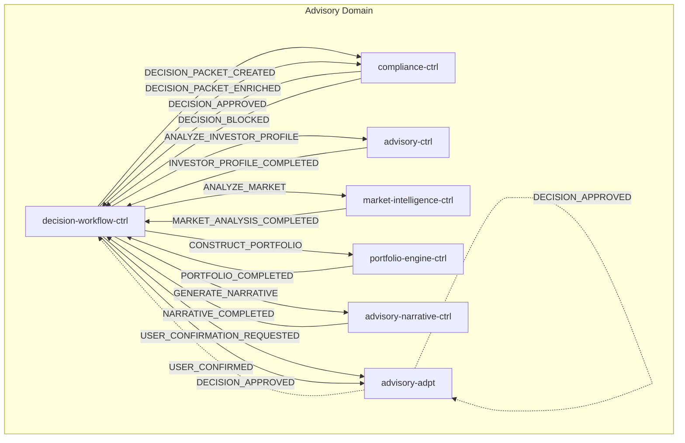
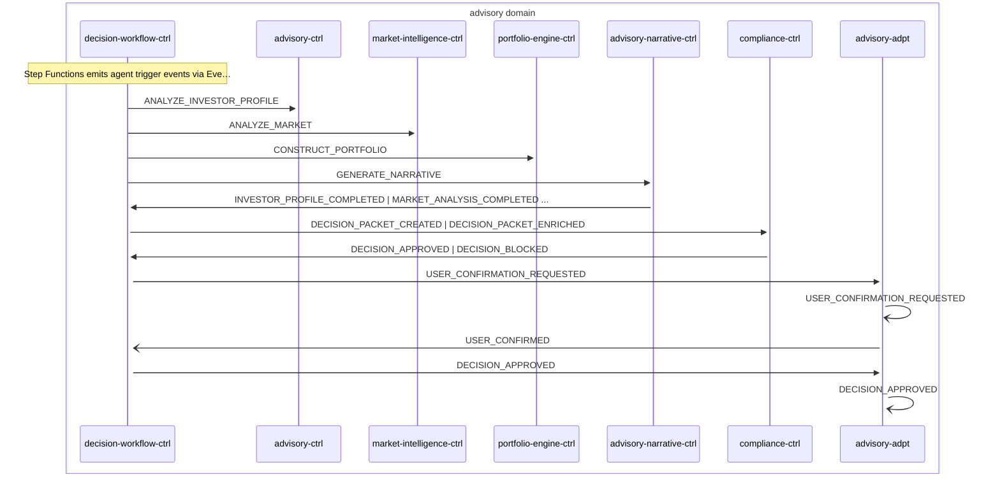

# Advisory Cycle

> Advisory decision cycle orchestrated by decision-workflow-ctrl Step Functions, invoking 4 LangGraph agents in parallel, compliance check, and user confirmation

**Domains:** advisory, investor, execution

**Trigger:** decision-workflow-ctrl receives trigger event (MANDATE_GRANTED | GOAL_UPDATED | RISK_PROFILE_UPDATED | OPERATING_MODE_CHANGED | PORTFOLIO_DRIFT_DETECTED | ORDER_FILLED | ORDER_REJECTED | ORDER_CANCELLED | DEPOSIT_DETECTED)

## Flowchart

## Sequence Diagram

## Steps

### Step 1: decision-workflow-ctrl

- **Receives:** `MANDATE_GRANTED | GOAL_UPDATED | RISK_PROFILE_UPDATED | OPERATING_MODE_CHANGED | PORTFOLIO_DRIFT_DETECTED | ORDER_FILLED | ORDER_REJECTED | ORDER_CANCELLED | DEPOSIT_DETECTED`
- **Via:** AdvisoryBus -> SQS -> decision-workflow-ctrl-TriggerIngress
- **State change:** Materializes WorkflowTrigger record to DDB; CDC emits DECISION_PACKET_CREATED; starts new SF execution
- **Emits:** `DECISION_PACKET_CREATED (CDC from DecisionPacket:INSERT)`
- **Idempotent:** yes

### Step 2: decision-workflow-ctrl

- **Action:** Step Functions emits agent trigger events via EventBridge
- **Emits:** `ANALYZE_INVESTOR_PROFILE, ANALYZE_MARKET, CONSTRUCT_PORTFOLIO, GENERATE_NARRATIVE (SF EventBridge integration)`

### Step 3: advisory-ctrl

- **Receives:** `ANALYZE_INVESTOR_PROFILE`
- **Via:** AdvisoryBus -> SQS -> advisory-ctrl-ingress
- **State change:** LangGraph agent analyzes investor profile using portfolio-lookup and instrument-universe tools
- **Emits:** `INVESTOR_PROFILE_COMPLETED (explicit via event-publisher tool)`
- **Idempotent:** no

### Step 4: market-intelligence-ctrl

- **Receives:** `ANALYZE_MARKET`
- **Via:** AdvisoryBus -> SQS -> market-intelligence-ctrl-ingress
- **State change:** LangGraph agent retrieves market data from KB, produces market analysis
- **Emits:** `MARKET_ANALYSIS_COMPLETED (explicit via event-publisher)`
- **Idempotent:** no

### Step 5: portfolio-engine-ctrl

- **Receives:** `CONSTRUCT_PORTFOLIO`
- **Via:** AdvisoryBus -> SQS -> portfolio-engine-ctrl-ingress
- **State change:** LangGraph agent constructs optimal portfolio allocation
- **Emits:** `PORTFOLIO_COMPLETED (explicit via event-publisher)`
- **Idempotent:** no

### Step 6: advisory-narrative-ctrl

- **Receives:** `GENERATE_NARRATIVE`
- **Via:** AdvisoryBus -> SQS -> advisory-narrative-ctrl-ingress
- **State change:** LangGraph agent generates human-readable narrative explanation
- **Emits:** `NARRATIVE_COMPLETED (explicit via event-publisher)`
- **Idempotent:** no

### Step 7: decision-workflow-ctrl

- **Receives:** `INVESTOR_PROFILE_COMPLETED, MARKET_ANALYSIS_COMPLETED, PORTFOLIO_COMPLETED, NARRATIVE_COMPLETED`
- **Via:** AdvisoryBus -> SQS -> decision-workflow-ctrl-CallbackIngress
- **State change:** SendTaskSuccess resumes SF execution; merges agent outputs into DecisionPacket
- **Emits:** `DECISION_PACKET_ENRICHED (CDC from DecisionPacket:MODIFY)`
- **Idempotent:** yes

### Step 8: compliance-ctrl

- **Receives:** `DECISION_PACKET_CREATED | DECISION_PACKET_ENRICHED`
- **Via:** AdvisoryBus -> SQS -> compliance-ctrl-ingress
- **State change:** Runs compliance rules against mandate and operating mode; writes ComplianceCheck record
- **Emits:** `DECISION_APPROVED or DECISION_BLOCKED (CDC from ComplianceCheck:INSERT)`
- **Idempotent:** yes

### Step 9: decision-workflow-ctrl

- **Receives:** `DECISION_APPROVED | DECISION_BLOCKED`
- **Via:** AdvisoryBus -> SQS -> decision-workflow-ctrl-CallbackIngress
- **State change:** SendTaskSuccess resumes SF; if approved, emits USER_CONFIRMATION_REQUESTED; if blocked, terminates
- **Emits:** `USER_CONFIRMATION_REQUESTED (CDC)`
- **Idempotent:** yes

### Step 10: advisory-adpt

- **Receives:** `USER_CONFIRMATION_REQUESTED`
- **Via:** AdvisoryBus -> advisory-adpt ToInvestor rule
- **Forwards to:** InvestorBus
- **Emits:** `USER_CONFIRMATION_REQUESTED`

### Step 11: advisory-adpt

- **Receives:** `USER_CONFIRMED`
- **Via:** AdvisoryBus -> advisory-adpt ToExecution rule
- **Forwards to:** ExecutionBus
- **Emits:** `USER_CONFIRMED`

### Step 12: decision-workflow-ctrl

- **Receives:** `USER_CONFIRMED | USER_REJECTED`
- **Via:** AdvisoryBus -> SQS -> decision-workflow-ctrl-CallbackIngress
- **State change:** SendTaskSuccess completes SF; if confirmed, emits DECISION_APPROVED cross-domain
- **Emits:** `DECISION_APPROVED (CDC)`
- **Idempotent:** yes

### Step 13: advisory-adpt

- **Receives:** `DECISION_APPROVED`
- **Via:** AdvisoryBus -> advisory-adpt ToExecution rule
- **Forwards to:** ExecutionBus
- **Emits:** `DECISION_APPROVED`

### Step 14: advisory-adpt

- **Receives:** `DECISION_APPROVED`
- **Via:** AdvisoryBus -> advisory-adpt ToInvestor rule
- **Forwards to:** InvestorBus
- **Emits:** `DECISION_APPROVED`

## Success Criteria

- All 4 agent tasks complete and DecisionPacket is enriched
- Compliance check passes and DECISION_APPROVED reaches execution domain
- User confirmation is requested and response is captured
- Final DECISION_APPROVED event triggers order execution

## Failure Modes

- **step 1 fails:** decision-workflow-ctrl TriggerIngress DLQ; SF execution not started
- **step 3-6 fails:** Agent Lambda fails; SF task token times out; DECISION_WORKFLOW_FAILED emitted
- **step 7 fails:** CallbackIngress DLQ; SF stuck waiting for agent completion
- **step 8 fails:** compliance-ctrl ingress DLQ; decision not checked
- **step 10 fails:** advisory-adpt ToInvestorDLQ; user not notified of confirmation request
