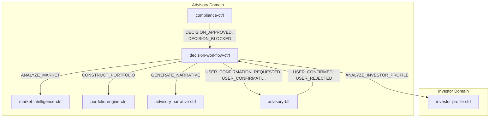
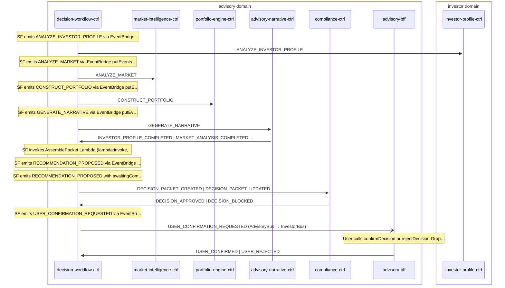

# Advisory Cycle

> Advisory decision cycle — Step Functions orchestrates 4 LangGraph agents (2 parallel + 2 sequential), assembles outputs via AgentCore Memory, runs compliance check, then optionally requests user confirmation before forwarding to execution

**Domains:** advisory, investor, execution

**Trigger:** decision-workflow-ctrl receives one of 7 trigger events; EventBridge starts the Step Functions execution directly via a native target.

## Flowchart

## Sequence Diagram

## Steps

### Step 1: Cross-domain hop

- **Event:** `INVESTOR_PROFILE_CREATED | INVESTOR_PROFILE_UPDATED | MANDATE_ACCEPTED | MANDATE_REVOKED`
- **From:** InvestorBus
- **To:** AdvisoryBus
- **Via:** advisory-adpt EB rule (AdvisoryIngress-FromInvestor)

### Step 2: Cross-domain hop

- **Event:** `ORDER_FILLED | ORDER_REJECTED | ORDER_CANCELLED | DEPOSIT_DETECTED | PORTFOLIO_DRIFT_DETECTED`
- **From:** ExecutionBus
- **To:** AdvisoryBus
- **Via:** advisory-adpt EB rule (AdvisoryIngress-FromExecution)

### Step 3: decision-workflow-ctrl

- **Receives:** `INVESTOR_PROFILE_CREATED | INVESTOR_PROFILE_UPDATED | PORTFOLIO_DRIFT_DETECTED | ORDER_FILLED | ORDER_REJECTED | ORDER_CANCELLED | DEPOSIT_DETECTED`
- **Via:** AdvisoryBus -> EB Rule -> SfnStateMachine target (Orchestration.triggers, direct)
- **State change:** New DecisionStateMachine execution starts directly from the EventBridge target. The 7-event trigger list is wired declaratively on Orchestration.triggers. Entry Pass state (UnpackTriggerEnvelope) mints decisionId via States.UUID() and flattens {context.tenantId, context.userId, context.region, type, subject} to top-level SF state so every downstream putEvents task state can emit the event-processor envelope ({id, type, timestamp, subject, context}).

- **Emits:** `(none -- SF internal)`
- **Idempotent:** no

### Step 4: decision-workflow-ctrl

- **Action:** SF emits ANALYZE_INVESTOR_PROFILE via EventBridge putEvents.waitForTaskToken
- **Emits:** `ANALYZE_INVESTOR_PROFILE (SF EventBridge integration with taskToken)`

### Step 5: investor-profile-ctrl

- **Receives:** `ANALYZE_INVESTOR_PROFILE`
- **Via:** AdvisoryBus -> SQS -> investor-profile-ctrl-Ingress
- **State change:** LangGraph agent (Opus model) analyzes investor profile using Regulatory KB; writes AgentInvocation and ReasoningOutput records; stores output to AgentCore Memory
- **Emits:** `GOAL_INTERPRETATION_PRODUCED (CDC, AgentInvocation:INSERT), RISK_EVALUATION_PRODUCED (CDC, ReasoningOutput:INSERT)`
- **Idempotent:** no

### Step 6: decision-workflow-ctrl

- **Action:** SF emits ANALYZE_MARKET via EventBridge putEvents.waitForTaskToken (parallel with 2a)
- **Emits:** `ANALYZE_MARKET (SF EventBridge integration with taskToken)`

### Step 7: market-intelligence-ctrl

- **Receives:** `ANALYZE_MARKET`
- **Via:** AdvisoryBus -> SQS -> market-intelligence-ctrl-Ingress
- **State change:** LangGraph agent (Sonnet model) retrieves market data from Market KB (5 feed sources); writes AgentInvocation record; stores output to AgentCore Memory
- **Emits:** `MARKET_SIGNAL_DETECTED (CDC, AgentInvocation:INSERT)`
- **Idempotent:** no

### Step 8: decision-workflow-ctrl

- **Action:** SF emits CONSTRUCT_PORTFOLIO via EventBridge putEvents.waitForTaskToken (after parallel branches complete)
- **Emits:** `CONSTRUCT_PORTFOLIO (SF EventBridge integration with taskToken)`

### Step 9: portfolio-engine-ctrl

- **Receives:** `CONSTRUCT_PORTFOLIO`
- **Via:** AdvisoryBus -> SQS -> portfolio-engine-ctrl-Ingress
- **State change:** LangGraph agent (Opus model) constructs optimal portfolio using Fund KB, portfolio-lookup tool; writes AgentInvocation and ReasoningOutput records; stores output to AgentCore Memory
- **Emits:** `PORTFOLIO_CONSTRUCTION_PROPOSED (CDC, AgentInvocation:INSERT), REBALANCE_PLAN_PRODUCED (CDC, ReasoningOutput:INSERT)`
- **Idempotent:** no

### Step 10: decision-workflow-ctrl

- **Action:** SF emits GENERATE_NARRATIVE via EventBridge putEvents.waitForTaskToken
- **Emits:** `GENERATE_NARRATIVE (SF EventBridge integration with taskToken)`

### Step 11: advisory-narrative-ctrl

- **Receives:** `GENERATE_NARRATIVE`
- **Via:** AdvisoryBus -> SQS -> advisory-narrative-ctrl-Ingress
- **State change:** LangGraph agent (Sonnet model) generates human-readable explanation using Explainability KB; writes ReasoningOutput record; stores output to AgentCore Memory
- **Emits:** `EXPLANATION_GENERATED (CDC, ReasoningOutput:INSERT)`
- **Idempotent:** no

### Step 12: decision-workflow-ctrl

- **Receives:** `INVESTOR_PROFILE_COMPLETED | MARKET_ANALYSIS_COMPLETED | PORTFOLIO_COMPLETED | NARRATIVE_COMPLETED`
- **Via:** AdvisoryBus -> SQS -> decision-workflow-ctrl-CallbackIngress
- **State change:** SendTaskSuccess resumes SF; writes AgentOutput record to DDB per agent completion
- **Emits:** `AGENT_OUTPUT_CREATED (CDC, AgentOutput:INSERT auto-expand)`
- **Idempotent:** yes

### Step 13: decision-workflow-ctrl

- **Action:** SF invokes AssemblePacket Lambda (lambda:invoke, not waitForTaskToken)
- **State change:** Reads all 4 agent outputs from AgentCore Memory (investor-profile, market-intelligence, portfolio-engine, advisory-narrative); returns assembled packet to SF state

### Step 14: decision-workflow-ctrl

- **Action:** SF emits RECOMMENDATION_PROPOSED via EventBridge putEvents (fire-and-forget, NOT waitForTaskToken)
- **Emits:** `RECOMMENDATION_PROPOSED (SF EventBridge integration)`

### Step 15: decision-workflow-ctrl

- **Action:** SF emits RECOMMENDATION_PROPOSED with awaitingCompliance=true via EventBridge putEvents.waitForTaskToken; waits up to 24h for compliance result
- **Emits:** `RECOMMENDATION_PROPOSED (SF EventBridge integration with taskToken)`

### Step 16: compliance-ctrl

- **Receives:** `DECISION_PACKET_CREATED | DECISION_PACKET_UPDATED`
- **Via:** AdvisoryBus -> SQS -> compliance-ctrl-Ingress
- **State change:** Loads mandate snapshot from DDB (includes mode-derived guardrail thresholds); runs MandateValidator -> GuardrailEvaluator -> SuitabilityChecker -> AuthorityResolver (uses mode-specific maxSingleTradePercent, monthlyTurnoverCapPercent, singleEtfConcentrationPercent for L1/L2 resolution); writes ComplianceCheck + AuditArtifact records to DDB
- **Emits:** `DECISION_APPROVED or DECISION_BLOCKED (CDC, field dispatch on ComplianceCheck.result — APPROVED->DECISION_APPROVED, BLOCKED->DECISION_BLOCKED), AUDIT_ARTIFACT (CDC, AuditArtifact:INSERT)`
- **Idempotent:** yes

### Step 17: decision-workflow-ctrl

- **Receives:** `DECISION_APPROVED | DECISION_BLOCKED`
- **Via:** AdvisoryBus -> SQS -> decision-workflow-ctrl-CallbackIngress
- **State change:** SendTaskSuccess resumes SF with {decision, authorityLevel}. If DECISION_APPROVED: updates DecisionPacket status to APPROVED (L1) or AWAITING_CONFIRMATION (L2). If DECISION_BLOCKED: updates DecisionPacket status to BLOCKED.

- **Emits:** `DECISION_PACKET_UPDATED (CDC, DecisionPacket:MODIFY auto-expand)`
- **Idempotent:** yes

### Step 18: decision-workflow-ctrl

- **Action:** SF emits USER_CONFIRMATION_REQUESTED via EventBridge putEvents.waitForTaskToken; waits up to 72h for user response
- **Emits:** `USER_CONFIRMATION_REQUESTED (SF EventBridge integration with taskToken)`

### Step 19: Cross-domain hop

- **Event:** `USER_CONFIRMATION_REQUESTED`
- **From:** AdvisoryBus
- **To:** InvestorBus
- **Via:** investor-adpt EB rule (InvestorIngress-FromAdvisory)

### Step 20: advisory-bff

- **Receives:** `USER_CONFIRMATION_REQUESTED | DECISION_PACKET_CREATED | DECISION_APPROVED | DECISION_BLOCKED`
- **Via:** AdvisoryBus -> SQS -> advisory-bff-Ingress
- **State change:** Materialises DecisionReadModel for GraphQL queries; user sees decision in UI
- **Emits:** `DECISION_READ_MODEL (CDC, DecisionReadModel) | USER_INTERACTION (CDC, UserInteraction)`
- **Idempotent:** yes

### Step 21: advisory-bff

- **Action:** User calls confirmDecision or rejectDecision GraphQL mutation; BFF writes UserConfirmation or UserRejection record to DDB
- **State change:** Writes UserConfirmation or UserRejection record
- **Emits:** `USER_CONFIRMED (CDC, UserConfirmation:INSERT) or USER_REJECTED (CDC, UserRejection:INSERT)`

### Step 22: decision-workflow-ctrl

- **Receives:** `USER_CONFIRMED | USER_REJECTED`
- **Via:** AdvisoryBus -> SQS -> decision-workflow-ctrl-CallbackIngress
- **State change:** SendTaskSuccess resumes SF with {decision}. If USER_CONFIRMED: updates DecisionPacket status to CONFIRMED. If USER_REJECTED: updates DecisionPacket status to REJECTED with rejectionReason.

- **Emits:** `DECISION_PACKET_UPDATED (CDC, DecisionPacket:MODIFY auto-expand)`
- **Idempotent:** yes

### Step 23: Cross-domain hop

- **Event:** `DECISION_APPROVED`
- **From:** AdvisoryBus
- **To:** ExecutionBus
- **Via:** execution-adpt EB rule (ExecutionIngress-FromAdvisory)

### Step 24: Cross-domain hop

- **Event:** `DECISION_APPROVED`
- **From:** AdvisoryBus
- **To:** InvestorBus
- **Via:** investor-adpt EB rule (InvestorIngress-FromAdvisory)

### Step 25: Cross-domain hop

- **Event:** `DECISION_PACKET_CREATED`
- **From:** AdvisoryBus
- **To:** LedgerBus
- **Via:** ledger-adpt EB rule (LedgerIngress-FromAdvisory)

### Step 26: Cross-domain hop

- **Event:** `DECISION_PACKET_CREATED`
- **From:** AdvisoryBus
- **To:** InvestorBus
- **Via:** investor-adpt EB rule (InvestorIngress-FromAdvisory)

### Step 27: Cross-domain hop

- **Event:** `DECISION_BLOCKED`
- **From:** AdvisoryBus
- **To:** InvestorBus
- **Via:** investor-adpt EB rule (InvestorIngress-FromAdvisory)

### Step 28: Cross-domain hop

- **Event:** `EXPLANATION_GENERATED`
- **From:** AdvisoryBus
- **To:** InvestorBus
- **Via:** investor-adpt EB rule (InvestorIngress-FromAdvisory)

### Step 29: Cross-domain hop

- **Event:** `USER_CONFIRMED`
- **From:** AdvisoryBus
- **To:** ExecutionBus
- **Via:** execution-adpt EB rule (ExecutionIngress-FromAdvisory)

## Success Criteria

- All 4 agent tasks complete and agent outputs stored to AgentCore Memory
- AssemblePacket Lambda successfully reads all 4 outputs from Memory
- RECOMMENDATION_PROPOSED emitted and compliance check runs
- Compliance check produces DECISION_APPROVED (L1 auto-approve) or routes to user confirmation (L2)
- [object Object]
- DECISION_APPROVED reaches execution domain via execution-adpt for order execution

## Failure Modes

- **step 1 (trigger ingestion) fails:** EventBridge → SF native target invocation fails or is throttled; SF not started; trigger event sits on the source bus DLQ if a downstream rule failure cascades back
- **step 2a/2b (parallel agents) fails:** Agent Lambda fails or times out (10min default); SF task token expires; branch fails
- **step 2c (portfolio engine) fails:** SF task token timeout; PortfolioEngine branch fails
- **step 2d (narrative agent) fails:** SF task token timeout; AdvisoryNarrative branch fails
- **step 3 (agent callbacks) fails:** CallbackIngress DLQ; SF stuck waiting; eventually times out (72h SF timeout)
- **step 4 (assemble packet) fails:** Lambda invocation fails; SF catches error
- **step 6 (compliance) fails:** compliance-ctrl Ingress DLQ; WaitForCompliance times out (24h)
- **step 7 (compliance callback) fails:** CallbackIngress DLQ; SF stuck waiting
- **step 9 (user confirmation) fails:** USER_CONFIRMATION_REQUESTED not forwarded (investor-adpt FromAdvisoryDLQ); user never sees request; SF times out (72h)
- **step 11 (user callback) fails:** CallbackIngress DLQ; SF stuck waiting
