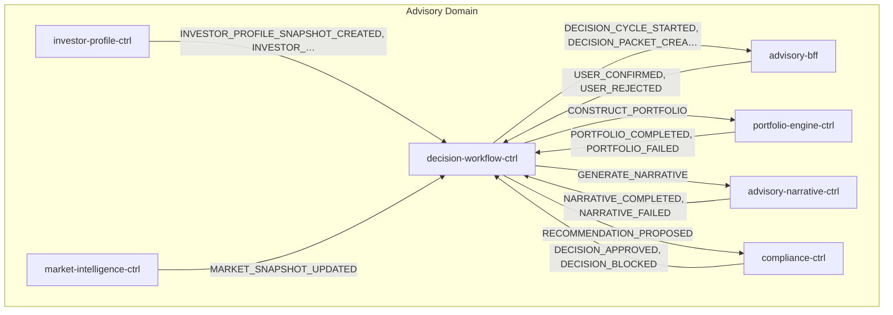
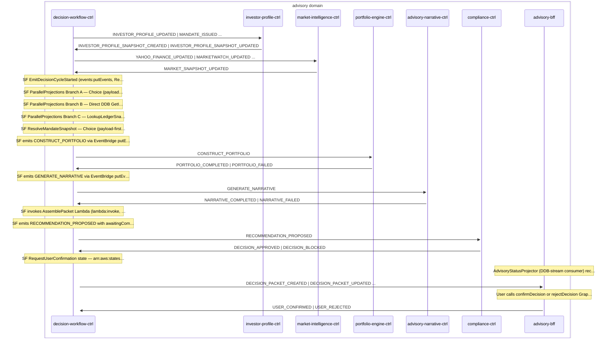

# Advisory Cycle

> Advisory decision cycle — Step Functions orchestrates 2 sequential agents (Portfolio Engine → Narrative). Investor-profile and market-intelligence outputs are precomputed snapshots — the SF reads them from DWC-local DDB projections via Direct DDB GetItem (no per-cycle agent invocation). PE + AN are the only waitForTaskToken hops; their CDC-emitted PORTFOLIO_COMPLETED/NARRATIVE_COMPLETED (and *_FAILED) events resume the SF via DWC's CallbackIngress. AssembleDecisionPacket reads agent outputs from SF state, runs compliance check, then optionally requests user confirmation before forwarding to execution and ledger.

**Domains:** advisory, investor, execution, ledger

**Trigger:** decision-workflow-ctrl receives one of 7 trigger events (MANDATE_SNAPSHOT_CREATED, INVESTOR_PROFILE_UPDATED, PORTFOLIO_DRIFT_DETECTED, ORDER_FILLED, ORDER_REJECTED, ORDER_CANCELLED, DEPOSIT_DETECTED); EventBridge starts the Step Functions execution directly via a native target (no Lambda hop). Pre-cycle snapshots (InvestorProfileSnapshot + MarketSnapshot) are continuously materialised in DWC-local DDB by SnapshotProjectorIngress so the SF can resolve them via Direct DDB GetItem without invoking IP/MI agents.

## Flowchart

## Sequence Diagram

## Steps

### Step 1: Cross-domain hop

- **Event:** `INVESTOR_PROFILE_UPDATED | MANDATE_ISSUED | MANDATE_REVOKED | OPERATING_MODE_CHANGED`
- **From:** InvestorBus
- **To:** AdvisoryBus
- **Via:** advisory-adpt EB rule (AdvisoryIngress-FromInvestor)

### Step 2: Cross-domain hop

- **Event:** `ORDER_FILLED | ORDER_REJECTED | ORDER_CANCELLED | DEPOSIT_DETECTED`
- **From:** ExecutionBus
- **To:** AdvisoryBus
- **Via:** advisory-adpt EB rule (AdvisoryIngress-FromExecution)

### Step 3: Cross-domain hop

- **Event:** `PORTFOLIO_UPDATED | PORTFOLIO_DRIFT_DETECTED`
- **From:** LedgerBus
- **To:** AdvisoryBus
- **Via:** advisory-adpt EB rule (AdvisoryIngress-FromLedger)

### Step 4: decision-workflow-ctrl

- **Receives:** `MANDATE_ISSUED | OPERATING_MODE_CHANGED`
- **Via:** AdvisoryBus -> SQS -> MandateProjectorIngress (handlers/mandate-projector.ts)
- **State change:** materializeToTable writes MandateSnapshot row with operatingMode + level + status='ACTIVE' (MANDATE_ISSUED → record; OPERATING_MODE_CHANGED → update operatingMode)
- **Emits:** `MANDATE_SNAPSHOT_CREATED (via Egress CDC on MandateSnapshot:INSERT only — operatingMode changes do NOT re-trigger the first decision)`
- **Idempotent:** yes

### Step 5: investor-profile-ctrl

- **Receives:** `INVESTOR_PROFILE_UPDATED | MANDATE_ISSUED | DECISION_BLOCKED | DECISION_APPROVED`
- **Via:** AdvisoryBus -> SQS -> investor-profile-ctrl-Ingress
- **State change:** INVESTOR_PROFILE_UPDATED | MANDATE_ISSUED drive the snapshot writer: LangGraph investor-profile agent (Haiku goals + Sonnet risk-assessment, parallel) runs once per input event against the Regulatory KB; materializeToTable writes the InvestorProfileSnapshot row carrying the composite agent output (decisionId + goals + risk + metadata). No AgentCore Memory write on the critical path; no SF callback (pre-cycle precomputation). DECISION_BLOCKED | DECISION_APPROVED feed the separate KBIngestion Lambda only (compliance precedents into RegulatoryKB) — they do NOT write a snapshot.

- **Emits:** `INVESTOR_PROFILE_SNAPSHOT_CREATED (CDC, InvestorProfileSnapshot:INSERT) | INVESTOR_PROFILE_SNAPSHOT_UPDATED (CDC, InvestorProfileSnapshot:MODIFY)`
- **Idempotent:** yes

### Step 6: decision-workflow-ctrl

- **Receives:** `INVESTOR_PROFILE_SNAPSHOT_CREATED | INVESTOR_PROFILE_SNAPSHOT_UPDATED`
- **Via:** AdvisoryBus -> SQS -> SnapshotProjectorIngress (handlers/snapshot-projector.ts)
- **State change:** materializeToTable mirrors IP-ctrl's snapshot into DWC's own DDB table as the InvestorProfileSnapshot row (pk=`InvestorProfileSnapshot#{tenantId}#{userId}`, sk='InvestorProfileSnapshot'). The SF reads this via Direct DDB GetItem during the cycle. CREATED → record; UPDATED → update. Missing subject.agentOutput → NotRetryableError.

- **Emits:** `(none — local projection)`
- **Idempotent:** yes

### Step 7: market-intelligence-ctrl

- **Receives:** `YAHOO_FINANCE_UPDATED | MARKETWATCH_UPDATED | SEC_8K_FILED | FRED_INDICATORS_UPDATED | ALPHA_VANTAGE_NEWS_UPDATED | MARKET_SNAPSHOT_REFRESH_TICK`
- **Via:** AdvisoryBus -> SQS -> market-intelligence-ctrl-Ingress
- **State change:** LangGraph market-intelligence agent (Sonnet) runs against the Market KB plus deterministic in-process context (market-data + instrument-universe pre-fetch); materializeToTable writes the MarketSnapshot row (one per region) carrying the agent output. Also writes legacy AgentInvocation row (no longer CDC-emitted — MARKET_SIGNAL_DETECTED stop-emitted, zero consumers). Slow-tier tick (every 15 min) backstops idle feed periods; on stack Create a BootstrapSnapshotFn custom resource emits a synthetic tick and polls until the row materialises (5-min deadline).

- **Emits:** `MARKET_SNAPSHOT_UPDATED (CDC, MarketSnapshot:INSERT and MODIFY) | MARKET_INTELLIGENCE_AGENT_INVOCATION_TRACED (EventBridgeTraceEmitter)`
- **Idempotent:** yes

### Step 8: decision-workflow-ctrl

- **Receives:** `MARKET_SNAPSHOT_UPDATED`
- **Via:** AdvisoryBus -> SQS -> SnapshotProjectorIngress (handlers/snapshot-projector.ts)
- **State change:** projectVersioned mirrors MI-ctrl's snapshot into DWC's own DDB table as the MarketSnapshot row (pk=`MarketSnapshot#{region}`, sk='MarketSnapshot'), keyed on subject.__version. The SF reads this via Direct DDB GetItem during the cycle. Missing subject.agentOutput → NotRetryableError.

- **Emits:** `(none — local projection)`
- **Idempotent:** yes

### Step 9: decision-workflow-ctrl

- **Receives:** `PORTFOLIO_UPDATED`
- **Via:** AdvisoryBus -> SQS -> SnapshotProjectorIngress (handlers/snapshot-projector.ts)
- **State change:** projectVersioned mirrors the ledger's per-tenant positions + cashBalanceCents into DWC's own table as the LedgerSnapshot row (pk=`LedgerSnapshot#{tenantId}`, sk='LedgerSnapshot'), keyed on snapshot.lastEventSequence. `state` is JSON-stringified so the SF parses it via States.StringToJson on read. The SF reads it via Direct DDB GetItem (ParallelProjections Branch C); AssemblePacket uses it to compute portfolioValueCents + delta-based proposedTrades. Missing subject.snapshot → NotRetryableError.

- **Emits:** `(none — local projection)`
- **Idempotent:** yes

### Step 10: decision-workflow-ctrl

- **Receives:** `MANDATE_SNAPSHOT_CREATED | INVESTOR_PROFILE_UPDATED | PORTFOLIO_DRIFT_DETECTED | ORDER_FILLED | ORDER_REJECTED | ORDER_CANCELLED | DEPOSIT_DETECTED`
- **Via:** AdvisoryBus -> EB Rule -> SfnStateMachine target (Orchestration.triggers, direct)
- **State change:** New DecisionStateMachine execution starts directly from the EventBridge target. The 7-event trigger list is wired declaratively on Orchestration.triggers. Entry Pass state (UnpackTriggerEnvelope) mints decisionId via States.UUID() and flattens {context.tenantId, context.userId, context.region, type, subject} to top-level SF state so every downstream putEvents task state can emit the event-processor envelope ({id, type, timestamp, subject, context}).

- **Emits:** `(none -- SF internal)`
- **Idempotent:** no

### Step 11: decision-workflow-ctrl

- **Action:** SF EmitDecisionCycleStarted (events:putEvents, ResultPath:null) right after UnpackTriggerEnvelope; on any pre-packet failure the shared Catch routes to EmitDecisionCycleFailed → Fail
- **Emits:** `DECISION_CYCLE_STARTED (SF-direct putEvents, status=GENERATING, __version:0) | DECISION_CYCLE_FAILED (SF-direct putEvents from the shared pre-packet Catch, status=FAILED, __version:1) — uncatchable States.Runtime emits neither (WS-3 UI-staleness guard)`
- **Idempotent:** no

### Step 12: decision-workflow-ctrl

- **Action:** SF ParallelProjections Branch A — Choice (payload-first hoist when trigger carries an InvestorProfile body) else Direct DDB GetItem on InvestorProfileSnapshot (pk=`InvestorProfileSnapshot#{tenantId}#{userId}`, sk='InvestorProfileSnapshot'). No event emitted; no Lambda invoked.
- **State change:** SF state Parameters carry investorProfile.agentOutput (operatingMode + goalInterpretation + riskEvaluation) for downstream PE + AN steps.

### Step 13: decision-workflow-ctrl

- **Action:** SF ParallelProjections Branch B — Direct DDB GetItem on MarketSnapshot (pk=`MarketSnapshot#{region}`, sk='MarketSnapshot'). No payload-first path (market signals are a global projection). No event emitted; no Lambda invoked.
- **State change:** SF state Parameters carry marketSnapshot.agentOutput for downstream PE + AN steps.

### Step 14: decision-workflow-ctrl

- **Action:** SF ParallelProjections Branch C — LookupLedgerSnapshot (Direct DDB GetItem on LedgerSnapshot, pk=`LedgerSnapshot#{tenantId}`, sk='LedgerSnapshot', captures raw response on $.ledgerSnapshotResponse) → CheckLedgerSnapshotPresent (Choice on isPresent($.ledgerSnapshotResponse.Item.state.S)) → ExtractLedgerSnapshot (States.StringToJson of $.ledgerSnapshotResponse.Item.state.S) on hit, or HandleMissingLedgerSnapshot (Pass seeding {positions:{}, cashBalanceCents:0}) on miss. No payload-first path (no trigger carries a full ledger state). No event emitted; no Lambda invoked.
- **State change:** SF state Parameters carry ledgerSnapshot.state (positions + cashBalanceCents) for AssemblePacket portfolioValueCents + delta-based proposedTrades. Choice-on-isPresent avoids the uncatchable States.Runtime from States.StringToJson(undefined) on a missing row.

### Step 15: decision-workflow-ctrl

- **Action:** SF ResolveMandateSnapshot — Choice (payload-first hoist when trigger carries operatingMode) else LookupMandateSnapshot via Direct DDB GetItem. No event emitted.
- **State change:** SF state Parameters carry mandateSnapshot (operatingMode + level + status='ACTIVE').

### Step 16: decision-workflow-ctrl

- **Action:** SF emits CONSTRUCT_PORTFOLIO via EventBridge putEvents.waitForTaskToken
- **Emits:** `CONSTRUCT_PORTFOLIO (SF EventBridge integration with taskToken)`

### Step 17: portfolio-engine-ctrl

- **Receives:** `CONSTRUCT_PORTFOLIO`
- **Via:** AdvisoryBus -> SQS -> portfolio-engine-ctrl-Ingress
- **State change:** LangGraph portfolio-construction agent (Opus) runs against Fund KB; reads upstream agent outputs (operatingMode + investor-profile + market-analysis) directly from SF state Parameters (no AgentCore Memory roundtrip); materializeToTable writes AgentCompletion row on success (carries taskToken + agentOutput {allocations, trades, metadata}) or AgentFailure row on failure (carries taskToken + errorCode + cause). No states:SendTask* IAM grant on this service; the CDC event from the Egress is the sole bridge back to the SF.

- **Emits:** `PORTFOLIO_COMPLETED (CDC, AgentCompletion:INSERT) | PORTFOLIO_FAILED (CDC, AgentFailure:INSERT)`
- **Idempotent:** no

### Step 18: decision-workflow-ctrl

- **Receives:** `PORTFOLIO_COMPLETED | PORTFOLIO_FAILED`
- **Via:** AdvisoryBus -> SQS -> decision-workflow-ctrl-CallbackIngress
- **State change:** PORTFOLIO_COMPLETED: SendTaskSuccess resumes SF with agentOutput; sfn-callback also persists an AgentOutput record for the cycle. PORTFOLIO_FAILED: SendTaskFailure with errorCode + cause; SF state catches and the cycle ends as DECISION_WORKFLOW_FAILED.

- **Emits:** `none (sfn-callback persists an AgentOutput record, but AGENT_OUTPUT_CREATED/UPDATED are stop-emitted — zero consumers; advisory-agent-event-contract-coverage)`
- **Idempotent:** yes

### Step 19: decision-workflow-ctrl

- **Action:** SF emits GENERATE_NARRATIVE via EventBridge putEvents.waitForTaskToken
- **Emits:** `GENERATE_NARRATIVE (SF EventBridge integration with taskToken)`

### Step 20: advisory-narrative-ctrl

- **Receives:** `GENERATE_NARRATIVE`
- **Via:** AdvisoryBus -> SQS -> advisory-narrative-ctrl-Ingress
- **State change:** LangGraph narrative agent (Haiku 4.5) runs against Explainability KB; reads upstream agent outputs from SF state Parameters; materializeToTable writes AgentCompletion row on success (carries taskToken + agentOutput carrying explanation) or AgentFailure row on failure. No states:SendTask* IAM grant on this service.

- **Emits:** `NARRATIVE_COMPLETED (CDC, AgentCompletion:INSERT) | NARRATIVE_FAILED (CDC, AgentFailure:INSERT) | EXPLANATION_GENERATED (CDC, ReasoningOutput:INSERT)`
- **Idempotent:** no

### Step 21: decision-workflow-ctrl

- **Receives:** `NARRATIVE_COMPLETED | NARRATIVE_FAILED`
- **Via:** AdvisoryBus -> SQS -> decision-workflow-ctrl-CallbackIngress
- **State change:** NARRATIVE_COMPLETED: SendTaskSuccess resumes SF with agentOutput (explanation); sfn-callback persists an AgentOutput record. NARRATIVE_FAILED: SendTaskFailure; SF state catches and the cycle ends as DECISION_WORKFLOW_FAILED.

- **Emits:** `none (sfn-callback persists an AgentOutput record, but AGENT_OUTPUT_CREATED/UPDATED are stop-emitted — zero consumers; advisory-agent-event-contract-coverage)`
- **Idempotent:** yes

### Step 22: decision-workflow-ctrl

- **Action:** SF invokes AssemblePacket Lambda (lambda:invoke, synchronous — NOT waitForTaskToken)
- **State change:** Reads all 4 agent outputs from SF state Parameters — investor-profile + market from the precomputed snapshots resolved in Phase 2a/2b, portfolio + narrative from the waitForTaskToken callbacks. No AgentCore Memory reads. Builds proposedTrades from portfolio.allocations; extracts explanation from narrative.explainability.rationale (fallback summary). Writes DecisionPacket row with status='PENDING' via putIfNotExists (idempotent under SF retries).

- **Emits:** `DECISION_PACKET_CREATED (CDC, DecisionPacket:INSERT)`
- **Idempotent:** yes

### Step 23: decision-workflow-ctrl

- **Action:** SF emits RECOMMENDATION_PROPOSED with awaitingCompliance=true via EventBridge putEvents.waitForTaskToken; waits up to 24h for compliance result
- **Emits:** `RECOMMENDATION_PROPOSED (SF EventBridge integration with taskToken)`

### Step 24: compliance-ctrl

- **Receives:** `RECOMMENDATION_PROPOSED`
- **Via:** AdvisoryBus -> SQS -> compliance-ctrl-Ingress
- **State change:** Loads GuardrailPolicy (MandateSnapshot) from DDB — projected ahead of time from MANDATE_ISSUED and OPERATING_MODE_CHANGED events (not from the InvestorProfile carrier). Runs MandateValidator -> GuardrailEvaluator -> SuitabilityChecker -> AuthorityResolver (mode-specific: maxSingleTradePercent, monthlyTurnoverCapPercent, singleEtfConcentrationPercent for L1/L2 resolution); writes ComplianceCheck + AuditArtifact records to DDB.

- **Emits:** `DECISION_APPROVED or DECISION_BLOCKED (CDC, field dispatch on ComplianceCheck.result — APPROVED->DECISION_APPROVED, BLOCKED->DECISION_BLOCKED), AUDIT_ARTIFACT (CDC, AuditArtifact:INSERT)`
- **Idempotent:** yes

### Step 25: decision-workflow-ctrl

- **Receives:** `DECISION_APPROVED | DECISION_BLOCKED`
- **Via:** AdvisoryBus -> SQS -> decision-workflow-ctrl-CallbackIngress
- **State change:** SendTaskSuccess resumes SF with {decision, authorityLevel}. If DECISION_APPROVED: updates DecisionPacket status to APPROVED (L1) or AWAITING_CONFIRMATION (L2). If DECISION_BLOCKED: updates DecisionPacket status to BLOCKED.

- **Emits:** `DECISION_PACKET_UPDATED (CDC, DecisionPacket:MODIFY auto-expand)`
- **Idempotent:** yes

### Step 26: decision-workflow-ctrl

- **Action:** SF RequestUserConfirmation state — arn:aws:states:::aws-sdk:dynamodb:updateItem.waitForTaskToken writes taskToken + status=AWAITING_CONFIRMATION (and bumps __version) directly onto the DecisionPacket row; waits up to 72h. NO event emitted (USER_CONFIRMATION_REQUESTED removed). SF is the sole writer of AWAITING_CONFIRMATION.
- **Emits:** `DECISION_PACKET_UPDATED (CDC, DecisionPacket:MODIFY — the versioned snapshot carries taskToken + AWAITING_CONFIRMATION to advisory-bff)`

### Step 27: advisory-bff

- **Action:** AdvisoryStatusProjector (DDB-stream consumer) recomputes the AdvisoryStatus derived aggregate post-commit from non-terminal DecisionReadModel rows (tenantId-index query) and writes it via update(add:{__version:1})
- **State change:** Sets AdvisoryStatus.{inFlightCount, generatingCount, failedCount, oldestGeneratingAt} as a pure function of the current DecisionReadModel rows; self-increments __version
- **Emits:** `ADVISORY_STATUS_UPDATED (CDC, AdvisoryStatus insert/modify — consumed by dashboard-bff)`
- **Idempotent:** yes

### Step 28: advisory-bff

- **Receives:** `DECISION_PACKET_CREATED | DECISION_PACKET_UPDATED | DECISION_CYCLE_STARTED | DECISION_CYCLE_FAILED`
- **Via:** AdvisoryBus -> SQS -> advisory-bff-Ingress
- **State change:** DECISION_PACKET_CREATED / _UPDATED: decision-snapshot.ts projects the full CDC subject into DecisionReadModel P1 via projectVersioned (degraded snapshots — no explanation AND no proposedTrades — are skipped). DECISION_CYCLE_STARTED / _FAILED: decision-cycle-status.ts projects a minimal versioned DecisionReadModel row (STARTED→GENERATING v0, FAILED→FAILED v1) BEFORE any packet exists. User sees decision (and generating/failed cycle state) in UI.

- **Emits:** `DECISION_READ_MODEL_CREATED | DECISION_READ_MODEL_UPDATED (CDC, DecisionReadModel insert/modify)`
- **Idempotent:** yes

### Step 29: advisory-bff

- **Action:** User calls confirmDecision or rejectDecision GraphQL mutation; BFF writes UserConfirmation or UserRejection record to DDB
- **State change:** Writes UserConfirmation or UserRejection record
- **Emits:** `USER_CONFIRMED (CDC, UserConfirmation:INSERT) or USER_REJECTED (CDC, UserRejection:INSERT)`

### Step 30: decision-workflow-ctrl

- **Receives:** `USER_CONFIRMED | USER_REJECTED`
- **Via:** AdvisoryBus -> SQS -> decision-workflow-ctrl-CallbackIngress
- **State change:** SendTaskSuccess resumes SF with {decision}. If USER_CONFIRMED: updates DecisionPacket status to CONFIRMED. If USER_REJECTED: updates DecisionPacket status to REJECTED with rejectionReason.

- **Emits:** `DECISION_PACKET_UPDATED (CDC, DecisionPacket:MODIFY auto-expand)`
- **Idempotent:** yes

### Step 31: Cross-domain hop

- **Event:** `DECISION_APPROVED`
- **From:** AdvisoryBus
- **To:** ExecutionBus
- **Via:** execution-adpt EB rule (ExecutionIngress-FromAdvisory)

### Step 32: Cross-domain hop

- **Event:** `DECISION_APPROVED`
- **From:** AdvisoryBus
- **To:** InvestorBus
- **Via:** investor-adpt EB rule (InvestorIngress-FromAdvisory)

### Step 33: Cross-domain hop

- **Event:** `DECISION_PACKET_CREATED`
- **From:** AdvisoryBus
- **To:** LedgerBus
- **Via:** ledger-adpt EB rule (LedgerIngress-FromAdvisory)

### Step 34: Cross-domain hop

- **Event:** `DECISION_PACKET_CREATED`
- **From:** AdvisoryBus
- **To:** InvestorBus
- **Via:** investor-adpt EB rule (InvestorIngress-FromAdvisory)

### Step 35: Cross-domain hop

- **Event:** `DECISION_BLOCKED`
- **From:** AdvisoryBus
- **To:** InvestorBus
- **Via:** investor-adpt EB rule (InvestorIngress-FromAdvisory)

### Step 36: Cross-domain hop

- **Event:** `EXPLANATION_GENERATED`
- **From:** AdvisoryBus
- **To:** InvestorBus
- **Via:** investor-adpt EB rule (InvestorIngress-FromAdvisory)

### Step 37: Cross-domain hop

- **Event:** `USER_CONFIRMED`
- **From:** AdvisoryBus
- **To:** ExecutionBus
- **Via:** execution-adpt EB rule (ExecutionIngress-FromAdvisory)

## Success Criteria

- [object Object]
- SF resolves all three snapshots (InvestorProfile + Market + Ledger) via Direct DDB GetItem (no IP/MI agent invocation per cycle)
- PE + AN agents return via materializeToTable AgentCompletion CDC within their windows; PORTFOLIO_COMPLETED / NARRATIVE_COMPLETED reach DWC's CallbackIngress and SendTaskSuccess resumes the SF
- AssemblePacket writes a DecisionPacket row; CDC emits DECISION_PACKET_CREATED reaching advisory-bff (UI), ledger-adpt (audit, via cross-domain hop), and dashboard-bff (investor-domain decision history, via the InvestorIngress-FromAdvisory cross-domain hop)
- compliance-ctrl emits exactly one of DECISION_APPROVED / DECISION_BLOCKED
- For L1 approved DecisionPacket.status='APPROVED' and DECISION_APPROVED reaches ExecutionBus
- For L2 approved confirmDecision/rejectDecision mutation lands within 72h; USER_CONFIRMED causes DECISION_APPROVED propagation; USER_REJECTED ends the cycle with no execution

## Failure Modes

- **trigger ingestion fails:** EventBridge → SF native target invocation fails or is throttled; SF not started; trigger event sits on source-bus DLQ. No automatic retry of the cycle; manual replay.
- **InvestorProfileSnapshot missing at cycle start (IP-ctrl Ingress DLQ accumulating, or new tenant never went through onboarding):** SF Branch A's Choice payload-first path is the safety net only when the trigger payload carries the IP body; otherwise the Direct DDB GetItem returns no row and SF state catches the error.
- MarketSnapshot missing at cycle start (MI-ctrl Ingress DLQ, scheduler-broken, Bedrock outage, or fresh-deploy 15-min window): LookupMarketSnapshot captures the raw GetItem response on $.marketSnapshotResponse (no ResultSelector — that would raise the uncatchable States.Runtime on missing rows), then CheckMarketSnapshotPresent (Choice on isPresent($.marketSnapshotResponse.Item)) routes to HandleMissingMarketSnapshot, a Pass that seeds `{ agentOutput: {} }` on $.agentResults.InvokeMarketIntelligence. PE+AN read `subject.marketAnalysis ?? {}` so absent market context degrades the decision rather than aborting the cycle. Hit path: ExtractMarketSnapshot lifts $.marketSnapshotResponse.Item.agentOutput.M into the same shape.
- SnapshotProjectorIngress fails (DWC-local mirror falls behind IP/MI/Ledger source rows): DWC's SF reads a stale snapshot until the SQS retry succeeds; missing subject.agentOutput (IP/Market) or subject.snapshot (Ledger) → NotRetryableError so corrupt envelopes go straight to DLQ.
- LedgerSnapshot missing at cycle start (no PORTFOLIO_UPDATED yet, or SnapshotProjectorIngress DLQ): LookupLedgerSnapshot captures the raw GetItem response on $.ledgerSnapshotResponse (no ResultSelector), then CheckLedgerSnapshotPresent (Choice on isPresent($.ledgerSnapshotResponse.Item.state.S)) routes to HandleMissingLedgerSnapshot, a Pass seeding `{ state: { positions: {}, cashBalanceCents: 0 } }`. PE tolerates empty ledger context via `?? {}`; AssemblePacket computes portfolioValueCents from the empty defaults (isInitialBuild=true). Hit path: ExtractLedgerSnapshot parses $.ledgerSnapshotResponse.Item.state.S via States.StringToJson.
- **PE / AN agent invocation fails (Lambda exception, AgentCore degraded response):** handler writes AgentFailure row → CDC emits PORTFOLIO_FAILED / NARRATIVE_FAILED → CallbackIngress calls SendTaskFailure → SF state catches and the cycle fails with DECISION_WORKFLOW_FAILED.
- **PE / AN agent stalls past waitForTaskToken window:** SF TaskTimedOut fires; CDC-based completion event arriving after the timeout is logged and ignored. Manual replay; no auto-retry.
- **AssemblePacket fails:** Lambda invocation error; SF state catches the error. Cycle ends without a DecisionPacket row. No retry.
- **compliance fails:** compliance-ctrl Ingress DLQ; WaitForCompliance times out at 24h. Manual DLQ replay; SF can resume only if token is still valid (won't be after 24h).
- **compliance callback fails:** CallbackIngress DLQ; SF stuck waiting; eventually times out at 24h. Manual replay (token-lag risk applies).
- **L2 confirmation snapshot fails to reach the UI:** RequestUserConfirmation writes taskToken + AWAITING_CONFIRMATION onto the DecisionPacket row, but the DECISION_PACKET_UPDATED CDC → advisory-bff DecisionReadModel projection stalls (advisory-bff Ingress DLQ, or decision-snapshot.ts skip() on a degraded snapshot); user never sees the confirm/reject prompt. SF will time out at 72h. (No USER_CONFIRMATION_REQUESTED cross-bus hop exists — the event was removed.)
- **user callback fails:** CallbackIngress DLQ; SF stuck waiting. Manual replay within the 72h window.
