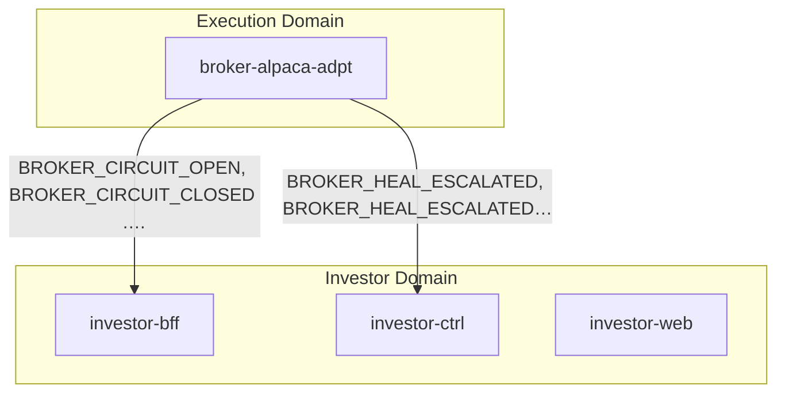

# Broker Circuit Breaker

> broker-alpaca-adpt detects Alpaca API failure, opens a global circuit breaker, triggers a singleton HealStateMachine that polls health until recovery or escalation, surfaces visibility to investors via feature flags and push notifications

**Domains:** execution, investor

**Trigger:** broker-alpaca-adpt ALPACA_ORDER_REQUESTED handler exhausts 3-attempt retry on Alpaca API, health-check (GET /v2/account) confirms broker is globally down, writes CircuitBreaker#alpaca (state=OPEN) + NormalizedEvent → CDC → BROKER_CIRCUIT_OPEN on ExecutionBus

## Flowchart



## Sequence Diagram

```mermaid
sequenceDiagram
    box execution domain
        participant broker_alpaca_adpt as broker-alpaca-adpt
    end
    box investor domain
        participant investor_bff as investor-bff
        participant investor_ctrl as investor-ctrl
        participant investor_web as investor-web
    end
    Note over broker_alpaca_adpt: HealStateMachine CloseBreaker step completes; CDC…
    Note over broker_alpaca_adpt: HealStateMachine EscalateHealFailure step fires a…
    broker_alpaca_adpt-)investor_bff: BROKER_CIRCUIT_OPEN (ExecutionBus → InvestorBus)
    broker_alpaca_adpt-)investor_bff: BROKER_CIRCUIT_CLOSED (ExecutionBus → InvestorBus)
    broker_alpaca_adpt-)investor_bff: BROKER_HEAL_ESCALATED (ExecutionBus → InvestorBus)
    broker_alpaca_adpt->>+investor_bff: BROKER_CIRCUIT_CLOSED
    broker_alpaca_adpt->>+investor_ctrl: BROKER_CIRCUIT_OPEN
    broker_alpaca_adpt->>+investor_ctrl: BROKER_CIRCUIT_CLOSED
    broker_alpaca_adpt->>+investor_ctrl: BROKER_HEAL_ESCALATED
    Note over investor_web: Angular app boots; shell-level FeatureFlagService…
    Note over investor_web: SystemBannerComponent (in shell app-root) renders…
    Note over investor_web: Deposit and withdrawal buttons in MFEs disabled w…
```

## Steps

### Step 1: broker-alpaca-adpt

- **Receives:** `ALPACA_ORDER_REQUESTED (or ALPACA_TRANSFER_REQUESTED | ALPACA_CANCEL_REQUESTED | ALPACA_ACCOUNT_CHECK_REQUESTED)`
- **Via:** ExecutionBus -> SQS -> broker-alpaca-adpt-Ingress
- **State change:** Handler preamble checks CircuitBreaker#alpaca (isOpen); if already OPEN, records
AlpacaOrderResult (status=REJECTED, rejectionReason=BROKER_UNAVAILABLE) and returns.
If CLOSED: AlpacaClient.submitOrder() called with 3-attempt exponential retry.
On full retry exhaustion: calls isBrokerDown() (single GET /v2/account, ~5s timeout).
If broker confirmed down: CircuitBreakerRepository.open('alpaca', reason) writes
CircuitBreaker record (pk=CircuitBreaker#alpaca, sk=CircuitBreaker, state=OPEN,
openedAt=timestamp, reason). Also writes NormalizedEvent
(pk=NormalizedEvent#{tenantId}#{orderId}, sk=BROKER_CIRCUIT_OPEN#{timestamp}).
Records AlpacaOrderResult (status=REJECTED, rejectionReason=BROKER_UNAVAILABLE).

- **Emits:** `BROKER_CIRCUIT_OPEN (CDC from NormalizedEvent:INSERT, sk passthrough prefix BROKER_CIRCUIT_OPEN)`
- **Idempotent:** yes

### Step 2: broker-alpaca-adpt

- **Receives:** `BROKER_CIRCUIT_OPEN`
- **Via:** ExecutionBus -> Orchestration EB rule -> broker-alpaca-adpt HealStateMachine (singleton executionName='heal-alpaca', 2h timeout)
- **State change:** HealStateMachine (CircuitBreakerHealDefinition construct) runs:
  InitAttemptCount (Pass: attemptCount=0)
    → HealthCheck (HTTP:Invoke GET /v2/account via EB Connection with Alpaca auth,
                   10s timeout, 3 retries 5/10/20s backoff)
      on success → CloseBreaker (DDB UpdateItem: CircuitBreaker#alpaca state=CLOSED,
                     closedAt=timestamp)
        → EmitBreakerClosed (DDB PutItem: NormalizedEvent sk=BROKER_CIRCUIT_CLOSED#{timestamp})
          → EndHealed (Succeed)
      on catch → IncrementAttempt (Pass: attemptCount+1)
        → CheckAttemptLimit (Choice)
            < maxAttempts (default 10) → WaitForRetry (Wait 60s) → HealthCheck (loop)
            >= maxAttempts → EscalateHealFailure (DDB PutItem: NormalizedEvent
                             sk=BROKER_HEAL_ESCALATED#{timestamp})
              → EndEscalated (Fail)

- **Emits:** `BROKER_CIRCUIT_CLOSED or BROKER_HEAL_ESCALATED (CDC from NormalizedEvent:INSERT, sk passthrough)`
- **Idempotent:** yes

### Step 3: broker-alpaca-adpt

- **Action:** HealStateMachine CloseBreaker step completes; CDC emits BROKER_CIRCUIT_CLOSED
- **State change:** CircuitBreaker#alpaca record updated to state=CLOSED, closedAt=timestamp
- **Emits:** `BROKER_CIRCUIT_CLOSED (CDC from NormalizedEvent:INSERT)`
- **Idempotent:** yes

### Step 4: broker-alpaca-adpt

- **Action:** HealStateMachine EscalateHealFailure step fires after maxAttempts exhausted
- **State change:** NormalizedEvent record written (sk=BROKER_HEAL_ESCALATED#{timestamp}); CircuitBreaker record remains OPEN
- **Emits:** `BROKER_HEAL_ESCALATED (CDC from NormalizedEvent:INSERT)`
- **Idempotent:** yes

### Step 5: Cross-domain hop

- **Event:** `BROKER_CIRCUIT_OPEN`
- **From:** ExecutionBus
- **To:** InvestorBus
- **Via:** investor-adpt EB rule (InvestorIngress-FromExecution)

### Step 6: Cross-domain hop

- **Event:** `BROKER_CIRCUIT_CLOSED`
- **From:** ExecutionBus
- **To:** InvestorBus
- **Via:** investor-adpt EB rule (InvestorIngress-FromExecution)

### Step 7: Cross-domain hop

- **Event:** `BROKER_HEAL_ESCALATED`
- **From:** ExecutionBus
- **To:** InvestorBus
- **Via:** investor-adpt EB rule (InvestorIngress-FromExecution)

### Step 8: investor-bff

- **Receives:** `BROKER_CIRCUIT_OPEN`
- **Via:** InvestorBus -> SQS -> investor-bff-Ingress
- **State change:** event-listener handler calls AppSync updateFeatureFlag mutation (IAM auth) twice:
  updateFeatureFlag(flag: 'initiateDeposit', enabled: false)
  updateFeatureFlag(flag: 'requestWithdrawal', enabled: false)
AppSync persists flags and broadcasts onFeatureFlagUpdate subscription to all
connected investor-web clients.

- **Emits:** `none (AppSync mutation side-effects only; no DDB CDC)`
- **Idempotent:** yes

### Step 9: investor-bff

- **Receives:** `BROKER_CIRCUIT_CLOSED`
- **Via:** InvestorBus -> SQS -> investor-bff-Ingress
- **State change:** event-listener handler calls AppSync updateFeatureFlag mutation (IAM auth) twice:
  updateFeatureFlag(flag: 'initiateDeposit', enabled: true)
  updateFeatureFlag(flag: 'requestWithdrawal', enabled: true)
AppSync broadcasts onFeatureFlagUpdate subscription to all connected clients.

- **Emits:** `none`
- **Idempotent:** yes

### Step 10: investor-ctrl

- **Receives:** `BROKER_CIRCUIT_OPEN`
- **Via:** InvestorBus -> SQS -> investor-ctrl-Ingress
- **State change:** Creates Notification record (tenantId='SYSTEM', type=CIRCUIT_BREAKER_OPEN,
channel=PUSH, title='Deposits and withdrawals temporarily paused',
body='Deposits, withdrawals, and accepting decisions are temporarily paused
while we restore broker connectivity. We will notify you when service resumes.')

- **Emits:** `NOTIFICATION_CREATED (CDC from Notification:INSERT)`
- **Idempotent:** yes

### Step 11: investor-ctrl

- **Receives:** `BROKER_CIRCUIT_CLOSED`
- **Via:** InvestorBus -> SQS -> investor-ctrl-Ingress
- **State change:** Creates Notification record (tenantId='SYSTEM', type=CIRCUIT_BREAKER_CLOSED,
channel=PUSH, title='Service restored',
body='Broker connectivity has been restored. Deposits, withdrawals, and decision
confirmation are available again.')

- **Emits:** `NOTIFICATION_CREATED (CDC from Notification:INSERT)`
- **Idempotent:** yes

### Step 12: investor-ctrl

- **Receives:** `BROKER_HEAL_ESCALATED`
- **Via:** InvestorBus -> SQS -> investor-ctrl-Ingress
- **State change:** Creates two Notification records (tenantId='SYSTEM'):
  1. type=BROKER_HEAL_ESCALATED, channel=EMAIL, title='Broker connectivity issue
     requires attention', body='Automated recovery has failed after repeated attempts.
     Operations team has been alerted. Deposits and withdrawals remain paused.'
  2. type=BROKER_HEAL_ESCALATED, channel=PUSH (same message, shorter copy)

- **Emits:** `NOTIFICATION_CREATED (CDC from Notification:INSERT, two records)`
- **Idempotent:** yes

### Step 13: investor-web

- **Action:** Angular app boots; shell-level FeatureFlagService subscribes to onFeatureFlagUpdate AppSync subscription and calls getFeatureFlags query to hydrate FeatureFlagsStore
- **Via:** AppSync WebSocket subscription (Cognito auth)
- **State change:** FeatureFlagsStore (NgRx signal store) updated in real time when updateFeatureFlag mutation fires
- **Emits:** `none`

### Step 14: investor-web

- **Action:** SystemBannerComponent (in shell app-root) renders warning banner when initiateDeposit or requestWithdrawal flag is disabled
- **Via:** FeatureFlagsStore signal; SystemBannerComponent uses async pipe on selectDisabledFlags
- **State change:** Banner visible while any monitored flag is disabled; auto-dismisses when all re-enabled
- **Emits:** `none`

### Step 15: investor-web

- **Action:** Deposit and withdrawal buttons in MFEs disabled when flags are off; advisory-bff confirmDecision button also disabled (frontend guard; investor-bff pipeline resolver rejects as fallback)
- **Via:** FeatureFlagDirective (hasFeature structural directive) on button elements
- **State change:** none
- **Emits:** `none`

## Success Criteria

- broker-alpaca-adpt writes CircuitBreaker#alpaca (state=OPEN) only after health check confirms broker is globally down (not on first transient failure)
- BROKER_CIRCUIT_OPEN emitted via CDC from NormalizedEvent INSERT within seconds of detection
- HealStateMachine starts as singleton (executionName='heal-alpaca'); duplicate BROKER_CIRCUIT_OPEN events during active heal are silently deduplicated
- HealStateMachine CloseBreaker updates CircuitBreaker#alpaca to state=CLOSED and emits BROKER_CIRCUIT_CLOSED via CDC
- BROKER_CIRCUIT_OPEN, BROKER_CIRCUIT_CLOSED, BROKER_HEAL_ESCALATED all forwarded ExecutionBus → InvestorBus via investor-adpt
- investor-bff disables initiateDeposit + requestWithdrawal flags on OPEN; re-enables on CLOSED
- AppSync onFeatureFlagUpdate subscription delivers flag changes to all connected investor-web clients in real time
- investor-ctrl sends PUSH notification on BROKER_CIRCUIT_OPEN and BROKER_CIRCUIT_CLOSED; EMAIL+PUSH on BROKER_HEAL_ESCALATED
- SystemBannerComponent renders and dismisses reactively based on FeatureFlagsStore signal state
- Deposit and withdrawal UI controls disabled while flags are off

## Failure Modes

- **Detection fails:** isBrokerDown() call itself times out or throws → breaker not opened; handler falls through to existing error path; no BROKER_CIRCUIT_OPEN emitted; per-order failures continue accumulating
- **Open race:** two concurrent handlers both pass isOpen=false check; conditional DDB write ensures only first succeeds; second write is silently rejected (condition failed); one NormalizedEvent written, one heal SM started
- **CDC pipeline:** DynamoDB Streams event delivery delayed or Lambda throttled → BROKER_CIRCUIT_OPEN reaches ExecutionBus late; heal SM starts late; investor visibility delayed
- **Heal SM singleton:** SF execution name conflict if a previous heal completed and a new OPEN fires within 90 days (SF execution history window); resolved by appending date suffix to executionName if needed
- **HealthCheck HTTP:Invoke:** EB Connection secret rotation mid-execution → auth failure → SF retries will re-fetch credentials; no special handling needed
- **Heal SM exhausts maxAttempts:** BROKER_HEAL_ESCALATED emitted; CircuitBreaker record remains OPEN; all subsequent ALPACA_ORDER_REQUESTED continue to reject immediately; manual intervention required to reset
- **investor-adpt DLQ:** InvestorIngress-FromExecution rule target throttled → BROKER_CIRCUIT_OPEN/CLOSED/HEAL_ESCALATED land in FromExecutionDLQ (14-day retention); feature flags and notifications delayed until DLQ redriven
- **investor-bff AppSync mutation fails:** IAM permission error or AppSync unavailable → feature flags not updated; FeatureFlagsStore not notified; UI continues showing enabled buttons during outage
- **investor-ctrl ingress DLQ:** Notification records not created; push/email notifications not sent; investor has no history of the outage
- **Frontend offline:** investor-web not connected during flag change → misses onFeatureFlagUpdate subscription event; getFeatureFlags query on next app load reconciles state
