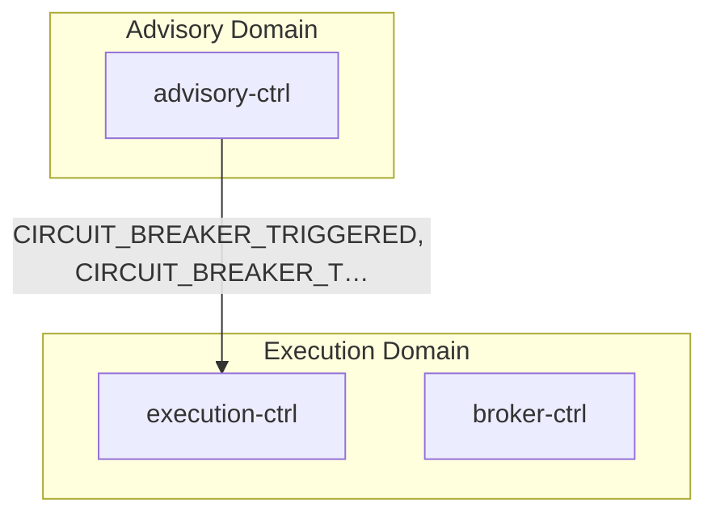
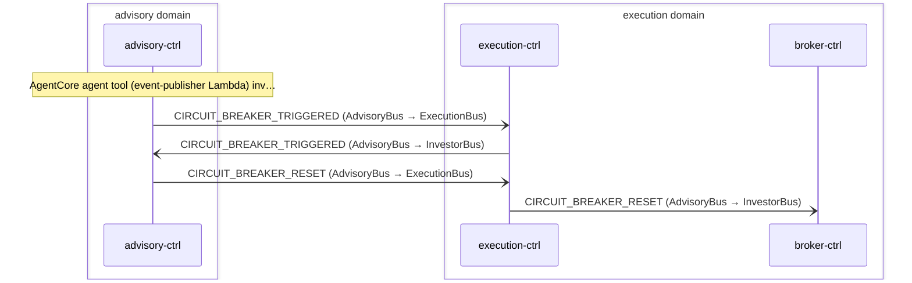

# Circuit Breaker

> Advisory agent triggers circuit breaker to halt execution on risk events; broker-ctrl opens its own circuit breaker on adapter timeout and auto-heals via Step Functions

**Domains:** advisory, execution, investor

**Trigger:** advisory-ctrl agent tool publishes CIRCUIT_BREAKER_TRIGGERED directly to AdvisoryBus

## Flowchart

## Sequence Diagram

## Steps

### Step 1: advisory-ctrl

- **Action:** AgentCore agent tool (event-publisher Lambda) invokes PutEvents to AdvisoryBus
- **State change:** No DDB write — direct PutEvents with source "advisory-ctrl" and eventType CIRCUIT_BREAKER_TRIGGERED
- **Emits:** `CIRCUIT_BREAKER_TRIGGERED (explicit PutEvents from agent tool, not CDC)`
- **Idempotent:** yes

### Step 2: Cross-domain hop

- **Event:** `CIRCUIT_BREAKER_TRIGGERED`
- **From:** AdvisoryBus
- **To:** ExecutionBus
- **Via:** execution-adpt EB rule (ExecutionIngress-FromAdvisory)

### Step 3: execution-ctrl

- **Receives:** `CIRCUIT_BREAKER_TRIGGERED`
- **Via:** ExecutionBus -> SQS -> execution-ctrl-ingress
- **State change:** Logs "Circuit breaker triggered — execution paused"; returns skip() — no DDB write, no further action
- **Emits:** `none`
- **Idempotent:** yes

### Step 4: Cross-domain hop

- **Event:** `CIRCUIT_BREAKER_TRIGGERED`
- **From:** AdvisoryBus
- **To:** InvestorBus
- **Via:** investor-adpt EB rule (InvestorIngress-FromAdvisory)

### Step 5: advisory-ctrl

- **Action:** AgentCore agent tool (event-publisher Lambda) invokes PutEvents to AdvisoryBus
- **State change:** No DDB write — direct PutEvents with source "advisory-ctrl" and eventType CIRCUIT_BREAKER_RESET
- **Emits:** `CIRCUIT_BREAKER_RESET (explicit PutEvents from agent tool, not CDC)`
- **Idempotent:** yes

### Step 6: Cross-domain hop

- **Event:** `CIRCUIT_BREAKER_RESET`
- **From:** AdvisoryBus
- **To:** ExecutionBus
- **Via:** execution-adpt EB rule (ExecutionIngress-FromAdvisory)

### Step 7: execution-ctrl

- **Receives:** `CIRCUIT_BREAKER_RESET`
- **Via:** ExecutionBus -> SQS -> execution-ctrl-ingress
- **State change:** Logs "Circuit breaker reset — execution resumed"; returns skip() — no DDB write
- **Emits:** `none`
- **Idempotent:** yes

### Step 8: Cross-domain hop

- **Event:** `CIRCUIT_BREAKER_RESET`
- **From:** AdvisoryBus
- **To:** InvestorBus
- **Via:** investor-adpt EB rule (InvestorIngress-FromAdvisory)

### Step 9: broker-ctrl

- **Action:** OrderStateMachine HandleTimeout parallel branch (adapter 300s timeout)
- **State change:** SF writes NormalizedEvent to DDB — pk=NormalizedEvent#{tenantId}#CIRCUIT_BREAKER, sk=BROKER_CIRCUIT_OPEN#{timestamp}, __typename=NormalizedEvent
- **Emits:** `BROKER_CIRCUIT_OPEN (CDC from NormalizedEvent INSERT, sk passthrough)`
- **Idempotent:** yes

### Step 10: broker-ctrl

- **Receives:** `BROKER_CIRCUIT_OPEN`
- **Via:** ExecutionBus -> Orchestration EB rule -> broker-ctrl HealStateMachine
- **State change:** SF starts HealWorkflow:
1. EmitHealthCheck: invokes EmitHealthCheckFn (waitForTaskToken) — Lambda stores healTaskToken, emits ALPACA_ACCOUNT_CHECK to ExecutionBus
2. Awaits ALPACA_ACCOUNT_SNAPSHOT callback via CallbackIngress (HEAL_STATE_MACHINE_ARN)
3. On success: CloseBreaker (DDB UpdateItem clears circuit breaker state)
4. On timeout/failure: IncrementAttempt → CheckAttemptLimit (< 10 retries → WaitForRetry 60s → loop; >= 10 → EscalateHealFailure terminal)

- **Emits:** `BROKER_CIRCUIT_CLOSED or BROKER_HEAL_ESCALATED (CDC from NormalizedEvent INSERT after SF writes result record)`
- **Idempotent:** yes

### Step 11: Cross-domain hop

- **Event:** `BROKER_CIRCUIT_OPEN`
- **From:** ExecutionBus
- **To:** InvestorBus
- **Via:** investor-adpt EB rule (InvestorIngress-FromExecution)

## Success Criteria

- CIRCUIT_BREAKER_TRIGGERED published by advisory-ctrl agent reaches ExecutionBus and InvestorBus via adapters
- execution-ctrl processes CIRCUIT_BREAKER_TRIGGERED without error (skip handler, no DDB write)
- CIRCUIT_BREAKER_RESET published by advisory-ctrl agent reaches ExecutionBus and InvestorBus
- execution-ctrl processes CIRCUIT_BREAKER_RESET without error (skip handler, no DDB write)
- broker-ctrl OrderStateMachine timeout writes NormalizedEvent BROKER_CIRCUIT_OPEN to DDB
- BROKER_CIRCUIT_OPEN CDC emission triggers HealStateMachine on ExecutionBus
- HealStateMachine emits ALPACA_ACCOUNT_CHECK and awaits adapter callback
- [object Object]
- BROKER_CIRCUIT_OPEN reaches InvestorBus via investor-adpt

## Failure Modes

- **step 1 fails:** agent tool PutEvents rejected (IAM, bus not found); advisory-ctrl agent receives error from event-publisher tool; no circuit breaker state propagated
- **step 2/4/7/9/12 fails:** adapter EB rule DLQ (FromAdvisoryDLQ / FromExecutionDLQ); downstream domains not notified; 14-day retention for replay
- **step 3/8 fails:** execution-ctrl ingress DLQ; log observability lost but no state corruption (handler is skip-only)
- **step 10 fails:** DDB PutItem fails inside SF parallel branch; BROKER_CIRCUIT_OPEN not emitted; circuit breaker not opened; order hangs without heal
- **step 11 (EmitHealthCheck) fails:** ALPACA_ACCOUNT_CHECK not emitted; SF waits until task token timeout; increments attempt counter (up to 10 retries with 60s gaps)
- **step 11 (heal exhausted):** after 10 retries, HealStateMachine writes EscalateHealFailure — BROKER_HEAL_ESCALATED emitted via CDC; manual operator intervention required
