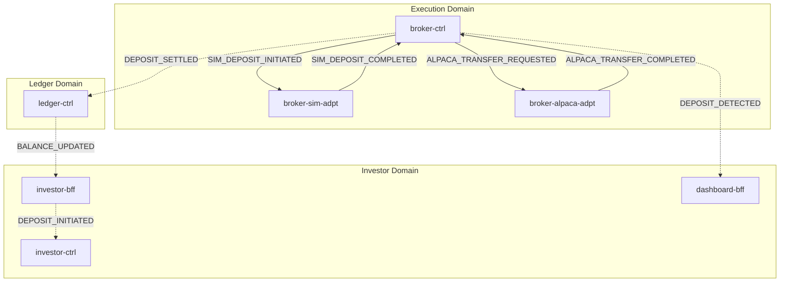
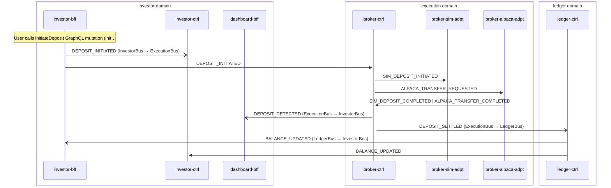

# Deposit

> Investor initiates a deposit, routed through broker-ctrl to sim or Alpaca adapter, normalized back to canonical events, recorded in ledger, balance update propagated to investor domain

**Domains:** investor, execution, ledger

**Trigger:** investor-bff emits DEPOSIT_INITIATED (CDC from DepositIntent:INSERT)

## Flowchart

## Sequence Diagram

## Steps

### Step 1: investor-bff

- **Action:** User calls initiateDeposit GraphQL mutation (initiate-deposit.fn.js) which writes a DepositIntent record to DDB; alternatively onboardingCompleted writes a DepositIntent record if capitalAmount > 0
- **State change:** DepositIntent record written with status INITIATED
- **Emits:** `DEPOSIT_INITIATED (CDC, DepositIntent:insert)`
- **Idempotent:** yes

### Step 2: Cross-domain hop

- **Event:** `DEPOSIT_INITIATED`
- **From:** InvestorBus
- **To:** ExecutionBus
- **Via:** execution-adpt EB rule (ExecutionIngress-FromInvestor)

### Step 3: investor-ctrl

- **Receives:** `DEPOSIT_INITIATED`
- **Via:** InvestorBus → SQS → investor-ctrl-trigger-ingress
- **State change:** Creates Notification record (title "Deposit Received")
- **Emits:** `NOTIFICATION_CREATED (CDC, Notification:insert)`
- **Idempotent:** yes

### Step 4: broker-ctrl

- **Receives:** `DEPOSIT_INITIATED`
- **Via:** ExecutionBus → SQS → broker-ctrl-deposit-withdrawal-ingress
- **State change:** None (stateless routing). deposit-withdrawal-router reads ExecutionMode from DDB, emits SIM_DEPOSIT_INITIATED (simulation) or ALPACA_TRANSFER_REQUESTED with direction=INCOMING (live) via explicit EventBridge PutEvents
- **Emits:** `SIM_DEPOSIT_INITIATED or ALPACA_TRANSFER_REQUESTED (explicit)`
- **Idempotent:** yes

### Step 5: broker-sim-adpt

- **Receives:** `SIM_DEPOSIT_INITIATED`
- **Via:** ExecutionBus → SQS → broker-sim-adpt-ingress
- **State change:** Converts amountCents to dollars, guardedAddToCashBalance credits virtual ledger (idempotent via event-keyed guard). Writes DepositDetected record to DDB
- **Emits:** `SIM_DEPOSIT_COMPLETED (CDC, DepositDetected:insert)`
- **Idempotent:** yes

### Step 6: broker-alpaca-adpt

- **Receives:** `ALPACA_TRANSFER_REQUESTED`
- **Via:** ExecutionBus → SQS → broker-alpaca-adpt-ingress
- **State change:** Calls Alpaca ACH transfer API (direction=INCOMING), writes AlpacaTransferResult record with status INITIATED or FAILED
- **Emits:** `ALPACA_TRANSFER_INITIATED or ALPACA_TRANSFER_FAILED (CDC, AlpacaTransferResult:insert)`
- **Idempotent:** yes

### Step 7: broker-alpaca-adpt

- **Receives:** `ALPACA_TRANSFER_INITIATED (triggers TransferPollingStateMachine)`
- **Via:** Orchestration trigger on ExecutionBus
- **State change:** TransferPollFn polls Alpaca API with exponential backoff (up to 7-day timeout). On terminal status, writes AlpacaTransferResult update (COMPLETED or FAILED)
- **Emits:** `ALPACA_TRANSFER_COMPLETED or ALPACA_TRANSFER_FAILED (CDC, AlpacaTransferResult:modify)`
- **Idempotent:** yes

### Step 8: broker-ctrl

- **Receives:** `SIM_DEPOSIT_COMPLETED | ALPACA_TRANSFER_COMPLETED`
- **Via:** ExecutionBus → SQS → broker-ctrl-deposit-withdrawal-normalizer-ingress
- **State change:** deposit-withdrawal-normalizer writes TWO FundingEvent records (sk=DEPOSIT_DETECTED status=detected, sk=DEPOSIT_SETTLED status=settled) via fundingCarrier
- **Emits:** `DEPOSIT_DETECTED, DEPOSIT_SETTLED (CDC, FundingEvent:insert, passthrough on sk field)`
- **Idempotent:** yes

### Step 9: Cross-domain hop

- **Event:** `DEPOSIT_DETECTED`
- **From:** ExecutionBus
- **To:** InvestorBus
- **Via:** investor-adpt EB rule (InvestorIngress-FromExecution)

### Step 10: dashboard-bff

- **Receives:** `DEPOSIT_DETECTED`
- **Via:** InvestorBus → SQS → dashboard-bff-ingress
- **State change:** recentActivity transform writes Activity record (activityType=DEPOSIT_DETECTED)
- **Emits:** `none (read model projection)`
- **Idempotent:** yes

### Step 11: Cross-domain hop

- **Event:** `DEPOSIT_SETTLED`
- **From:** ExecutionBus
- **To:** LedgerBus
- **Via:** ledger-adpt EB rule (LedgerIngress-FromExecution)

### Step 12: ledger-ctrl

- **Receives:** `DEPOSIT_SETTLED`
- **Via:** LedgerBus → SQS → ledger-ctrl-ingress
- **State change:** event-listener writes LedgerEntry record (actual stream). Reducer (DDB Stream consumer, filters LedgerEntry:INSERT) replays events through accountReducer (RecordDeposit adds amountCents to cashBalanceCents). saveSnapshotWithEvents writes AccountSnapshot + BalanceEvent (when balanceChanged) + LedgerEntryEvent
- **Emits:** `BALANCE_UPDATED (CDC, BalanceEvent:insert), LEDGER_ENTRY_RECORDED (CDC, LedgerEntryEvent:insert)`
- **Idempotent:** yes

### Step 13: Cross-domain hop

- **Event:** `BALANCE_UPDATED`
- **From:** LedgerBus
- **To:** InvestorBus
- **Via:** investor-adpt EB rule (InvestorIngress-FromLedger)

### Step 14: investor-bff

- **Receives:** `BALANCE_UPDATED`
- **Via:** InvestorBus → SQS → investor-bff-ingress
- **State change:** balanceUpdated transform projects CashBalance record (pk=InvestorProfile#tenantId#userId, sk=CashBalance) with updated cashBalanceCents
- **Emits:** `none (read model projection, no CDC entity configured for CashBalance)`
- **Idempotent:** yes

### Step 15: investor-ctrl

- **Receives:** `BALANCE_UPDATED`
- **Via:** InvestorBus → SQS → investor-ctrl-trigger-ingress
- **State change:** Creates Notification record for balance update
- **Emits:** `NOTIFICATION_CREATED (CDC, Notification:insert)`
- **Idempotent:** yes

## Success Criteria

- Deposit amount credited in ledger-ctrl account snapshot (cashBalanceCents increased)
- BALANCE_UPDATED event reaches investor domain
- investor-bff CashBalance read model reflects new balance
- LEDGER_ENTRY_RECORDED event persists audit trail
- investor-ctrl creates notifications for both DEPOSIT_INITIATED and BALANCE_UPDATED
- dashboard-bff getRecentActivity surfaces a DEPOSIT_DETECTED activity entry

## Failure Modes

- **step 2 (cross_domain) fails:** execution-adpt FromInvestorDLQ captures undelivered event; deposit not routed to execution domain
- **step 4 (broker-ctrl routing) fails:** broker-ctrl DepositWithdrawalIngress DLQ; deposit not routed to adapter
- **step 5 (broker-sim-adpt) fails:** broker-sim-adpt ingress DLQ; simulated deposit not completed
- **step 6 (broker-alpaca-adpt initiate) fails:** broker-alpaca-adpt ingress DLQ; Alpaca transfer not submitted
- **step 7 (broker-alpaca-adpt polling) fails:** TransferPollingStateMachine 7-day timeout writes FAILED status; broker-ctrl normalizer receives ALPACA_TRANSFER_FAILED instead
- **step 8 (broker-ctrl normalizer) fails:** broker-ctrl DepositWithdrawalNormalizerIngress DLQ; normalized DEPOSIT_DETECTED/DEPOSIT_SETTLED carriers not created
- **step 9 (cross_domain) fails:** investor-adpt FromExecutionDLQ; DEPOSIT_DETECTED not forwarded to investor domain, dashboard activity entry not created
- **step 10 (dashboard-bff) fails:** dashboard-bff ingress DLQ; recent-activity feed missing the deposit entry
- **step 11 (cross_domain) fails:** ledger-adpt FromExecutionDLQ; balance not updated in ledger
- **step 12 (ledger-ctrl) fails:** ledger-ctrl ingress DLQ; ledger entry not recorded, balance not materialized
- **step 13 (cross_domain) fails:** investor-adpt FromLedgerDLQ; investor not notified of balance change
