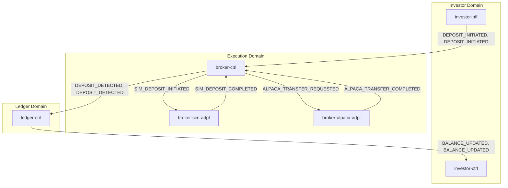
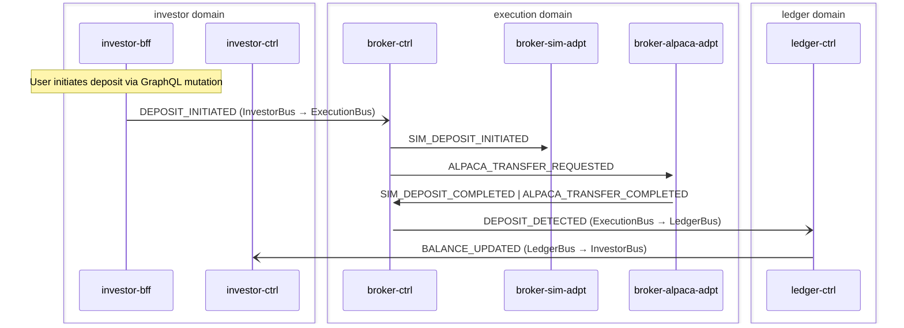

# Deposit

> Investor initiates a deposit, routed through broker-ctrl to sim or Alpaca adapter, normalized back to canonical events

**Domains:** investor, execution, ledger

**Trigger:** investor-bff emits DEPOSIT_INITIATED (CDC from Deposit:INSERT)

## Flowchart

## Sequence Diagram

## Steps

### Step 1: investor-bff

- **Action:** User initiates deposit via GraphQL mutation
- **State change:** Writes Deposit record to DDB
- **Emits:** `DEPOSIT_INITIATED (CDC)`
- **Idempotent:** yes

### Step 2: Cross-domain hop

- **Event:** `DEPOSIT_INITIATED`
- **From:** InvestorBus
- **To:** ExecutionBus
- **Via:** execution-adpt EB rule

### Step 3: broker-ctrl

- **Receives:** `DEPOSIT_INITIATED`
- **Via:** ExecutionBus -> SQS -> broker-ctrl-DepositWithdrawalIngress
- **State change:** deposit-withdrawal-router reads ExecutionMode and routes to SIM_DEPOSIT_INITIATED or ALPACA_TRANSFER_REQUESTED
- **Emits:** `SIM_DEPOSIT_INITIATED or ALPACA_TRANSFER_REQUESTED (explicit publish)`
- **Idempotent:** yes

### Step 4: broker-sim-adpt

- **Receives:** `SIM_DEPOSIT_INITIATED`
- **Via:** ExecutionBus -> SQS -> broker-sim-adpt-ingress
- **State change:** Simulates deposit, writes DepositDetected record
- **Emits:** `SIM_DEPOSIT_COMPLETED (CDC)`
- **Idempotent:** yes

### Step 5: broker-alpaca-adpt

- **Receives:** `ALPACA_TRANSFER_REQUESTED`
- **Via:** ExecutionBus -> SQS -> broker-alpaca-adpt-ingress
- **State change:** Submits ACH transfer to Alpaca API, writes AlpacaTransferResult
- **Emits:** `ALPACA_TRANSFER_COMPLETED or ALPACA_TRANSFER_FAILED (CDC)`
- **Idempotent:** yes

### Step 6: broker-ctrl

- **Receives:** `SIM_DEPOSIT_COMPLETED | ALPACA_TRANSFER_COMPLETED`
- **Via:** ExecutionBus -> SQS -> broker-ctrl-DepositWithdrawalNormalizerIngress
- **State change:** Writes NormalizedEvent record (sk = DEPOSIT_DETECTED)
- **Emits:** `DEPOSIT_DETECTED (CDC from NormalizedEvent:INSERT, sk is event type)`
- **Idempotent:** yes

### Step 7: Cross-domain hop

- **Event:** `DEPOSIT_DETECTED`
- **From:** ExecutionBus
- **To:** LedgerBus
- **Via:** ledger-adpt EB rule

### Step 8: ledger-ctrl

- **Receives:** `DEPOSIT_DETECTED`
- **Via:** LedgerBus -> SQS -> ledger-ctrl-ingress
- **State change:** Records BalanceEvent (credit) and LedgerEntryEvent in DDB; reducer materializes account snapshot
- **Emits:** `BALANCE_UPDATED, LEDGER_ENTRY_RECORDED (CDC)`
- **Idempotent:** yes

### Step 9: Cross-domain hop

- **Event:** `BALANCE_UPDATED`
- **From:** LedgerBus
- **To:** InvestorBus
- **Via:** investor-adpt EB rule

### Step 10: investor-ctrl

- **Receives:** `BALANCE_UPDATED`
- **Via:** InvestorBus -> SQS -> investor-ctrl-ingress
- **State change:** Updates investor balance view, may trigger notification
- **Emits:** `NOTIFICATION_CREATED (CDC)`
- **Idempotent:** yes

## Success Criteria

- Deposit amount credited in ledger-ctrl balance
- BALANCE_UPDATED event reaches investor domain
- LEDGER_ENTRY_RECORDED event persists audit trail

## Failure Modes

- **step 2 fails:** investor-adpt ToExecutionDLQ; deposit not routed to execution domain
- **step 3 fails:** broker-ctrl DepositWithdrawalIngress DLQ; deposit not routed to adapter
- **step 4 fails:** broker-sim-adpt ingress DLQ; simulated deposit not completed
- **step 5 fails:** broker-alpaca-adpt ingress DLQ; Alpaca transfer not submitted
- **step 6 fails:** broker-ctrl DepositWithdrawalNormalizerIngress DLQ; normalized event not created
- **step 8 fails:** ledger-ctrl ingress DLQ; balance not updated
