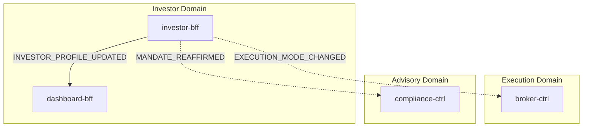
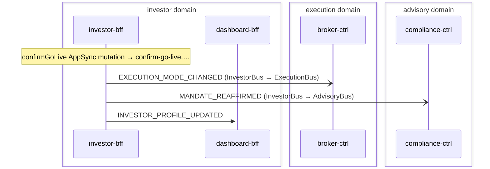

# Go Live

> Investor transitions from simulation to live trading. The investor-bff confirmGoLive mutation atomically flips executionMode, re-affirms the Mandate effectiveDate, and writes an audit row — CDC then fans out to execution (broker-ctrl mode cache), advisory (compliance-ctrl MandateSnapshot re-affirmation), and the dashboard UI (InvestorSnapshot live badge).

**Domains:** investor, execution, advisory

**Trigger:** investor-bff confirmGoLive AppSync mutation (authenticated investor)

## Flowchart

## Sequence Diagram

## Steps

### Step 1: investor-bff

- **Action:** confirmGoLive AppSync mutation → confirm-go-live.fn.js → TransactWriteItems (3 items); get-profile.fn.js readback (extraSteps) returns the updated InvestorProfile to the caller
- **State change:** ExecutionModeChange row written (pk=InvestorProfile#<tenantId>#<userId>, sk=ExecutionModeChange#<changeId>, __typename='ExecutionModeChange', fromMode='simulation', toMode='live'); InvestorProfile row updated (executionMode='live', __version++); Mandate sibling row updated (effectiveDate re-affirmed to now, __version++) — only when Mandate status='ACTIVE'
- **Emits:** `EXECUTION_MODE_CHANGED (CDC, ExecutionModeChange:INSERT), INVESTOR_PROFILE_UPDATED (CDC, InvestorProfile:MODIFY — always carrier), MANDATE_REAFFIRMED (CDC, Mandate:MODIFY onFieldChange effectiveDate)
`
- **Idempotent:** yes

### Step 2: Cross-domain hop

- **Event:** `EXECUTION_MODE_CHANGED`
- **From:** InvestorBus
- **To:** ExecutionBus
- **Via:** execution-adpt EB rule (ExecutionIngress-FromInvestor)

### Step 3: broker-ctrl

- **Receives:** `EXECUTION_MODE_CHANGED`
- **Via:** ExecutionBus -> SQS -> broker-ctrl-ModeIngress
- **State change:** mode-listener records ExecutionMode row (pk='ExecutionMode#<tenantId>', sk='ExecutionMode', __typename='ExecutionMode', mode='live') via record(); future order/deposit/withdrawal routing reads this row via Direct DDB GetItem and dispatches to broker-alpaca-adpt instead of broker-sim-adpt
- **Idempotent:** yes

### Step 4: Cross-domain hop

- **Event:** `MANDATE_REAFFIRMED`
- **From:** InvestorBus
- **To:** AdvisoryBus
- **Via:** advisory-adpt EB rule (AdvisoryIngress-FromInvestor)

### Step 5: compliance-ctrl

- **Receives:** `MANDATE_REAFFIRMED`
- **Via:** AdvisoryBus -> SQS -> compliance-ctrl-Ingress
- **State change:** projectMandateSnapshot writes (or overwrites) MandateSnapshot row via projectVersioned (pk=GuardrailPolicy#<tenantId>#<userId>, sk='MandateSnapshot'), carrying the full Mandate image (level, status, operatingMode, effectiveDate) keyed on Mandate's __version; the version guard prevents a stale re-affirmation from clobbering a newer MANDATE_REVOKED
- **Idempotent:** yes

### Step 6: dashboard-bff

- **Receives:** `INVESTOR_PROFILE_UPDATED`
- **Via:** InvestorBus -> SQS -> dashboard-bff-Ingress
- **State change:** investor-snapshot.ts projects InvestorSnapshot row via projectVersioned, carrying executionMode='live' (plus goal, riskProfile, operatingMode, onboardedAt from the full InvestorProfile CDC payload), keyed on __version; the version guard prevents out-of-order CDC from clobbering a newer snapshot. dashboard-bff DDB-stream publisher then broadcasts the updated InvestorSnapshot to AppSync @aws_subscribe clients — the dashboard execution-mode badge switches to LIVE and survives a page refresh.
- **Idempotent:** yes

## Success Criteria

- ExecutionMode row materialised in broker-ctrl DDB with mode='live' (pk='ExecutionMode#<tenantId>', sk='ExecutionMode')
- compliance-ctrl MandateSnapshot row re-affirmed (__version bumped, effectiveDate updated) — next compliance check uses the refreshed effectiveDate
- dashboard-bff InvestorSnapshot row carries executionMode='live' — live badge visible on dashboard and survives refresh
- Future ORDER_SUBMITTED events routed to broker-alpaca-adpt instead of broker-sim-adpt
- Future DEPOSIT_INITIATED events routed to ALPACA_TRANSFER_REQUESTED instead of SIM_DEPOSIT_INITIATED
- Future WITHDRAWAL_REQUESTED events routed to ALPACA_TRANSFER_REQUESTED instead of SIM_WITHDRAWAL_REQUESTED

## Failure Modes

- **step 1 fails (TransactionCanceledException):** TransactWriteItems is atomic; if InvestorProfile is missing or already live (executionMode != 'simulation'), or Mandate is not ACTIVE, the resolver returns InvalidState — no rows written, no CDC emitted, caller sees the error
- **step 1 DLQ (CDC publish):** if Egress CDC lambda fails after the row is committed, EXECUTION_MODE_CHANGED / INVESTOR_PROFILE_UPDATED / MANDATE_REAFFIRMED are not emitted; rows are written (execution mode IS live at the DDB level) but downstream read-models lag until manual DLQ replay
- **step 2 fails (execution-adpt DLQ):** EXECUTION_MODE_CHANGED not forwarded to ExecutionBus (FromInvestorDLQ); broker-ctrl never materialises ExecutionMode row; orders still route to simulator adapters until DLQ is replayed
- **step 2a fails (broker-ctrl ModeIngress DLQ):** ExecutionMode row not materialised; routing remains in simulation mode
- **step 3 fails (advisory-adpt DLQ):** MANDATE_REAFFIRMED not forwarded to AdvisoryBus (FromInvestorDLQ); compliance-ctrl MandateSnapshot not re-affirmed; the old effectiveDate remains until DLQ is replayed
- **step 3a fails (compliance-ctrl Ingress DLQ):** MandateSnapshot not updated; compliance checks use stale effectiveDate
- **step 4 fails (dashboard-bff Ingress DLQ):** InvestorSnapshot not updated; dashboard still shows SIMULATION badge until DLQ is replayed
