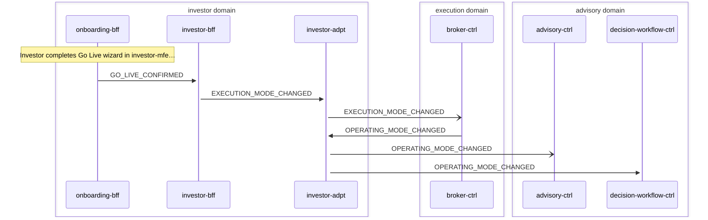

# Go Live

> Investor transitions from simulation to live trading by completing Go Live wizard, switching execution mode from simulation to live

**Domains:** investor, execution

**Trigger:** onboarding-bff emits GO_LIVE_CONFIRMED (CDC from GoLiveConfirmed:INSERT)

## Flow Diagram

## Steps

### Step 1: onboarding-bff

- **Action:** Investor completes Go Live wizard in investor-mfe, calls confirmGoLive() resolver
- **State change:** TransactWrite updates OnboardingSession status and writes GoLiveConfirmed record to DDB
- **Emits:** `GO_LIVE_CONFIRMED (CDC from GoLiveConfirmed:INSERT)`
- **Idempotent:** yes

### Step 2: investor-bff

- **Receives:** `GO_LIVE_CONFIRMED`
- **Via:** InvestorBus -> SQS -> investor-bff-ingress
- **State change:** event-listener calls setExecutionMode('simulation' -> 'live'), writes ExecutionModeChange record to DDB
- **Emits:** `EXECUTION_MODE_CHANGED (CDC from ExecutionModeChange:INSERT)`
- **Idempotent:** yes

### Step 3: investor-adpt

- **Receives:** `EXECUTION_MODE_CHANGED`
- **Via:** InvestorBus -> investor-adpt ToExecution rule
- **Forwards to:** ExecutionBus
- **Emits:** `EXECUTION_MODE_CHANGED`

### Step 4: broker-ctrl

- **Receives:** `EXECUTION_MODE_CHANGED`
- **Via:** ExecutionBus -> SQS -> broker-ctrl-ModeIngress
- **State change:** mode-listener materializes ExecutionMode record (mode='live') in DDB; future deposit/withdrawal/order routing uses Alpaca instead of simulator
- **Idempotent:** yes

### Step 5: investor-adpt

- **Receives:** `OPERATING_MODE_CHANGED`
- **Via:** InvestorBus -> investor-adpt ToAdvisory rule
- **Forwards to:** AdvisoryBus
- **Emits:** `OPERATING_MODE_CHANGED`

### Step 6: advisory-ctrl

- **Receives:** `OPERATING_MODE_CHANGED`
- **Via:** AdvisoryBus -> SQS -> advisory-ctrl-ingress
- **State change:** Updates operating mode context for future advisory decisions
- **Idempotent:** yes

### Step 7: decision-workflow-ctrl

- **Receives:** `OPERATING_MODE_CHANGED`
- **Via:** AdvisoryBus -> SQS -> decision-workflow-ctrl-TriggerIngress
- **State change:** May trigger new advisory decision cycle for live mode portfolio review
- **Emits:** `DECISION_PACKET_CREATED (CDC)`
- **Idempotent:** yes

## Success Criteria

- ExecutionMode record materialized in broker-ctrl with mode='live'
- Future orders routed to broker-alpaca-adpt instead of broker-sim-adpt
- Future deposits/withdrawals routed to Alpaca ACH instead of simulator
- Advisory domain aware of operating mode change

## Failure Modes

- **step 1 fails:** onboarding-bff CDC not emitted; go-live not triggered
- **step 2 fails:** investor-bff ingress DLQ; execution mode not changed
- **step 3 fails:** investor-adpt ToExecutionDLQ; broker-ctrl not notified
- **step 4 fails:** broker-ctrl ModeIngress DLQ; mode not materialized, orders still route to simulator
