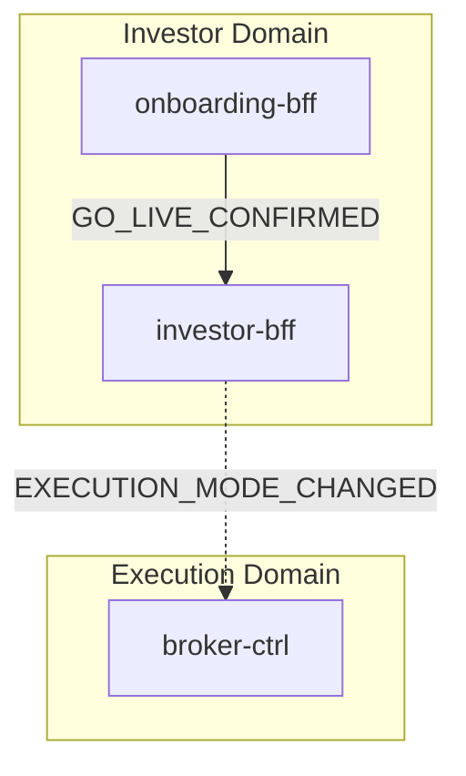
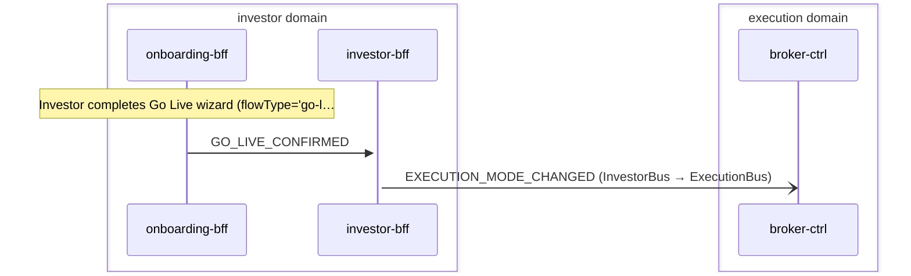

# Go Live

> Investor transitions from simulation to live trading by completing Go Live wizard, switching execution mode from simulation to live

**Domains:** investor, execution

**Trigger:** onboarding-bff WOULD emit GO_LIVE_CONFIRMED (CDC from GoLiveConfirmed:INSERT) — emission path NOT wired in agent

## Flowchart

## Sequence Diagram

## Steps

### Step 1: onboarding-bff

- **Action:** Investor completes Go Live wizard (flowType='go-live', phases review_risk -> review_goals -> review_mandate -> fund_account -> go_live_confirmation). NOTE: these phases exist only as zod schema (src/domain/schemas.ts); the agent graph (src/agent/state.ts PHASE_ORDER) does not run them.
- **State change:** confirmGoLive() (onboarding.repository.ts:121) WOULD TransactWrite OnboardingSession (status='completed', currentPhase='go_live_confirmation') + put GoLiveConfirmed CDC record — but confirmGoLive() has no runtime caller, so this state change does not occur today.
- **Emits:** `GO_LIVE_CONFIRMED (CDC from GoLiveConfirmed:INSERT)`
- **Idempotent:** yes

### Step 2: investor-bff

- **Receives:** `GO_LIVE_CONFIRMED`
- **Via:** InvestorBus -> SQS -> investor-bff-Ingress
- **State change:** event-listener calls profileRepo.setExecutionMode(reqCtx, 'simulation', 'live') which TransactWrites ExecutionModeChange record (__typename='ExecutionModeChange', fromMode='simulation', toMode='live') and updates InvestorProfile (executionMode='live')
- **Emits:** `EXECUTION_MODE_CHANGED (CDC from ExecutionModeChange:INSERT)`
- **Idempotent:** yes

### Step 3: Cross-domain hop

- **Event:** `EXECUTION_MODE_CHANGED`
- **From:** InvestorBus
- **To:** ExecutionBus
- **Via:** execution-adpt EB rule (ExecutionIngress-FromInvestor)

### Step 4: broker-ctrl

- **Receives:** `EXECUTION_MODE_CHANGED`
- **Via:** ExecutionBus -> SQS -> broker-ctrl-ModeIngress
- **State change:** mode-listener records ExecutionMode (__typename='ExecutionMode', pk='ExecutionMode#{tenantId}', mode='live'); future deposit/withdrawal/order routing uses Alpaca adapters instead of simulators
- **Idempotent:** yes

## Success Criteria

- ExecutionMode record materialized in broker-ctrl with mode='live'
- Future ORDER_SUBMITTED events routed to broker-alpaca-adpt instead of broker-sim-adpt
- Future DEPOSIT_INITIATED events routed to ALPACA_TRANSFER_REQUESTED instead of SIM_DEPOSIT_INITIATED
- Future WITHDRAWAL_REQUESTED events routed to ALPACA_TRANSFER_REQUESTED instead of SIM_WITHDRAWAL_REQUESTED

## Failure Modes

- **step 1 fails:** onboarding-bff CDC not emitted; go-live not triggered
- **step 2 fails:** investor-bff Ingress DLQ; ExecutionModeChange not written, execution mode unchanged
- **step 3 fails:** execution-adpt FromInvestorDLQ; EXECUTION_MODE_CHANGED not forwarded to ExecutionBus
- **step 4 fails:** broker-ctrl ModeIngress DLQ; ExecutionMode not materialized, orders still route to simulator adapters
