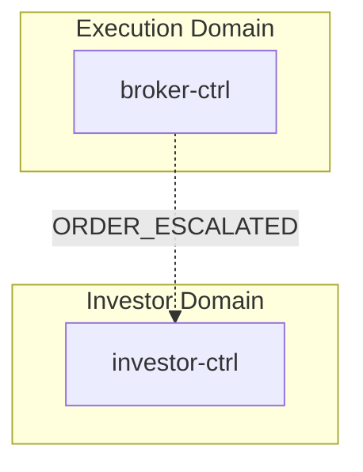
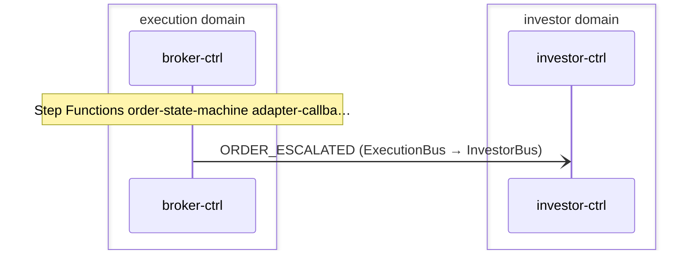

# Incident Escalation

> Broker order escalations surface as investor notifications via cross-domain forwarding

**Domains:** execution, investor

**Trigger:** broker-ctrl Step Functions order-state-machine times out → writes NormalizedEvent record (sk=ORDER_ESCALATED) → CDC emits ORDER_ESCALATED on ExecutionBus

## Flowchart

## Sequence Diagram

## Steps

### Step 1: broker-ctrl

- **Action:** Step Functions order-state-machine adapter-callback timeout branch fires
- **Via:** broker-ctrl-OrderStateMachine (Step Functions) HandleTimeout Parallel state — branch 1 DynamoDB UpdateItem (arn:aws:states:::dynamodb:updateItem) sets BrokerOrder.state='ESCALATED'; branch 2 DynamoDB PutItem (arn:aws:states:::dynamodb:putItem) writes the NormalizedEvent row
- **State change:** Updates BrokerOrder row (sk=BrokerOrder, state='ESCALATED') and writes NormalizedEvent record (pk=NormalizedEvent#{tenantId}#{orderId}, sk=ORDER_ESCALATED#{$$.State.EnteredTime}, failureReason="Adapter timeout — escalated")
- **Emits:** `ORDER_ESCALATED (CDC from NormalizedEvent INSERT, sk passthrough determines event type)`
- **Idempotent:** yes

### Step 2: Cross-domain hop

- **Event:** `ORDER_ESCALATED`
- **From:** ExecutionBus
- **To:** InvestorBus
- **Via:** investor-adpt EB rule (InvestorIngress-FromExecution)

### Step 3: investor-ctrl

- **Receives:** `ORDER_ESCALATED`
- **Via:** InvestorBus -> SQS -> investor-ctrl-TriggerIngress
- **State change:** event-listener parses the subject (NormalizedOrderEventSchema) and writes a Notification record (pk=Notification#{tenantId}#{notificationId}, sk=Notification, type=ORDER_ESCALATED, relatedEntityType=ORDER, relatedEntityId=orderId, channel=email,push) via record('Notification') -> CDC emits NOTIFICATION_CREATED
- **Emits:** `NOTIFICATION_CREATED (CDC from Notification INSERT)`
- **Idempotent:** yes

## Success Criteria

- ORDER_ESCALATED NormalizedEvent written by Step Functions, CDC emits on ExecutionBus, forwarded to InvestorBus via investor-adpt InvestorIngress-FromExecution rule
- investor-ctrl TriggerIngress consumes ORDER_ESCALATED and writes a Notification row (type=ORDER_ESCALATED, relatedEntityType=ORDER) -> NOTIFICATION_CREATED -> the investor sees an "Order Needs Review" notification

## Failure Modes

- Step Functions DynamoDB PutItem fails — ORDER_ESCALATED NormalizedEvent not written; CDC never fires; event lost
- **cross-domain:** investor-adpt InvestorIngress-FromExecution DLQ (FromExecutionDLQ, 14-day retention) receives the message if the InvestorBus target is unavailable
- **investor-ctrl Notification poison-pill:** a malformed ORDER_ESCALATED subject (fails NormalizedOrderEventSchema) routes to the TriggerIngress DLQ rather than creating a Notification
