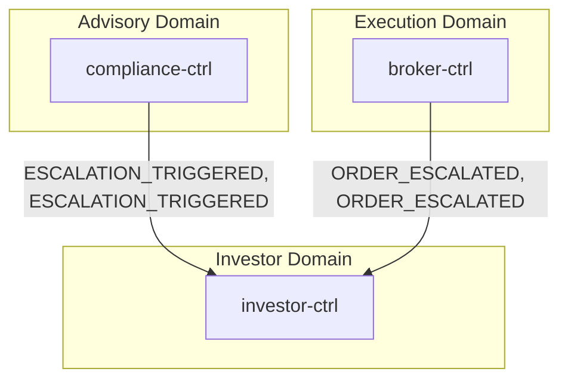
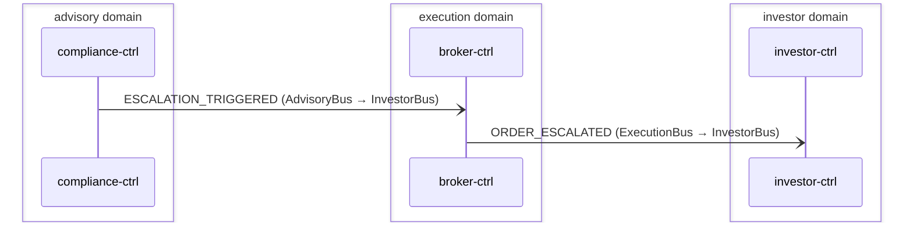

# Incident Escalation

> Compliance escalations and broker order escalations surface as investor notifications via cross-domain forwarding

**Domains:** advisory, execution, investor

**Trigger:** compliance-ctrl emits ESCALATION_TRIGGERED (direct PutEvents to AdvisoryBus); broker-ctrl Step Functions writes NormalizedEvent record (sk=ORDER_ESCALATED) → CDC emits ORDER_ESCALATED on ExecutionBus

## Flowchart

## Sequence Diagram

## Steps

### Step 1: compliance-ctrl

- **Receives:** `DECISION_PACKET_CREATED or DECISION_PACKET_UPDATED`
- **Via:** AdvisoryBus -> SQS -> compliance-ctrl-Ingress
- **State change:** Evaluates suitability and guardrail rules; if threshold breached, publishes ESCALATION_TRIGGERED directly to AdvisoryBus via event-listener/event-publisher Lambda
- **Emits:** `ESCALATION_TRIGGERED (direct PutEvents to AdvisoryBus; not in egress CDC config)`
- **Idempotent:** yes

### Step 2: Cross-domain hop

- **Event:** `ESCALATION_TRIGGERED`
- **From:** AdvisoryBus
- **To:** InvestorBus
- **Via:** investor-adpt EB rule (InvestorIngress-FromAdvisory)

### Step 3: broker-ctrl

- **Action:** Step Functions order-state-machine adapter-callback timeout branch fires
- **Via:** broker-ctrl-OrderStateMachine (Step Functions) → DynamoDB PutItem (arn:aws:states:::dynamodb:putItem)
- **State change:** Writes NormalizedEvent record (pk=NormalizedEvent#{tenantId}#{orderId}, sk=ORDER_ESCALATED#{timestamp}, failureReason="Adapter timeout — escalated")
- **Emits:** `ORDER_ESCALATED (CDC from NormalizedEvent INSERT, sk passthrough determines event type)`
- **Idempotent:** yes

### Step 4: Cross-domain hop

- **Event:** `ORDER_ESCALATED`
- **From:** ExecutionBus
- **To:** InvestorBus
- **Via:** investor-adpt EB rule (InvestorIngress-FromExecution)

### Step 5: investor-ctrl

- **Receives:** `ESCALATION_TRIGGERED | ORDER_ESCALATED`
- **Via:** InvestorBus -> (no SQS subscription configured — events are forwarded but not consumed)
- **State change:** none (gap — no Notification record created for these event types)
- **Emits:** `none`
- **Idempotent:** yes

## Success Criteria

- ESCALATION_TRIGGERED reaches InvestorBus via investor-adpt InvestorIngress-FromAdvisory rule
- ORDER_ESCALATED NormalizedEvent written by Step Functions, CDC emits on ExecutionBus, forwarded to InvestorBus via investor-adpt InvestorIngress-FromExecution rule

## Failure Modes

- **Path B fails:** compliance-ctrl event-publisher Lambda IAM error — PutEvents denied; event never reaches AdvisoryBus
- **Path B cross-domain:** investor-adpt InvestorIngress-FromAdvisory DLQ (FromAdvisoryDLQ, 14-day retention) receives message if InvestorBus target is throttled or unavailable
- **Path C fails:** Step Functions DynamoDB PutItem fails — ORDER_ESCALATED NormalizedEvent not written; CDC never fires; event lost
- **Path C cross-domain:** investor-adpt InvestorIngress-FromExecution DLQ (FromExecutionDLQ, 14-day retention) receives message if InvestorBus target is unavailable
- **All paths:** events reach InvestorBus but investor-ctrl has no subscription — no downstream notification is created (known gap)
