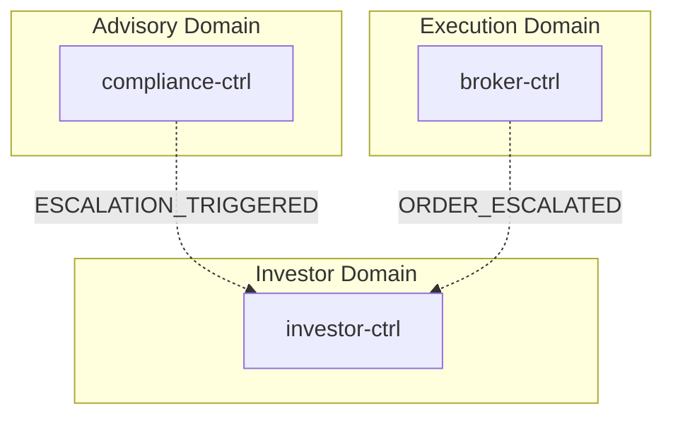
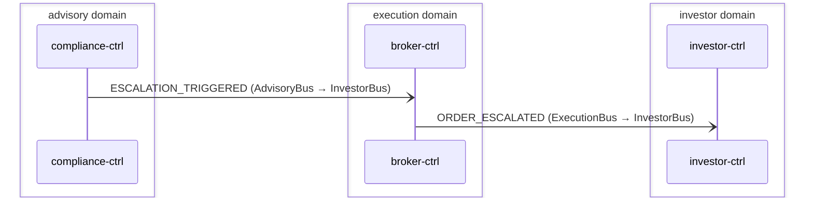

# Incident Escalation

> Compliance escalations and broker order escalations surface as investor notifications via cross-domain forwarding

**Domains:** advisory, execution, investor

**Trigger:** broker-ctrl Step Functions order-state-machine times out → writes NormalizedEvent record (sk=ORDER_ESCALATED) → CDC emits ORDER_ESCALATED on ExecutionBus. (Path B / ESCALATION_TRIGGERED is a NON-FUNCTIONAL aspirational path — no producer emits it; see step note.)

## Flowchart

## Sequence Diagram

## Steps

### Step 1: compliance-ctrl

- **Receives:** `RECOMMENDATION_PROPOSED`
- **Via:** AdvisoryBus -> SQS -> compliance-ctrl-Ingress
- **State change:** compliance-ctrl event-listener writes only a ComplianceCheck row (result=APPROVED|BLOCKED) -> CDC emits DECISION_APPROVED|DECISION_BLOCKED. NO escalation branch exists; ESCALATION_TRIGGERED is never emitted (dead constant in domain/events.ts:7).
- **Emits:** `none (ESCALATION_TRIGGERED is defined but unpublished -- no producer; event-publisher.ts is a pure CDC publisher)`
- **Idempotent:** yes

### Step 2: Cross-domain hop

- **Event:** `ESCALATION_TRIGGERED`
- **From:** AdvisoryBus
- **To:** InvestorBus
- **Via:** investor-adpt EB rule (InvestorIngress-FromAdvisory)

### Step 3: broker-ctrl

- **Action:** Step Functions order-state-machine adapter-callback timeout branch fires
- **Via:** broker-ctrl-OrderStateMachine (Step Functions) HandleTimeout Parallel state — branch 1 DynamoDB UpdateItem (arn:aws:states:::dynamodb:updateItem) sets BrokerOrder.state='ESCALATED'; branch 2 DynamoDB PutItem (arn:aws:states:::dynamodb:putItem) writes the NormalizedEvent row
- **State change:** Updates BrokerOrder row (sk=BrokerOrder, state='ESCALATED') and writes NormalizedEvent record (pk=NormalizedEvent#{tenantId}#{orderId}, sk=ORDER_ESCALATED#{$$.State.EnteredTime}, failureReason="Adapter timeout — escalated")
- **Emits:** `ORDER_ESCALATED (CDC from NormalizedEvent INSERT, sk passthrough determines event type)`
- **Idempotent:** yes

### Step 4: Cross-domain hop

- **Event:** `ORDER_ESCALATED`
- **From:** ExecutionBus
- **To:** InvestorBus
- **Via:** investor-adpt EB rule (InvestorIngress-FromExecution)

### Step 5: investor-ctrl

- **Receives:** `ESCALATION_TRIGGERED | ORDER_ESCALATED`
- **Via:** InvestorBus -> (no SQS subscription configured — events are forwarded but not consumed)
- **State change:** none (gap — no Notification record created for these event types)
- **Emits:** `none`
- **Idempotent:** yes

## Success Criteria

- [UNIMPLEMENTED] ESCALATION_TRIGGERED would reach InvestorBus via investor-adpt InvestorIngress-FromAdvisory rule — but no producer emits ESCALATION_TRIGGERED, so this path never fires
- ORDER_ESCALATED NormalizedEvent written by Step Functions, CDC emits on ExecutionBus, forwarded to InvestorBus via investor-adpt InvestorIngress-FromExecution rule

## Failure Modes

- [UNIMPLEMENTED] Path B: ESCALATION_TRIGGERED has no producer — compliance-ctrl only writes a ComplianceCheck row (DECISION_APPROVED|DECISION_BLOCKED via CDC); the escalation branch and its DLQ path (InvestorIngress-FromAdvisory / FromAdvisoryDLQ) are never exercised
- **Path C fails:** Step Functions DynamoDB PutItem fails — ORDER_ESCALATED NormalizedEvent not written; CDC never fires; event lost
- **Path C cross-domain:** investor-adpt InvestorIngress-FromExecution DLQ (FromExecutionDLQ, 14-day retention) receives message if InvestorBus target is unavailable
- **All paths:** events reach InvestorBus but investor-ctrl has no subscription — no downstream notification is created (known gap)
