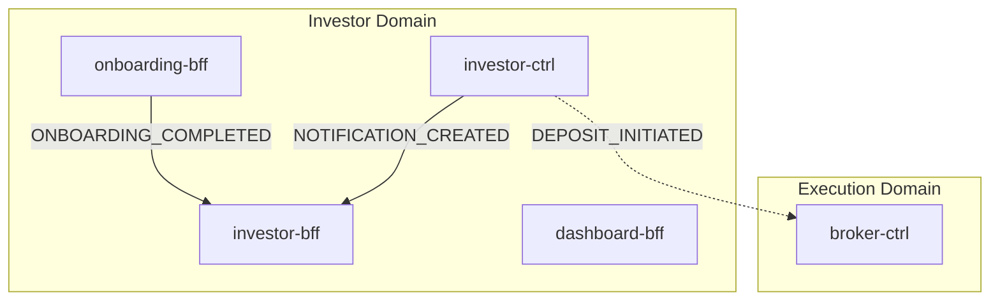
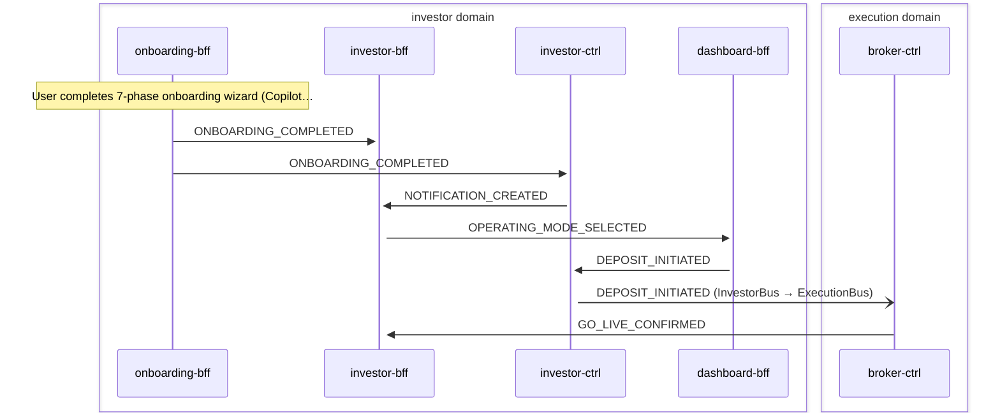

# Investor Onboarding

> New investor completes onboarding wizard; investor-bff materializes profile records; investor-ctrl sends welcome notification; conditional deposit triggers execution domain

**Domains:** investor, execution

**Trigger:** onboarding-bff emits ONBOARDING_COMPLETED (CDC from OnboardingCompleted:INSERT)

## Flowchart

## Sequence Diagram

## Steps

### Step 1: onboarding-bff

- **Action:** User completes 7-phase onboarding wizard (CopilotKit + LangGraph agent)
- **State change:** Writes OnboardingCompleted record to DDB (tenantId, userId, goal, riskTolerance, riskExperience, operatingMode, mandateAccepted, capitalAmount, accountMode)
- **Emits:** `ONBOARDING_COMPLETED (CDC from OnboardingCompleted:INSERT)`
- **Idempotent:** yes

### Step 2: investor-bff

- **Receives:** `ONBOARDING_COMPLETED`
- **Via:** InvestorBus -> SQS -> investor-bff-ingress
- **State change:** transactWrite creates/updates 6-7 records atomically: 1. InvestorProfile (UPDATE -- sets operatingMode, onboardingCompletedAt) 2. Goal (PUT -- objective, timeHorizonMonths, currency) 3. RiskProfile (PUT -- score, band, toleranceResponse, experienceLevel) 4. OperatingModeRecord (PUT -- mode, selectedAt) 5. AccountMode (PUT -- mode, capitalAmount, currency) 6. Mandate (PUT -- level=ADVISORY, turnover/trade caps, rebalanceCadence) 7. Deposit (PUT, conditional if capitalAmount > 0 -- depositId, amountCents, currency)

- **Emits:** `CDC events from DDB Streams (all INSERTs except InvestorProfile which is MODIFY): - INVESTOR_PROFILE_UPDATED (InvestorProfile:MODIFY) -- NO SUBSCRIBERS - GOAL_CREATED (Goal:INSERT) -- NO SUBSCRIBERS - RISK_PROFILE_CREATED (RiskProfile:INSERT) -- NO SUBSCRIBERS - OPERATING_MODE_SELECTED (OperatingModeRecord:INSERT) -- dashboard-bff subscribes - MANDATE_CREATED (Mandate:INSERT) -- NO SUBSCRIBERS - DEPOSIT_INITIATED (Deposit:INSERT, conditional) -- investor-ctrl + execution-adpt subscribe Note: AccountMode has no Egress mapping, so no CDC event fires for it
`
- **Idempotent:** yes

### Step 3: investor-ctrl

- **Receives:** `ONBOARDING_COMPLETED`
- **Via:** InvestorBus -> SQS -> investor-ctrl-TriggerIngress
- **State change:** Writes Notification record (title: "Welcome to Nestfolio", body: "Your account setup is complete. You can now start investing.", channel: email, status: DELIVERED)

- **Emits:** `NOTIFICATION_CREATED (CDC from Notification:INSERT)`
- **Idempotent:** yes

### Step 4: investor-bff

- **Receives:** `NOTIFICATION_CREATED`
- **Via:** InvestorBus -> SQS -> investor-bff-ingress
- **State change:** Materializes notification record for frontend display
- **Emits:** `none`
- **Idempotent:** yes

### Step 5: dashboard-bff

- **Receives:** `OPERATING_MODE_SELECTED`
- **Via:** InvestorBus -> SQS -> dashboard-bff-ingress
- **State change:** Updates investor snapshot read model with operating mode
- **Emits:** `none`
- **Idempotent:** yes

### Step 6: investor-ctrl

- **Receives:** `DEPOSIT_INITIATED`
- **Via:** InvestorBus -> SQS -> investor-ctrl-TriggerIngress
- **State change:** Writes "Deposit Received" notification
- **Emits:** `NOTIFICATION_CREATED (CDC from Notification:INSERT)`
- **Idempotent:** yes

### Step 7: Cross-domain hop

- **Event:** `DEPOSIT_INITIATED`
- **From:** InvestorBus
- **To:** ExecutionBus
- **Via:** execution-adpt EB rule (ExecutionIngress-FromInvestor)

### Step 8: broker-ctrl

- **Receives:** `DEPOSIT_INITIATED`
- **Via:** ExecutionBus -> SQS -> broker-ctrl-DepositWithdrawalIngress
- **State change:** Routes deposit to broker adapter for processing
- **Emits:** `broker-specific events (depends on broker adapter)`
- **Idempotent:** yes

### Step 9: investor-bff

- **Receives:** `GO_LIVE_CONFIRMED`
- **Via:** InvestorBus -> SQS -> investor-bff-ingress
- **State change:** Sets execution mode from 'simulation' to 'live' via InvestorProfileRepository.setExecutionMode()
- **Emits:** `skip() -- no CDC (direct repo call, returns skip)`
- **Idempotent:** yes

## Success Criteria

- InvestorProfile, Goal, RiskProfile, Mandate, OperatingModeRecord, AccountMode persisted in investor-bff DDB table
- Welcome notification delivered via investor-ctrl -> investor-bff materialization
- Dashboard snapshot updated with operating mode via dashboard-bff
- If capitalAmount > 0, deposit routed to execution domain via execution-adpt

## Failure Modes

- **step 1 fails:** Onboarding wizard incomplete; user can retry. No DDB write, no CDC
- **step 2a fails:** investor-bff ingress DLQ captures ONBOARDING_COMPLETED; profile records not created until replay
- **step 2b fails:** investor-ctrl ingress DLQ captures ONBOARDING_COMPLETED; welcome notification delayed
- **step 3 fails:** investor-bff ingress DLQ captures NOTIFICATION_CREATED; notification not visible in frontend
- **step 4 fails:** dashboard-bff ingress DLQ captures OPERATING_MODE_SELECTED; dashboard stale until replay
- **step 5 fails (conditional):** execution-adpt FromInvestorDLQ captures DEPOSIT_INITIATED; deposit not processed
