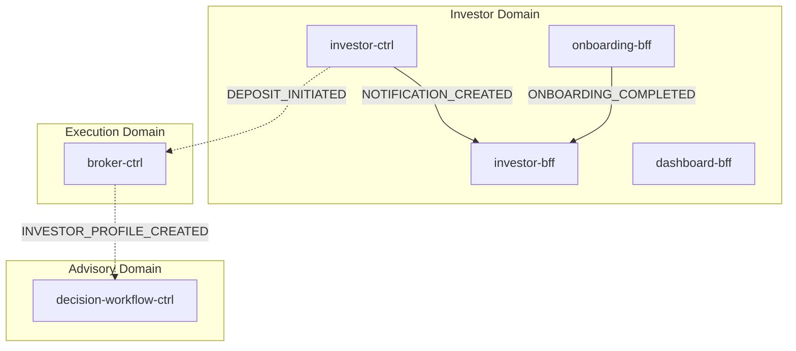
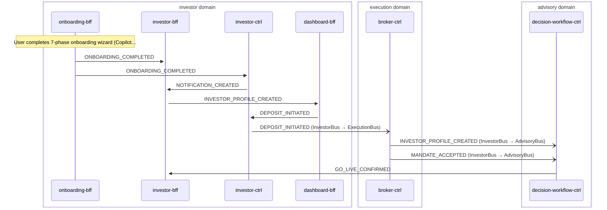

# Investor Onboarding

> New investor completes onboarding wizard; investor-bff materializes the composite InvestorProfile + MandateStatus rows; investor-ctrl sends welcome notification; conditional deposit triggers execution domain; initial advisory decision cycle triggered directly from INVESTOR_PROFILE_CREATED via advisory-adpt

**Domains:** investor, execution, advisory

**Trigger:** onboarding-bff emits ONBOARDING_COMPLETED (CDC from OnboardingCompleted:INSERT)

## Flowchart

## Sequence Diagram

## Steps

### Step 1: onboarding-bff

- **Action:** User completes 7-phase onboarding wizard (CopilotKit + LangGraph agent)
- **State change:** Writes OnboardingCompleted record to DDB (tenantId, userId, goal, riskTolerance, riskExperience, operatingMode, mandateAccepted, capitalAmount, accountMode)
- **Emits:** `ONBOARDING_COMPLETED (CDC from OnboardingCompleted:INSERT)`
- **Idempotent:** yes

### Step 2: investor-bff

- **Receives:** `ONBOARDING_COMPLETED`
- **Via:** InvestorBus -> SQS -> investor-bff-ingress
- **State change:** transactWrite creates 2-3 records atomically: 1. InvestorProfile composite row (sk='InvestorProfile', PUT) -- single row holds
   goal, riskProfile, operatingMode, mandate, accountMode, executionMode='simulation',
   onboardingCompletedAt
2. MandateStatus row (sk='MandateStatus', PUT) -- status='ACCEPTED', mandateLevel='ADVISORY',
   acceptedAt; sole lifecycle row updated by revokeMandate()
3. Deposit row (sk='Deposit#<id>', PUT, conditional only when capitalAmount > 0) --
   depositId, amountCents, currency

- **Emits:** `CDC events from DDB Streams (declarative Egress, single emit per logical entity): - INVESTOR_PROFILE_CREATED (InvestorProfile:INSERT) -- advisory-adpt + dashboard-bff + compliance-ctrl subscribe - MANDATE_ACCEPTED (MandateStatus:INSERT) -- advisory-adpt + investor-ctrl subscribe - DEPOSIT_INITIATED (Deposit:INSERT, conditional) -- investor-ctrl + execution-adpt subscribe
`
- **Idempotent:** yes

### Step 3: investor-ctrl

- **Receives:** `ONBOARDING_COMPLETED`
- **Via:** InvestorBus -> SQS -> investor-ctrl-TriggerIngress
- **State change:** Writes Notification record (title: "Welcome to Nestfolio", body: "Your account setup is complete. You can now start investing.", channel: email, status: DELIVERED)

- **Emits:** `NOTIFICATION_CREATED (CDC from Notification:INSERT)`
- **Idempotent:** yes

### Step 4: investor-bff

- **Receives:** `NOTIFICATION_CREATED`
- **Via:** InvestorBus -> SQS -> investor-bff-ingress
- **State change:** Materializes notification record for frontend display
- **Emits:** `none`
- **Idempotent:** yes

### Step 5: dashboard-bff

- **Receives:** `INVESTOR_PROFILE_CREATED`
- **Via:** InvestorBus -> SQS -> dashboard-bff-ingress
- **State change:** Updates investor snapshot read model from the composite InvestorProfile payload (operatingMode, goal, riskProfile)
- **Emits:** `none`
- **Idempotent:** yes

### Step 6: investor-ctrl

- **Receives:** `DEPOSIT_INITIATED`
- **Via:** InvestorBus -> SQS -> investor-ctrl-TriggerIngress
- **State change:** Writes "Deposit Received" notification
- **Emits:** `NOTIFICATION_CREATED (CDC from Notification:INSERT)`
- **Idempotent:** yes

### Step 7: Cross-domain hop

- **Event:** `DEPOSIT_INITIATED`
- **From:** InvestorBus
- **To:** ExecutionBus
- **Via:** execution-adpt EB rule (ExecutionIngress-FromInvestor)

### Step 8: broker-ctrl

- **Receives:** `DEPOSIT_INITIATED`
- **Via:** ExecutionBus -> SQS -> broker-ctrl-DepositWithdrawalIngress
- **State change:** Routes deposit to broker adapter for processing
- **Emits:** `broker-specific events (depends on broker adapter)`
- **Idempotent:** yes

### Step 9: Cross-domain hop

- **Event:** `INVESTOR_PROFILE_CREATED`
- **From:** InvestorBus
- **To:** AdvisoryBus
- **Via:** advisory-adpt EB rule (AdvisoryIngress-FromInvestor)

### Step 10: Cross-domain hop

- **Event:** `MANDATE_ACCEPTED`
- **From:** InvestorBus
- **To:** AdvisoryBus
- **Via:** advisory-adpt EB rule (AdvisoryIngress-FromInvestor)

### Step 11: decision-workflow-ctrl

- **Receives:** `INVESTOR_PROFILE_CREATED`
- **Via:** AdvisoryBus -> EventBridge target -> Step Functions (direct EB -> SF)
- **State change:** SF.StartExecution starts the initial advisory decision cycle for the new investor
- **Emits:** `agent-pipeline events (DECISION_PACKET_CREATED downstream)`
- **Idempotent:** yes

### Step 12: investor-bff

- **Receives:** `GO_LIVE_CONFIRMED`
- **Via:** InvestorBus -> SQS -> investor-bff-ingress
- **State change:** Sets executionMode from 'simulation' to 'live' on the composite InvestorProfile row via InvestorProfileRepository.setExecutionMode()
- **Emits:** `ExecutionModeChange (CDC -- INVESTOR_PROFILE_UPDATED with executionMode field set)`
- **Idempotent:** yes

## Success Criteria

- Composite InvestorProfile row + MandateStatus row persisted in investor-bff DDB table
- Conditional Deposit row written when capitalAmount > 0
- Welcome notification delivered via investor-ctrl -> investor-bff materialization
- Dashboard snapshot updated from INVESTOR_PROFILE_CREATED composite payload
- If capitalAmount > 0, deposit routed to execution domain via execution-adpt
- INVESTOR_PROFILE_CREATED + MANDATE_ACCEPTED forwarded to advisory domain via advisory-adpt
- decision-workflow-ctrl starts exactly ONE advisory SF execution per onboarding (direct EB -> SF on INVESTOR_PROFILE_CREATED)

## Failure Modes

- **step 1 fails:** Onboarding wizard incomplete; user can retry. No DDB write, no CDC
- **step 2a fails:** investor-bff ingress DLQ captures ONBOARDING_COMPLETED; composite profile + MandateStatus rows not created until replay
- **step 2b fails:** investor-ctrl ingress DLQ captures ONBOARDING_COMPLETED; welcome notification delayed
- **step 3 fails:** investor-bff ingress DLQ captures NOTIFICATION_CREATED; notification not visible in frontend
- **step 4 fails:** dashboard-bff ingress DLQ captures INVESTOR_PROFILE_CREATED; dashboard stale until replay
- **step 5 fails (conditional):** execution-adpt FromInvestorDLQ captures DEPOSIT_INITIATED; deposit not processed
- **step 6 fails:** advisory-adpt FromInvestorDLQ captures INVESTOR_PROFILE_CREATED/MANDATE_ACCEPTED; initial advisory cycle not started until replay
