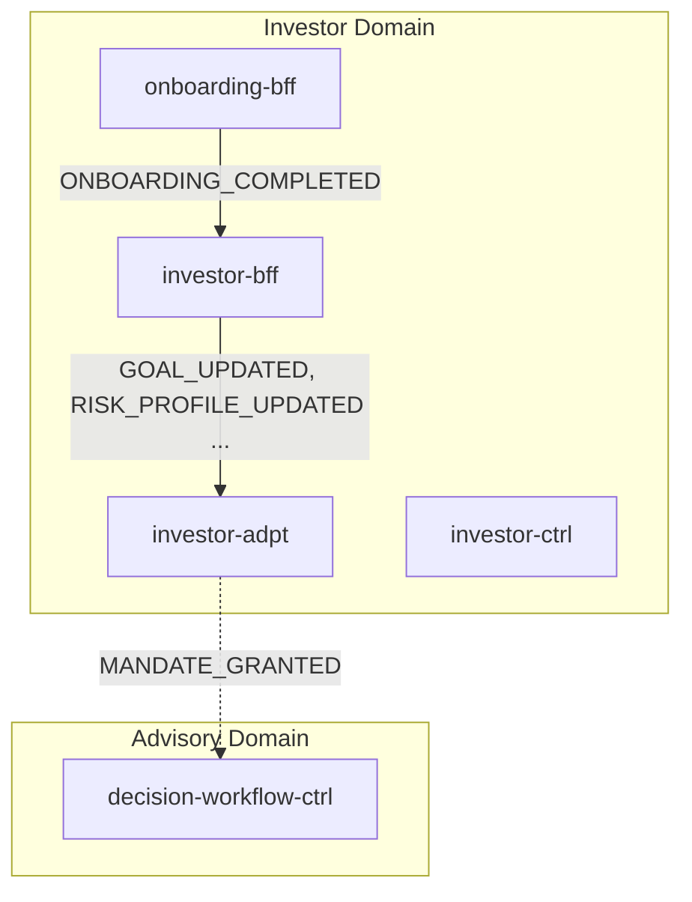
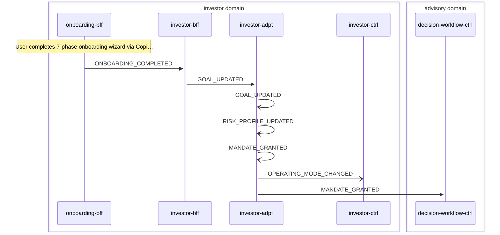

# Investor Onboarding

> New investor completes onboarding wizard, goals/risk/mandate are persisted and forwarded to advisory domain

**Domains:** investor, advisory

**Trigger:** onboarding-bff emits ONBOARDING_COMPLETED (CDC from OnboardingCompleted:INSERT)

## Flowchart

## Sequence Diagram

## Steps

### Step 1: onboarding-bff

- **Action:** User completes 7-phase onboarding wizard via CopilotKit UI
- **State change:** Writes OnboardingCompleted record to DDB
- **Emits:** `ONBOARDING_COMPLETED (CDC)`
- **Idempotent:** yes

### Step 2: investor-bff

- **Receives:** `ONBOARDING_COMPLETED`
- **Via:** InvestorBus -> SQS -> investor-bff-ingress
- **State change:** Materializes Goal, RiskProfile, Mandate, InvestorProfile, OperatingModeRecord records
- **Emits:** `GOAL_UPDATED, RISK_PROFILE_UPDATED, MANDATE_GRANTED, OPERATING_MODE_CHANGED (CDC)`
- **Idempotent:** yes

### Step 3: investor-adpt

- **Receives:** `GOAL_UPDATED`
- **Via:** InvestorBus -> investor-adpt ToAdvisory rule
- **Forwards to:** AdvisoryBus
- **Emits:** `GOAL_UPDATED`

### Step 4: investor-adpt

- **Receives:** `RISK_PROFILE_UPDATED`
- **Via:** InvestorBus -> investor-adpt ToAdvisory rule
- **Forwards to:** AdvisoryBus
- **Emits:** `RISK_PROFILE_UPDATED`

### Step 5: investor-adpt

- **Receives:** `MANDATE_GRANTED`
- **Via:** InvestorBus -> investor-adpt ToAdvisory rule
- **Forwards to:** AdvisoryBus
- **Emits:** `MANDATE_GRANTED`

### Step 6: investor-adpt

- **Receives:** `OPERATING_MODE_CHANGED`
- **Via:** InvestorBus -> investor-adpt ToAdvisory rule
- **Forwards to:** AdvisoryBus
- **Emits:** `OPERATING_MODE_CHANGED`

### Step 7: investor-ctrl

- **Receives:** `ONBOARDING_COMPLETED`
- **Via:** InvestorBus -> SQS -> investor-ctrl-ingress
- **State change:** Updates investor lifecycle state
- **Emits:** `NOTIFICATION_CREATED (CDC)`
- **Idempotent:** yes

### Step 8: decision-workflow-ctrl

- **Receives:** `MANDATE_GRANTED`
- **Via:** AdvisoryBus -> SQS -> decision-workflow-ctrl-TriggerIngress
- **State change:** Starts new Step Functions execution for initial advisory decision cycle
- **Emits:** `DECISION_PACKET_CREATED (CDC)`
- **Idempotent:** yes

## Success Criteria

- Investor profile, goals, risk profile, and mandate are persisted in investor-bff DDB table
- Advisory domain receives MANDATE_GRANTED and triggers first decision cycle
- Execution domain receives OPERATING_MODE_CHANGED (forwarded via investor-adpt ToExecution)

## Failure Modes

- **step 1 fails:** Onboarding session incomplete; user can retry wizard. DLQ on onboarding-bff ingress
- **step 2 fails:** investor-bff ingress DLQ captures event; CDC events not emitted until replay
- **step 3-6 fails:** investor-adpt forwarding DLQ (ToAdvisoryDLQ); advisory domain does not receive events
- **step 8 fails:** decision-workflow-ctrl ingress DLQ; initial advisory cycle not started
