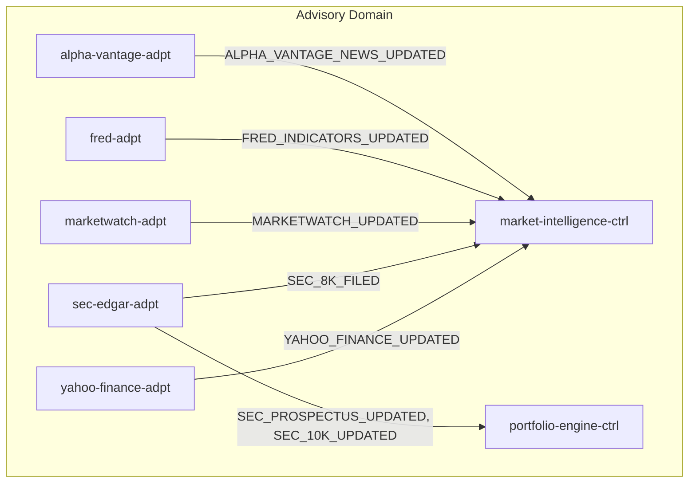
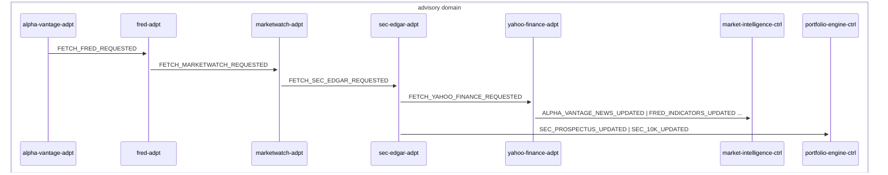

# Market Data Ingestion

> Scheduled market data adapters fetch external data, materialize records, and emit feed-updated events consumed by market-intelligence-ctrl and portfolio-engine-ctrl

**Domains:** advisory

**Trigger:** EventBridge Scheduler invokes each adapter's FetchTrigger Lambda, which publishes a FETCH_*_REQUESTED event to AdvisoryBus

## Flowchart

## Sequence Diagram

## Steps

### Step 1: alpha-vantage-adpt

- **Receives:** `FETCH_ALPHA_VANTAGE_REQUESTED`
- **Via:** AdvisoryBus → SQS → alpha-vantage-adpt-ingress
- **State change:** Fetches market news and economic indicators from Alpha Vantage API, writes AlphaVantageArticle and EconomicIndicator records to DDB
- **Emits:** `ALPHA_VANTAGE_NEWS_UPDATED (CDC, AlphaVantageArticle insert), ALPHA_VANTAGE_ECONOMIC_INDICATOR_UPDATED (CDC, EconomicIndicator insert)`
- **Idempotent:** yes

### Step 2: fred-adpt

- **Receives:** `FETCH_FRED_REQUESTED`
- **Via:** AdvisoryBus → SQS → fred-adpt-ingress
- **State change:** Fetches macro indicators from FRED API, writes FredIndicator records to DDB
- **Emits:** `FRED_INDICATORS_UPDATED (CDC, FredIndicator insert)`
- **Idempotent:** yes

### Step 3: marketwatch-adpt

- **Receives:** `FETCH_MARKETWATCH_REQUESTED`
- **Via:** AdvisoryBus → SQS → marketwatch-adpt-ingress
- **State change:** Scrapes MarketWatch articles, writes MarketWatchArticle records to DDB
- **Emits:** `MARKETWATCH_UPDATED (CDC, MarketWatchArticle insert)`
- **Idempotent:** yes

### Step 4: sec-edgar-adpt

- **Receives:** `FETCH_SEC_EDGAR_REQUESTED`
- **Via:** AdvisoryBus → SQS → sec-edgar-adpt-ingress
- **State change:** Fetches EDGAR filings for tracked CIKs, writes SecFiling records to DDB
- **Emits:** `SEC_8K_FILED, SEC_PROSPECTUS_UPDATED, SEC_10K_UPDATED (CDC, SecFiling insert+modify, form-type-based routing)`
- **Idempotent:** yes

### Step 5: yahoo-finance-adpt

- **Receives:** `FETCH_YAHOO_FINANCE_REQUESTED`
- **Via:** AdvisoryBus → SQS → yahoo-finance-adpt-ingress
- **State change:** Fetches Yahoo Finance articles for tracked tickers, writes YahooFinanceArticle records to DDB
- **Emits:** `YAHOO_FINANCE_UPDATED (CDC, YahooFinanceArticle insert)`
- **Idempotent:** yes

### Step 6: market-intelligence-ctrl

- **Receives:** `ALPHA_VANTAGE_NEWS_UPDATED | FRED_INDICATORS_UPDATED | MARKETWATCH_UPDATED | SEC_8K_FILED | YAHOO_FINANCE_UPDATED`
- **Via:** AdvisoryBus → SQS → market-intelligence-ctrl-ingress
- **State change:** Ingests feed data into Bedrock Knowledge Base (S3 vector store), refreshes market intelligence
- **Emits:** `MARKET_SNAPSHOT_UPDATED (CDC, MarketSnapshot insert/modify)`
- **Idempotent:** yes

### Step 7: portfolio-engine-ctrl

- **Receives:** `SEC_PROSPECTUS_UPDATED | SEC_10K_UPDATED`
- **Via:** AdvisoryBus → SQS → portfolio-engine-ctrl-ingress
- **State change:** Ingests fund prospectuses and 10-K/10-Q filings into Fund Knowledge Base
- **Emits:** `none (KB ingestion path only, no CDC on this path)`
- **Idempotent:** yes

## Success Criteria

- All 5 feed adapters fetch data on schedule and emit CDC events to AdvisoryBus
- market-intelligence-ctrl Knowledge Base is refreshed with latest market data from 5 sources
- portfolio-engine-ctrl Fund KB is refreshed with SEC prospectus and 10-K filings
- MARKET_SNAPSHOT_UPDATED event emitted when the market snapshot row is refreshed (the AgentInvocation-row MARKET_SIGNAL_DETECTED signal is no longer CDC-emitted — zero consumers)

## Failure Modes

- **step 1 fails:** alpha-vantage-adpt ingress DLQ; stale market news and economic indicator data
- **step 2 fails:** fred-adpt ingress DLQ; stale macro indicators
- **step 3 fails:** marketwatch-adpt ingress DLQ; stale MarketWatch article data
- **step 4 fails:** sec-edgar-adpt ingress DLQ; stale SEC filing data
- **step 5 fails:** yahoo-finance-adpt ingress DLQ; stale Yahoo Finance article data
- **step 6 fails:** market-intelligence-ctrl ingress DLQ; Market KB not updated
- **step 7 fails:** portfolio-engine-ctrl ingress DLQ; Fund KB not updated
