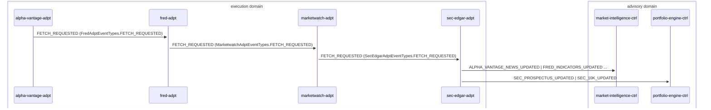

# Market Data Ingestion

> Scheduled market data adapters fetch external data, materialize records, and emit feed-updated events consumed by market-intelligence-ctrl

**Domains:** advisory

**Trigger:** AdapterSchedule (EventBridge Scheduler) emits FETCH_REQUESTED to each adapter on a configurable cron (default rate(24 hours))

## Flow Diagram

## Steps

### Step 1: alpha-vantage-adpt

- **Receives:** `FETCH_REQUESTED (AlphaVantageAdptEventTypes.FETCH_REQUESTED)`
- **Via:** AdvisoryBus -> SQS -> alpha-vantage-adpt-ingress (also triggered by AdapterSchedule)
- **State change:** Fetches market news from Alpha Vantage API, writes records to DDB
- **Emits:** `ALPHA_VANTAGE_NEWS_UPDATED (CDC)`
- **Idempotent:** yes

### Step 2: fred-adpt

- **Receives:** `FETCH_REQUESTED (FredAdptEventTypes.FETCH_REQUESTED)`
- **Via:** AdvisoryBus -> SQS -> fred-adpt-ingress (also triggered by AdapterSchedule)
- **State change:** Fetches macro indicators from FRED API, writes records to DDB
- **Emits:** `FRED_INDICATORS_UPDATED (CDC)`
- **Idempotent:** yes

### Step 3: marketwatch-adpt

- **Receives:** `FETCH_REQUESTED (MarketwatchAdptEventTypes.FETCH_REQUESTED)`
- **Via:** AdvisoryBus -> SQS -> marketwatch-adpt-ingress (also triggered by AdapterSchedule)
- **State change:** Scrapes MarketWatch articles, writes MarketWatchArticle records to DDB
- **Emits:** `MARKETWATCH_UPDATED (CDC)`
- **Idempotent:** yes

### Step 4: sec-edgar-adpt

- **Receives:** `FETCH_REQUESTED (SecEdgarAdptEventTypes.FETCH_REQUESTED)`
- **Via:** AdvisoryBus -> SQS -> sec-edgar-adpt-ingress (also triggered by AdapterSchedule)
- **State change:** Fetches EDGAR filings (8-K, 10-K, prospectuses), writes SecFiling records to DDB
- **Emits:** `SEC_8K_FILED, SEC_PROSPECTUS_UPDATED, SEC_10K_UPDATED (CDC)`
- **Idempotent:** yes

### Step 5: market-intelligence-ctrl

- **Receives:** `ALPHA_VANTAGE_NEWS_UPDATED | FRED_INDICATORS_UPDATED | MARKETWATCH_UPDATED | SEC_8K_FILED`
- **Via:** AdvisoryBus -> SQS -> market-intelligence-ctrl-ingress
- **State change:** Ingests feed data into Bedrock Knowledge Base (S3 + vector store), updates market intelligence records; when triggered as ANALYZE_MARKET agent, emits MARKET_ANALYSIS_COMPLETED
- **Emits:** `none (KB ingestion path only; CDC emits AgentInvocation, ReasoningOutput on agent path)`
- **Idempotent:** yes

### Step 6: portfolio-engine-ctrl

- **Receives:** `SEC_PROSPECTUS_UPDATED | SEC_10K_UPDATED`
- **Via:** AdvisoryBus -> SQS -> portfolio-engine-ctrl-ingress
- **State change:** Ingests fund prospectuses and 10-K filings into Fund Knowledge Base
- **Emits:** `none (KB ingestion only, no CDC)`
- **Idempotent:** yes

## Success Criteria

- All 4 feed adapters fetch data on schedule and emit updated events
- market-intelligence-ctrl Knowledge Base is refreshed with latest market data
- portfolio-engine-ctrl Fund KB is refreshed with latest SEC filings

## Failure Modes

- **step 1 fails:** alpha-vantage-adpt ingress DLQ; stale market news data
- **step 2 fails:** fred-adpt ingress DLQ; stale macro indicators
- **step 3 fails:** marketwatch-adpt ingress DLQ; stale article data
- **step 4 fails:** sec-edgar-adpt ingress DLQ; stale filing data
- **step 5 fails:** market-intelligence-ctrl ingress DLQ; KB not updated
- **step 6 fails:** portfolio-engine-ctrl ingress DLQ; fund KB not updated
