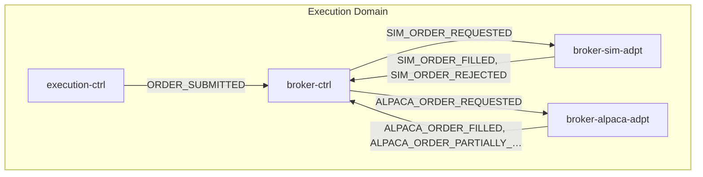
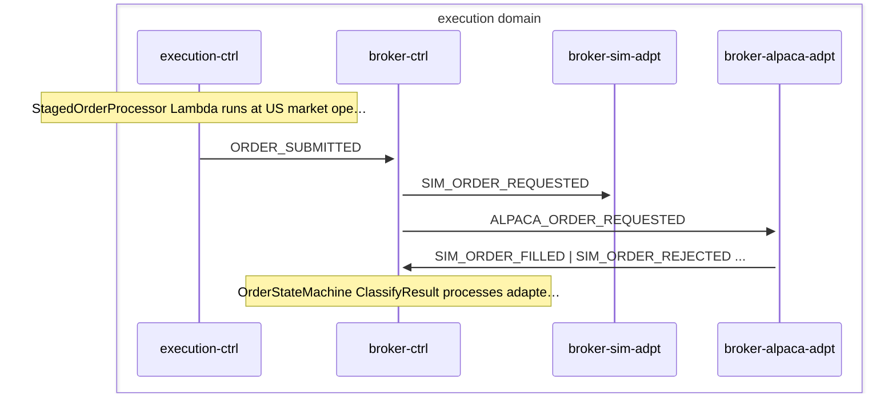

# Order Execution

> Approved decision triggers order creation in execution-ctrl, routed through broker-ctrl state machine to sim or Alpaca adapter, normalized back to canonical fill/reject events

**Domains:** advisory, execution, ledger, investor

**Trigger:** DECISION_APPROVED crosses AdvisoryBus -> ExecutionBus via execution-adpt EB rule

## Flowchart

## Sequence Diagram

## Steps

### Step 1: Cross-domain hop

- **Event:** `DECISION_APPROVED`
- **From:** AdvisoryBus
- **To:** ExecutionBus
- **Via:** execution-adpt EB rule

### Step 2: execution-ctrl

- **Receives:** `DECISION_APPROVED`
- **Via:** ExecutionBus -> SQS -> execution-ctrl-ingress
- **State change:** Runs safety checks on proposed trades; creates Order record in DDB with status SUBMITTED (market open), STAGED (market closed), or REJECTED (safety check failure)
- **Emits:** `ORDER_SUBMITTED, ORDER_STAGED, or ORDER_REJECTED (CDC from Order:INSERT, status-based mapping; default ORDER_CREATED)`
- **Idempotent:** yes

### Step 3: execution-ctrl

- **Receives:** `USER_CONFIRMED`
- **Via:** ExecutionBus -> SQS -> execution-ctrl-ingress
- **State change:** Same as DECISION_APPROVED — runs safety checks, creates Order record
- **Emits:** `ORDER_SUBMITTED, ORDER_STAGED, or ORDER_REJECTED (CDC from Order:INSERT)`
- **Idempotent:** yes

### Step 4: execution-ctrl

- **Action:** StagedOrderProcessor Lambda runs at US market open (cron 14:30 UTC, MON-FRI via AdapterSchedule)
- **State change:** Re-runs safety checks on staged orders; updates Order status to SUBMITTED or REJECTED; deletes StagedOrder record
- **Emits:** `ORDER_SUBMITTED or ORDER_REJECTED (CDC from Order:MODIFY, status-based mapping)`
- **Idempotent:** yes

### Step 5: broker-ctrl

- **Receives:** `ORDER_SUBMITTED`
- **Via:** ExecutionBus -> Orchestration EB rule -> broker-ctrl OrderStateMachine
- **State change:** SF starts; reads ExecutionMode from DDB (ReadExecutionMode GetItem). No circuit-breaker read in this SF — the circuit breaker lives in broker-alpaca-adpt.
Invokes RouteOrder Lambda (waitForTaskToken, TimeoutSeconds 300).
RouteOrder writes BrokerOrder record with taskToken, emits SIM_ORDER_REQUESTED (sim mode) or ALPACA_ORDER_REQUESTED (live mode) to ExecutionBus via PutEvents.

- **Emits:** `SIM_ORDER_REQUESTED or ALPACA_ORDER_REQUESTED (explicit PutEvents from RouteOrder Lambda)`
- **Idempotent:** yes

### Step 6: broker-sim-adpt

- **Receives:** `SIM_ORDER_REQUESTED`
- **Via:** ExecutionBus -> SQS -> broker-sim-adpt-ingress
- **State change:** Fetches market price, validates cash/position balance, executes atomic trade via VirtualLedger (writes VirtualTrade record with status FILLED or REJECTED)
- **Emits:** `SIM_ORDER_FILLED or SIM_ORDER_REJECTED (CDC from VirtualTrade:INSERT, status-based mapping)`
- **Idempotent:** yes

### Step 7: broker-alpaca-adpt

- **Receives:** `ALPACA_ORDER_REQUESTED`
- **Via:** ExecutionBus -> SQS -> broker-alpaca-adpt-ingress
- **State change:** Submits order to Alpaca API via AlpacaClient, writes AlpacaOrderResult record (status PLACED initially)
- **Emits:** `ALPACA_ORDER_PLACED (CDC from AlpacaOrderResult:INSERT, status=PLACED)`
- **Idempotent:** yes

### Step 8: broker-alpaca-adpt

- **Receives:** `ALPACA_ORDER_PLACED`
- **Via:** Orchestration EB rule -> broker-alpaca-adpt OrderPollingStateMachine (24h timeout)
- **State change:** Polls Alpaca API for order status updates; updates AlpacaOrderResult record to FILLED, PARTIALLY_FILLED, REJECTED, or CANCELLED
- **Emits:** `ALPACA_ORDER_FILLED, ALPACA_ORDER_PARTIALLY_FILLED, ALPACA_ORDER_REJECTED, or ALPACA_ORDER_CANCELLED (CDC from AlpacaOrderResult:MODIFY)`
- **Idempotent:** yes

### Step 9: broker-ctrl

- **Receives:** `SIM_ORDER_FILLED | SIM_ORDER_REJECTED | ALPACA_ORDER_FILLED | ALPACA_ORDER_PARTIALLY_FILLED | ALPACA_ORDER_REJECTED | ALPACA_ORDER_CANCELLED | ALPACA_ORDER_CANCEL_FAILED`
- **Via:** ExecutionBus -> SQS -> broker-ctrl-CallbackIngress
- **State change:** Looks up BrokerOrder taskToken; calls SF SendTaskSuccess with mapped status (FILLED, PARTIALLY_FILLED, REJECTED, CANCELLED) and failureClass (none, deterministic, transient). No DDB write — callback flows back to SF.
- **Emits:** `none (callback resolves SF waitForTaskToken)`
- **Idempotent:** yes

### Step 10: broker-ctrl

- **Action:** OrderStateMachine ClassifyResult processes adapter callback
- **State change:** SF ClassifyResult branches on adapterResult.status (FILLED / PARTIALLY_FILLED / otherwise):
- FILLED: Parallel writes BrokerOrder state=FILLED + NormalizedEvent sk=ORDER_FILLED#{timestamp}
- PARTIALLY_FILLED: Updates BrokerOrder state=PARTIALLY_FILLED, re-invokes RouteOrder (WaitForMoreFills, waitForTaskToken) for more fills
- otherwise (incl. all rejections): Parallel writes BrokerOrder state=REJECTED + NormalizedEvent sk=ORDER_REJECTED#{timestamp}
- RouteOrder/WaitForMoreFills States.Timeout (300s / 15min): addCatch -> HandleTimeout parallel writes BrokerOrder state=ESCALATED + NormalizedEvent sk=ORDER_ESCALATED#{timestamp}. No retry/backoff path and no circuit-breaker open in this SF.

- **Emits:** `ORDER_FILLED, ORDER_PARTIALLY_FILLED, ORDER_REJECTED, or ORDER_ESCALATED (CDC from NormalizedEvent:INSERT, sk passthrough). BROKER_CIRCUIT_OPEN is emitted by broker-alpaca-adpt, NOT broker-ctrl.`
- **Idempotent:** yes

### Step 11: Cross-domain hop

- **Event:** `ORDER_FILLED`
- **From:** ExecutionBus
- **To:** LedgerBus
- **Via:** ledger-adpt EB rule

### Step 12: Cross-domain hop

- **Event:** `ORDER_FILLED`
- **From:** ExecutionBus
- **To:** AdvisoryBus
- **Via:** advisory-adpt EB rule

### Step 13: Cross-domain hop

- **Event:** `ORDER_PARTIALLY_FILLED`
- **From:** ExecutionBus
- **To:** LedgerBus
- **Via:** ledger-adpt EB rule

### Step 14: Cross-domain hop

- **Event:** `ORDER_REJECTED`
- **From:** ExecutionBus
- **To:** LedgerBus
- **Via:** ledger-adpt EB rule

### Step 15: Cross-domain hop

- **Event:** `ORDER_REJECTED`
- **From:** ExecutionBus
- **To:** AdvisoryBus
- **Via:** advisory-adpt EB rule

### Step 16: Cross-domain hop

- **Event:** `ORDER_REJECTED`
- **From:** ExecutionBus
- **To:** InvestorBus
- **Via:** investor-adpt EB rule

### Step 17: Cross-domain hop

- **Event:** `ORDER_FILLED`
- **From:** ExecutionBus
- **To:** InvestorBus
- **Via:** investor-adpt EB rule

### Step 18: Cross-domain hop

- **Event:** `ORDER_CANCELLED`
- **From:** ExecutionBus
- **To:** InvestorBus
- **Via:** investor-adpt EB rule

### Step 19: Cross-domain hop

- **Event:** `ORDER_CANCELLED`
- **From:** ExecutionBus
- **To:** LedgerBus
- **Via:** ledger-adpt EB rule

### Step 20: Cross-domain hop

- **Event:** `ORDER_CANCELLED`
- **From:** ExecutionBus
- **To:** AdvisoryBus
- **Via:** advisory-adpt EB rule

## Success Criteria

- Order record created from DECISION_APPROVED with correct status (SUBMITTED, STAGED, or REJECTED)
- Staged orders promoted to SUBMITTED at US market open via scheduled processor
- ORDER_SUBMITTED triggers broker-ctrl OrderStateMachine
- RouteOrder Lambda routes to correct adapter based on ExecutionMode (sim vs live)
- Adapter produces fill/reject result and callback resolves SF task token
- SF writes NormalizedEvent triggering CDC emission of canonical ORDER_FILLED or ORDER_REJECTED
- ORDER_FILLED reaches LedgerBus and AdvisoryBus for downstream processing
- ORDER_REJECTED reaches LedgerBus, AdvisoryBus, and InvestorBus for notification

## Failure Modes

- **step 2 fails:** execution-ctrl ingress DLQ; orders not created from decision
- **step 4 fails:** broker-ctrl RouteOrder Lambda failure or no adapter callback; RouteOrder States.Timeout (300s) triggers HandleTimeout (BrokerOrder state=ESCALATED + ORDER_ESCALATED). The 1h Orchestration timeout is the SF-level cap, not the HandleTimeout trigger.
- **step 5a fails:** broker-sim-adpt ingress DLQ; simulated fill not produced, SF task token times out (300s) triggering HandleTimeout
- **step 5b fails:** broker-alpaca-adpt ingress DLQ or Alpaca API error; live order not submitted, SF task token times out
- **step 5b-poll fails:** OrderPollingStateMachine timeout (24h); AlpacaOrderResult stuck in PLACED status
- **step 6 fails:** broker-ctrl CallbackIngress DLQ; SF task token not resolved, times out triggering HandleTimeout
- **step 7 rejection:** any non-FILLED/non-PARTIALLY_FILLED adapterResult falls through ClassifyResult.otherwise -> MarkRejected writes NormalizedEvent ORDER_REJECTED (no retry/backoff path exists)
- step 7 timeout: RouteOrder/WaitForMoreFills States.Timeout (300s / 15min) triggers HandleTimeout -> BrokerOrder state=ESCALATED + NormalizedEvent ORDER_ESCALATED via CDC. No circuit-breaker open here (that is broker-alpaca-adpt).
- **step 8+ fails:** cross-domain adapter DLQs (ledger-adpt, advisory-adpt, investor-adpt); downstream domains not notified
