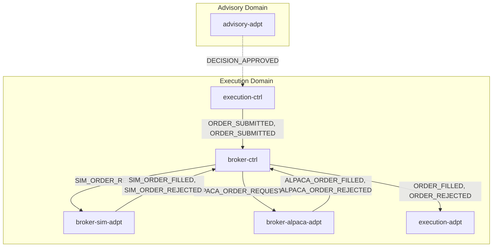
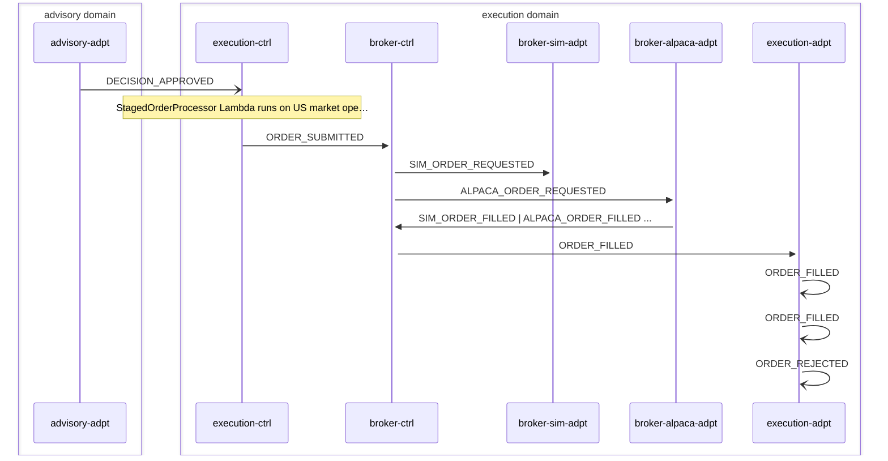

# Order Execution

> Approved decision triggers order creation in execution-ctrl, routed through broker-ctrl state machine to sim or Alpaca adapter, normalized back to canonical fill/reject events

**Domains:** advisory, execution

**Trigger:** advisory-adpt forwards DECISION_APPROVED to ExecutionBus

## Flowchart

## Sequence Diagram

## Steps

### Step 1: advisory-adpt

- **Receives:** `DECISION_APPROVED`
- **Via:** AdvisoryBus -> advisory-adpt ToExecution rule
- **Forwards to:** ExecutionBus
- **Emits:** `DECISION_APPROVED`

### Step 2: execution-ctrl

- **Receives:** `DECISION_APPROVED`
- **Via:** ExecutionBus -> SQS -> execution-ctrl-ingress
- **State change:** Creates Order records (one per instrument in decision packet) in DDB; status depends on operating mode (STAGED for simulation staging, SUBMITTED for live)
- **Emits:** `ORDER_SUBMITTED or ORDER_STAGED (CDC from Order:INSERT, status-based mapping)`
- **Idempotent:** yes

### Step 3: execution-ctrl

- **Action:** StagedOrderProcessor Lambda runs on US market open schedule (AdapterSchedule)
- **State change:** Submits staged orders, updates Order status to SUBMITTED
- **Emits:** `ORDER_SUBMITTED (CDC from Order:MODIFY)`
- **Idempotent:** yes

### Step 4: broker-ctrl

- **Receives:** `ORDER_SUBMITTED`
- **Via:** ExecutionBus -> broker-ctrl OrderIngress (EventBridge rule -> SF OrderStateMachine)
- **State change:** Order state machine starts; routes to SIM_ORDER_REQUESTED or ALPACA_ORDER_REQUESTED based on ExecutionMode
- **Emits:** `SIM_ORDER_REQUESTED or ALPACA_ORDER_REQUESTED (SF EventBridge integration)`
- **Idempotent:** yes

### Step 5: broker-sim-adpt

- **Receives:** `SIM_ORDER_REQUESTED`
- **Via:** ExecutionBus -> SQS -> broker-sim-adpt-ingress
- **State change:** Simulates order execution, writes VirtualTrade record with fill price
- **Emits:** `SIM_ORDER_FILLED or SIM_ORDER_REJECTED (CDC)`
- **Idempotent:** yes

### Step 6: broker-alpaca-adpt

- **Receives:** `ALPACA_ORDER_REQUESTED`
- **Via:** ExecutionBus -> SQS -> broker-alpaca-adpt-ingress
- **State change:** Submits order to Alpaca API, writes AlpacaOrderResult record
- **Emits:** `ALPACA_ORDER_FILLED or ALPACA_ORDER_REJECTED (CDC)`
- **Idempotent:** yes

### Step 7: broker-ctrl

- **Receives:** `SIM_ORDER_FILLED | ALPACA_ORDER_FILLED | SIM_ORDER_REJECTED | ALPACA_ORDER_REJECTED`
- **Via:** ExecutionBus -> SQS -> broker-ctrl-CallbackIngress
- **State change:** Writes NormalizedEvent record (sk = ORDER_FILLED or ORDER_REJECTED)
- **Emits:** `ORDER_FILLED or ORDER_REJECTED (CDC from NormalizedEvent:INSERT, sk is event type)`
- **Idempotent:** yes

### Step 8: execution-adpt

- **Receives:** `ORDER_FILLED`
- **Via:** ExecutionBus -> execution-adpt ToLedger rule
- **Forwards to:** LedgerBus
- **Emits:** `ORDER_FILLED`

### Step 9: execution-adpt

- **Receives:** `ORDER_FILLED`
- **Via:** ExecutionBus -> execution-adpt ToAdvisory rule
- **Forwards to:** AdvisoryBus
- **Emits:** `ORDER_FILLED`

### Step 10: execution-adpt

- **Receives:** `ORDER_REJECTED`
- **Via:** ExecutionBus -> execution-adpt ToInvestor rule
- **Forwards to:** InvestorBus
- **Emits:** `ORDER_REJECTED`

### Step 11: execution-adpt

- **Receives:** `ORDER_REJECTED`
- **Via:** ExecutionBus -> execution-adpt ToAdvisory rule
- **Forwards to:** AdvisoryBus
- **Emits:** `ORDER_REJECTED`

## Success Criteria

- Orders created from decision packet trades
- Orders routed to correct broker adapter (sim or Alpaca)
- ORDER_FILLED events reach ledger domain for recording
- ORDER_REJECTED events reach investor domain for notification

## Failure Modes

- **step 2 fails:** execution-ctrl ingress DLQ; orders not created
- **step 4 fails:** broker-ctrl OrderStateMachine stuck; circuit breaker may trigger BROKER_CIRCUIT_OPEN
- **step 5 fails:** broker-sim-adpt ingress DLQ; simulated fill not produced
- **step 6 fails:** broker-alpaca-adpt ingress DLQ; live order not submitted
- **step 7 fails:** broker-ctrl CallbackIngress DLQ; normalized event not created, SF task token times out
- **step 8-11 fails:** execution-adpt forwarding DLQs; downstream domains not notified
