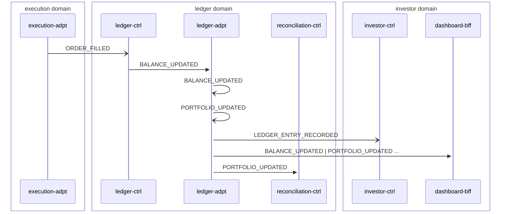

# Order Ledger

> Order fill events from execution domain are recorded as ledger entries, balance and portfolio snapshots are materialized and forwarded cross-domain

**Domains:** execution, ledger, investor, advisory

**Trigger:** broker-ctrl emits ORDER_FILLED (CDC from NormalizedEvent:INSERT)

## Flow Diagram

## Steps

### Step 1: execution-adpt

- **Receives:** `ORDER_FILLED`
- **Via:** ExecutionBus -> execution-adpt ToLedger rule
- **Forwards to:** LedgerBus
- **Emits:** `ORDER_FILLED`

### Step 2: ledger-ctrl

- **Receives:** `ORDER_FILLED`
- **Via:** LedgerBus -> SQS -> ledger-ctrl-ingress
- **State change:** Records LedgerEntryEvent (trade journal entry), BalanceEvent (cash debit/credit), PortfolioEvent (position update); reducer materializes account snapshots
- **Emits:** `BALANCE_UPDATED, PORTFOLIO_UPDATED, LEDGER_ENTRY_RECORDED (CDC)`
- **Idempotent:** yes

### Step 3: ledger-ctrl

- **Receives:** `ORDER_PARTIALLY_FILLED`
- **Via:** LedgerBus -> SQS -> ledger-ctrl-ingress
- **State change:** Records partial fill as LedgerEntryEvent and PortfolioEvent (partial position update)
- **Emits:** `PORTFOLIO_UPDATED, LEDGER_ENTRY_RECORDED (CDC)`
- **Idempotent:** yes

### Step 4: ledger-adpt

- **Receives:** `BALANCE_UPDATED`
- **Via:** LedgerBus -> ledger-adpt ToInvestor rule
- **Forwards to:** InvestorBus
- **Emits:** `BALANCE_UPDATED`

### Step 5: ledger-adpt

- **Receives:** `PORTFOLIO_UPDATED`
- **Via:** LedgerBus -> ledger-adpt ToAdvisory rule
- **Forwards to:** AdvisoryBus
- **Emits:** `PORTFOLIO_UPDATED`

### Step 6: ledger-adpt

- **Receives:** `LEDGER_ENTRY_RECORDED`
- **Via:** LedgerBus -> ledger-adpt ToInvestor rule
- **Forwards to:** InvestorBus
- **Emits:** `LEDGER_ENTRY_RECORDED`

### Step 7: investor-ctrl

- **Receives:** `BALANCE_UPDATED`
- **Via:** InvestorBus -> SQS -> investor-ctrl-ingress
- **State change:** Updates investor balance view
- **Emits:** `NOTIFICATION_CREATED (CDC)`
- **Idempotent:** yes

### Step 8: dashboard-bff

- **Receives:** `BALANCE_UPDATED | PORTFOLIO_UPDATED | LEDGER_ENTRY_RECORDED`
- **Via:** InvestorBus -> SQS -> dashboard-bff-ingress
- **State change:** Updates portfolio dashboard read model
- **Idempotent:** yes

### Step 9: reconciliation-ctrl

- **Receives:** `PORTFOLIO_UPDATED`
- **Via:** LedgerBus -> SQS -> reconciliation-ctrl-ingress
- **State change:** Triggers reconciliation check comparing intent vs settlement positions
- **Emits:** `RECONCILIATION_COMPLETED or PORTFOLIO_DRIFT_DETECTED (CDC)`
- **Idempotent:** yes

## Success Criteria

- Trade recorded as LedgerEntryEvent with correct debit/credit
- Balance and portfolio snapshots materialized by reducer
- BALANCE_UPDATED reaches investor domain for dashboard update
- PORTFOLIO_UPDATED reaches advisory domain for drift monitoring

## Failure Modes

- **step 1 fails:** execution-adpt ToLedgerDLQ; ledger not notified of fill
- **step 2 fails:** ledger-ctrl ingress DLQ; trade not recorded
- **step 4-6 fails:** ledger-adpt forwarding DLQs; downstream domains not notified
- **step 10 fails:** reconciliation-ctrl ingress DLQ; drift not detected
